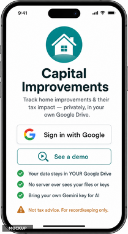
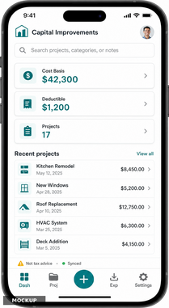
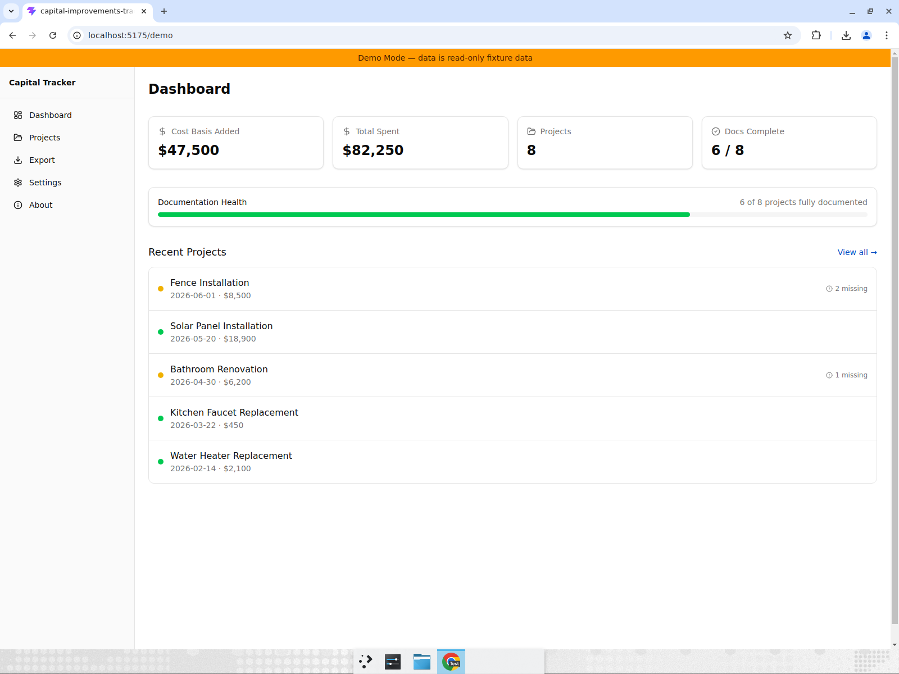
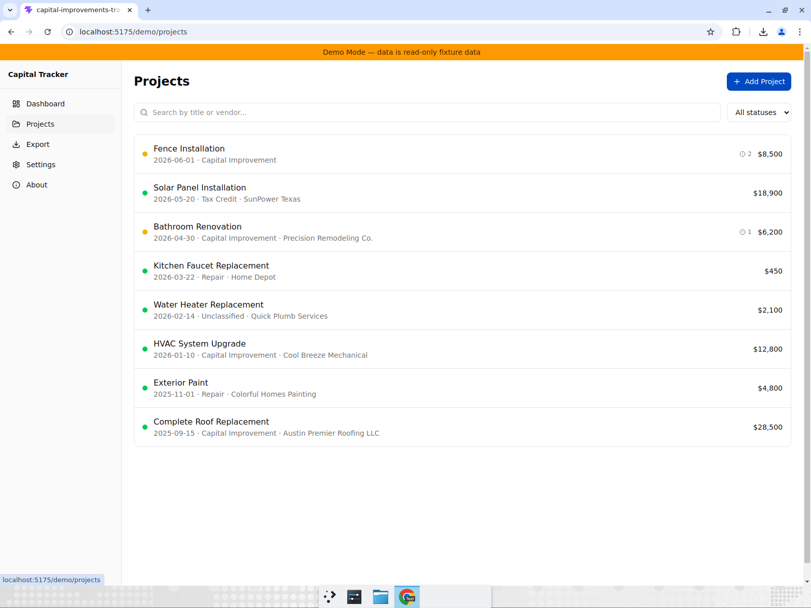
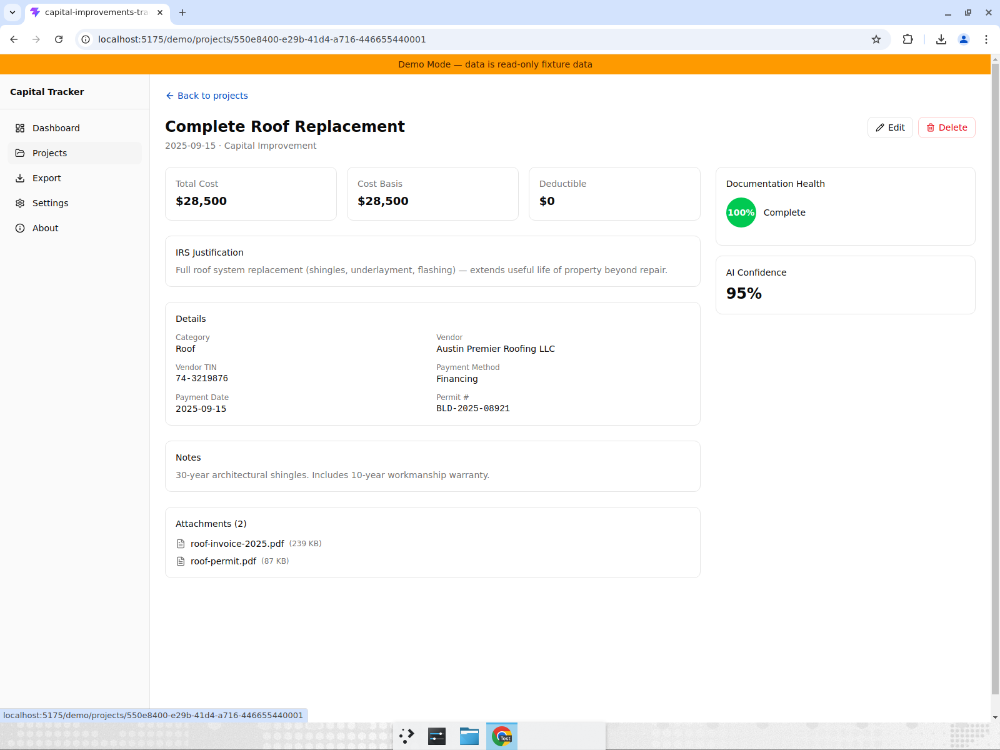

# Capital Improvements Tracker

A **100% serverless, client-side Single Page Application (SPA)** for tracking
residential home improvement projects, extracting tax-relevant data from receipts
with AI, and persisting structured records to the user's **personal Google Drive**.

No backend. No proxy. All network requests go **directly from your browser to
Google's endpoints**. Your tokens, API key, and documents never touch a third-party
server.

<p>
  
  &nbsp;&nbsp;
  
</p>

## Why this exists

Homeowners accumulate years of receipts and invoices for home improvements. Some
affect taxes — most commonly by **increasing the cost basis** of the home (reducing
capital-gains tax at sale), and in narrower cases by qualifying for **deductions or
credits** (e.g. energy efficiency credits, medically necessary improvements,
home-office allocation).

This app is a durable, low-maintenance personal ledger that:
- Survives ~20 years without a hosting bill
- Tells you if you have enough documentation for the IRS
- Scans receipts with AI and extracts the relevant fields
- Stores everything in your own Google Drive — you own your data

## Screenshots

<details>
<summary>Dashboard — summary cards, documentation health, recent projects</summary>


</details>

<details>
<summary>Projects list — search, filter by documentation status, doc health badges</summary>


</details>

<details>
<summary>Project detail — IRS fields, documentation health score, attachments</summary>


</details>

## Features

### Implemented (Tasks 1–4)

- **Google Drive integration** — OAuth sign-in, real read/write to `appDataFolder`, CAS concurrency

- **Dashboard** — cost basis / total spent / project count / documentation health summary
- **Projects CRUD** — create, view, edit, delete projects with full IRS field support
- **12 optional IRS fields** per project (category, vendor, TIN, payment method, permit #, depreciation, energy credits, safe harbor, etc.)
- **Documentation completeness checker** — per-project colored badge (green/yellow/red) based on what the IRS would need for that specific tax treatment
- **Search & filter** — search by title or vendor; filter by documentation status
- **Export** — download manifest as JSON or CSV
- **Property profile** — set-once address/type in Settings, inherited by all projects
- **Demo mode** — 8 fixture projects with realistic IRS data, no sign-in required
- **Analytics** — Plausible integration (privacy-first, no cookies)
- **Observability** — OpenTelemetry browser SDK → Honeycomb (performance traces, no PII)
- **Strict TypeScript** — `strict` + `noUncheckedIndexedAccess` + `exactOptionalPropertyTypes`, zero `any`
- **ESLint** — `strictTypeChecked` + `stylisticTypeChecked`

### Planned (Tasks 5–6)

- **AI extraction** — Gemini 2.5 Flash multimodal receipt scanning with human review step (BYOK)
- **PWA & offline** — service worker, offline read-only mode
- **Landing page polish** — production landing with demo CTA, about page, diagnostics

## Tech stack

| Layer | Technology |
| --- | --- |
| Framework | [React Router v7](https://reactrouter.com/) (SPA mode, no SSR) |
| UI | [Tailwind CSS v4](https://tailwindcss.com/) + [shadcn/ui](https://ui.shadcn.com/) (Radix primitives) |
| Language | TypeScript 6 (strict mode) |
| Validation | [Zod 4](https://zod.dev/) (runtime schema validation at every untrusted boundary) |
| Storage | Google Drive API v3 (`appDataFolder`, `drive.file` scope) |
| Auth | Google Identity Services (GIS) client-side OAuth2 |
| AI | Google Gemini 2.5 Flash (multimodal, BYOK) |
| Analytics | [Plausible](https://plausible.io/) (privacy-first, no cookies, GDPR-compliant) |
| Observability | [OpenTelemetry](https://opentelemetry.io/) browser SDK → [Honeycomb](https://www.honeycomb.io/) |
| Build | [Vite 8](https://vite.dev/) |
| Hosting | Cloudflare Pages (static deploy, strict CSP headers) |

## Core constraints

| Concern | Decision |
| --- | --- |
| **Zero backend** | All logic runs in the browser; no server, no proxy, no cloud functions |
| **Zero `any`** | Strict TypeScript with ESLint enforcement — no escape hatches |
| **Privacy-first** | BYOK for AI, `drive.file` scope for storage, no cross-site tracking |
| **Longevity** | Minimal dependencies, pinned versions, designed to run 20+ years |
| **IRS-defensible** | Documentation completeness checker tells you what's missing per tax treatment |
| **Cost-basis-aware** | Distinguishes capital improvements (basis adjustment) from repairs (deductible) from credits |

## Getting started

### Prerequisites

- [Node.js 24+](https://nodejs.org/) (see `.nvmrc`)
- npm (ships with Node)

### Setup

```bash
git clone https://github.com/jbisasky/capital-improvements-tracker.git
cd capital-improvements-tracker
nvm use          # switches to Node 24
npm install
npm run dev      # starts Vite dev server at http://localhost:5173
```

### Scripts

| Command | Description |
| --- | --- |
| `npm run dev` | Start Vite dev server with HMR |
| `npm run build` | Production build to `dist/` |
| `npm run preview` | Serve the production build locally |
| `npm run typecheck` | Run `tsc --noEmit` |
| `npm run lint` | Run ESLint |
| `npm run check` | Run typecheck + lint together |

### Demo mode

Visit `http://localhost:5173/demo` to see the app with 8 fixture projects — no
Google account required. Demo data includes realistic IRS fields, documentation
health scores, and mock attachments.

## Project structure

```
src/
├── app/                    # Routes and page components
│   ├── dashboard/          # Dashboard page
│   ├── demo/               # Demo layout + demo dashboard
│   ├── export/             # Export page (JSON/CSV)
│   ├── landing/            # Landing page (sign-in + demo CTA)
│   ├── projects/           # Projects CRUD (list, detail, new, edit, form)
│   ├── settings/           # Settings + diagnostics
│   ├── about/              # About page
│   └── router.tsx          # Route definitions
├── components/layout/      # App shell, sidebar, root layout
├── domain/                 # Pure domain logic (schemas, doc-completeness, result type)
├── hooks/                  # Custom hooks (useRoutePrefix)
└── services/               # I/O layer (storage driver, mock driver, analytics, telemetry)

docs/
├── high-level-design.md    # Architecture, data model, flows, risks, roadmap
├── low-level-design.md     # API contracts, sequence diagrams, retry/error model
├── requirements-ears.md    # EARS requirements specification (30 sections)
├── ui-ux-design.md         # Screens, wireframes, user flows, responsive/accessibility
└── google-cloud-setup.md   # One-time GCP setup runbook
```

## Documentation

- [High-Level Design](docs/high-level-design.md) — architecture, data model, flows, risks, roadmap
- [Low-Level Design](docs/low-level-design.md) — API contracts, sequence diagrams, data contracts, retry/error model (19 sections)
- [Requirements (EARS)](docs/requirements-ears.md) — formal requirements specification (30 sections, 150+ requirements)
- [UI/UX Design](docs/ui-ux-design.md) — screens, wireframes, user flows, state coverage, responsive/accessibility
- [Google Cloud Setup](docs/google-cloud-setup.md) — one-time runbook: enable APIs, OAuth consent, BYOK key restrictions

## Roadmap

| # | Task | Status |
| --- | --- | --- |
| 1 | Scaffold — React Router 7 SPA, Tailwind v4, shadcn/ui | Done |
| 2 | Domain + storage layer — Zod schemas, Result type, MockStorageDriver | Done |
| 3 | Core views — Dashboard, Projects, Settings, Export (mock data) | Done |
| 4 | Auth + Drive integration — GIS OAuth, real Drive read/write, CAS | Done |
| 5 | AI extraction + BYOK — Gemini integration, extraction review flow | Planned |
| 6 | Polish — Diagnostics page | Planned |
| 7 | Polish — Landing page & about page refinement | Planned |
| 8 | Polish — PWA/offline & service worker | Planned |

## License

[MIT](LICENSE) — Copyright (c) 2026 Jordan C Bisasky
