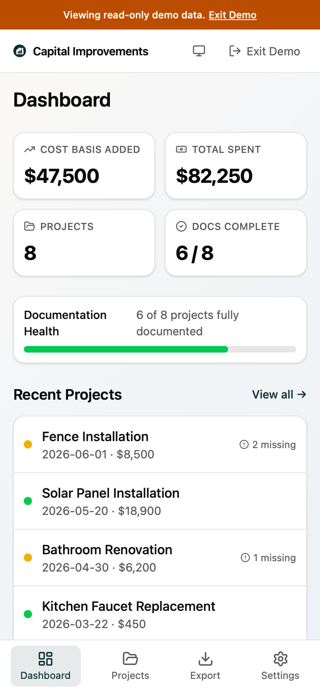
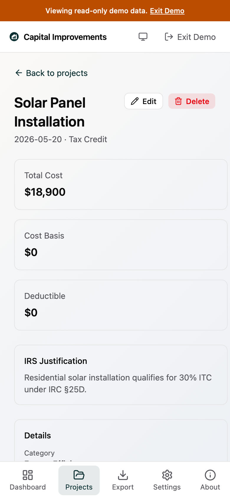
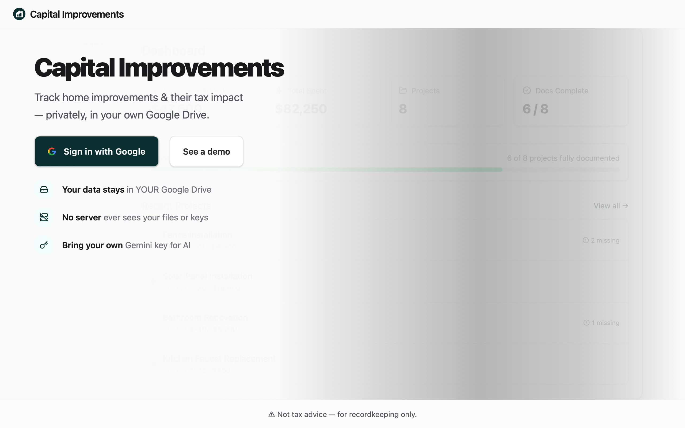
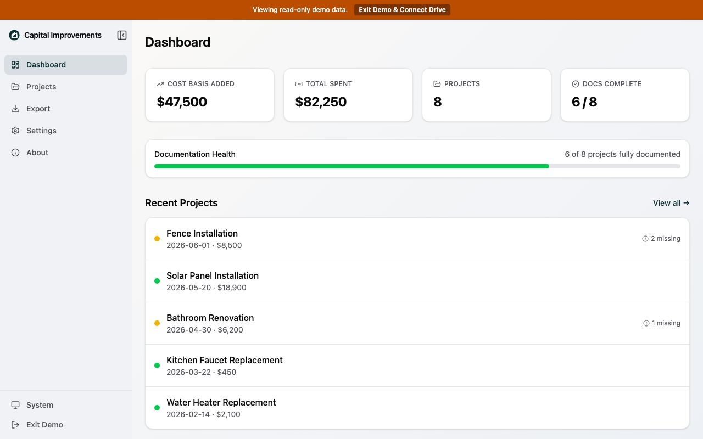
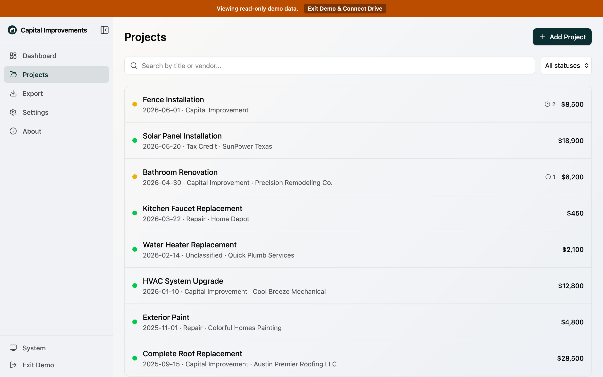
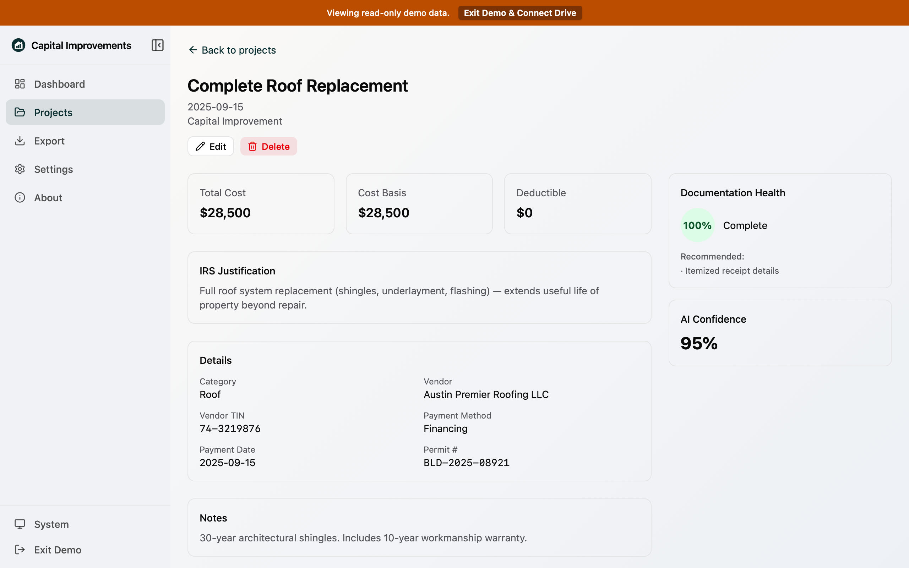

# Capital Improvements Tracker

**Live:** [capital-improvements-tracker.pages.dev](https://capital-improvements-tracker.pages.dev) · **Demo:** [capital-improvements-tracker.pages.dev/demo](https://capital-improvements-tracker.pages.dev/demo)

A **100% serverless, client-side Single Page Application (SPA)** for tracking
residential home improvement projects, extracting tax-relevant data from receipts
with AI, and persisting structured records to the user's **personal Google Drive**.

No backend. No proxy. All network requests go **directly from your browser to
Google's endpoints**. Your tokens, API key, and documents never touch a third-party
server.

<p>
  
  
  &nbsp;&nbsp;
</p>

## Why this exists

Homeowners accumulate years of receipts and invoices for home improvements. Some
affect taxes — most commonly by **increasing the cost basis** of the home (reducing
capital-gains tax at sale), and in narrower cases by qualifying for **deductions or
credits** (e.g. energy efficiency credits, medically necessary improvements,
home-office allocation).

This app is a durable, low-maintenance personal ledger that:
- Survives ~20 years without a hosting bill
- Tells you if you have enough documentation for the IRS
- Scans receipts with AI and extracts the relevant fields
- Stores everything in your own Google Drive — you own your data

## Screenshots

Captured from the running app in **demo mode** (`/demo`). Regenerate with:

```bash
npx playwright test e2e/readme-screenshots.spec.ts --project=chromium
npm run compress:doc-images   # ensure all docs/ images ≤200 kB
```

If you use Wrangler instead of Vite (`npm run dev:cf` on port 8788):

```bash
SCREENSHOT_BASE_URL=http://localhost:8788 npx playwright test e2e/readme-screenshots.spec.ts --project=chromium
npm run compress:doc-images   # ensure all docs/ images ≤200 kB
```

See [End-to-end tests (Playwright)](#end-to-end-tests-playwright) for full Playwright setup.

<details>
<summary>Mobile — demo dashboard and project detail</summary>

<p>
  
  
</p>
</details>

<details>
<summary>Desktop — landing page</summary>


</details>

<details>
<summary>Dashboard — summary cards, documentation health, recent projects</summary>


</details>

<details>
<summary>Projects list — search, filter by documentation status, doc health badges</summary>


</details>

<details>
<summary>Project detail — IRS fields, documentation health score, attachments</summary>


</details>

## Features

### Projects & documentation

- **Dashboard** — cost basis added, total spent, project count, documentation health, recent projects
- **Projects CRUD** — create, view, edit, delete with full IRS field support (12 optional fields: category, vendor, TIN, payment method, permit #, depreciation, energy credits, safe harbor, etc.)
- **Attachment uploads** — receipts and invoices to Google Drive; view, download, and remove with confirmation
- **Documentation completeness checker** — per-project badge (green/yellow/red) based on what the IRS would need for that tax treatment
- **Search & filter** — search by title or vendor; filter by documentation status
- **Loading skeletons** — static page chrome during Drive sync; no flash of stale cached data

### Export & AI

- **Export** — PDF summary (default), CSV spreadsheet, or full `manifest.json` backup; scope all projects or filter by tax year
- **AI extraction** — Gemini 2.5 Flash multimodal receipt scanning with human review step (BYOK — key stored locally)

### Storage, auth & offline

- **Google Drive integration** — GIS OAuth sign-in; read/write `manifest.json` in `appDataFolder`; attachments in a visible Drive folder; CAS concurrency
- **Demo mode** — 8 fixture projects with realistic IRS data at `/demo` — no sign-in required
- **PWA & offline** — service worker (app shell cache), web manifest, IndexedDB manifest cache, offline read-only mode with write guards
- **Property profile** — set-once address and property type in Settings, inherited by exports and projects

### Settings & polish

- **Appearance** — Light / Dark / System theme (device-local preference)
- **BYOK & AI limits** — Gemini API key storage, usage budgets, key test/remove
- **Diagnostics** — ring-buffer logging for sync and AI debugging
- **Landing & About** — marketing landing page with demo CTA; about page with doc links and disclaimers

### Observability & quality

- **Analytics** — Plausible (privacy-first, no cookies)
- **Observability** — OpenTelemetry browser SDK → Honeycomb (traces, no PII)
- **Strict TypeScript** — `strict`, `noUncheckedIndexedAccess`, `exactOptionalPropertyTypes`; zero `any`
- **ESLint** — `strictTypeChecked` + `stylisticTypeChecked`
- **Hosted on Cloudflare Pages** — static deploy with CSP and security headers

## Tech stack

| Layer | Technology |
| --- | --- |
| Framework | [React Router v7](https://reactrouter.com/) (SPA mode, no SSR) |
| UI | [Tailwind CSS v4](https://tailwindcss.com/) + [shadcn/ui](https://ui.shadcn.com/) (Radix primitives) |
| Language | TypeScript 6 (strict mode) |
| Validation | [Zod 4](https://zod.dev/) (runtime schema validation at every untrusted boundary) |
| Storage | Google Drive API v3 (`appDataFolder`, `drive.file` scope) |
| Auth | Google Identity Services (GIS) client-side OAuth2 |
| AI | Google Gemini 2.5 Flash (multimodal, BYOK) |
| Analytics | [Plausible](https://plausible.io/) (privacy-first, no cookies, GDPR-compliant) |
| Observability | [OpenTelemetry](https://opentelemetry.io/) browser SDK → [Honeycomb](https://www.honeycomb.io/) |
| Build | [Vite 8](https://vite.dev/) |
| Hosting | Cloudflare Pages (static deploy, strict CSP headers) |

## Core constraints

| Concern | Decision |
| --- | --- |
| **Zero backend** | All logic runs in the browser; no server, no proxy, no cloud functions |
| **Zero `any`** | Strict TypeScript with ESLint enforcement — no escape hatches |
| **Privacy-first** | BYOK for AI, `drive.file` scope for storage, no cross-site tracking |
| **Longevity** | Minimal dependencies, pinned versions, designed to run 20+ years |
| **IRS-defensible** | Documentation completeness checker tells you what's missing per tax treatment |
| **Cost-basis-aware** | Distinguishes capital improvements (basis adjustment) from repairs (deductible) from credits |

## Getting started

### Prerequisites

- [Node.js 24+](https://nodejs.org/) (see `.nvmrc`)
- npm (ships with Node)

### Setup

```bash
git clone https://github.com/jbisasky/capital-improvements-tracker.git
cd capital-improvements-tracker
nvm use          # switches to Node 24
npm install
cp .env.example .env   # optional — only needed for live Google sign-in (see below)
npm run dev      # starts Vite dev server at http://localhost:5173
```

### Enabling Google sign-in and Drive storage

By default the app runs in **demo mode** (`/demo`) with fixture data — no Google account or
configuration required. To use **live mode** (sign in, read/write your own Drive data):

1. **One-time Google Cloud setup** — follow [docs/google-cloud-setup.md](docs/google-cloud-setup.md):
   enable the Drive API, configure the OAuth consent screen (`drive.appdata` + `drive.file`),
   add yourself as a test user, and create an OAuth 2.0 **Web** Client ID with
   `http://localhost:5173` as an authorized JavaScript origin.

2. **Local environment file** — copy the template and paste your Client ID:

   ```bash
   cp .env.example .env
   ```

   Edit `.env` and set:

   ```bash
   VITE_GOOGLE_CLIENT_ID=xxxxxxxxxxxx.apps.googleusercontent.com
   ```

   `.env` is gitignored; never commit it. [`.env.example`](.env.example) documents all supported
   `VITE_*` variables (OAuth, optional Honeycomb telemetry).

3. **Restart the dev server** — Vite reads `.env` at startup. Click **Sign in with Google** on
   the landing page (not "See a demo"). On first sign-in the app bootstraps `manifest.json` in
   your Drive `appDataFolder`.

4. **Production** — set `VITE_GOOGLE_CLIENT_ID` as a build-time environment variable on your
   static host (e.g. Cloudflare Pages → Settings → Environment variables). Add your production
   origin to the OAuth client's authorized JavaScript origins.

5. **Gemini receipt scanning (optional)** — enter your API key in **Settings → BYOK** at runtime;
   it is stored in `localStorage`, not in `.env`. See the runbook for key restrictions.

Without `VITE_GOOGLE_CLIENT_ID`, "Sign in with Google" no-ops gracefully and authenticated
routes redirect to the landing page — demo mode continues to work.

### Deploying to Cloudflare Pages

The repo ships `public/_headers` (CSP + security headers) and `public/_redirects` (SPA
routing). Connect the GitHub repo in the [Cloudflare Pages dashboard](https://dash.cloudflare.com/):

| Setting | Value |
| --- | --- |
| Build command | `npm run build` |
| Build output directory | `dist` |
| Node version | 24 |

Set these build-time environment variables in **Pages → Settings → Environment variables**:

| Variable | Required | Notes |
| --- | --- | --- |
| `VITE_GOOGLE_CLIENT_ID` | For live sign-in | Same OAuth Web Client ID as local dev |
| `VITE_SITE_URL` | Recommended | `https://capital-improvements-tracker.pages.dev` — canonical + Open Graph |
| `VITE_PLAUSIBLE_DOMAIN` | For analytics | `capital-improvements-tracker.pages.dev` |
| `VITE_HONEYCOMB_API_KEY` | No | Telemetry no-ops when unset |
| `NODE_VERSION` | Recommended | `24` |

Production site: **https://capital-improvements-tracker.pages.dev**

After deploy, add the production origin to the OAuth
client's **Authorized JavaScript origins** in Google Cloud Console — see
[docs/google-cloud-setup.md](docs/google-cloud-setup.md).

### Scripts

| Command | Description |
| --- | --- |
| `npm run dev` | Start Vite dev server with HMR (`http://localhost:5173`) |
| `npm run dev:cf` | Vite via Wrangler Pages dev (`http://localhost:8788`) |
| `npm run build` | Production build to `dist/` |
| `npm run preview` | Serve the production build locally |
| `npm run typecheck` | Run `tsc --noEmit` |
| `npm run lint` | Run ESLint |
| `npm run check` | Run typecheck + lint together |
| `npm run compress:doc-images` | Compress all `docs/` images to ≤200 kB |
| `npm run compress:doc-images:check` | Fail if any `docs/` image exceeds 200 kB |

### End-to-end tests (Playwright)

Tests live in `e2e/` and run against a local dev server (`http://localhost:5173`).
Playwright starts `npm run dev` automatically, or reuses a server already running on
port 5173.

**One-time setup** — install browser binaries:

```bash
npx playwright install --with-deps chromium webkit
```

**Run the full local suite** (Chromium + WebKit — matches CI):

```bash
npx playwright test
```

**Common variants:**

```bash
# Chromium only (faster)
npx playwright test --project=chromium

# Single spec file
npx playwright test e2e/dashboard.spec.ts

# Filter by test title
npx playwright test -g "demo dashboard"

# Headed browser (watch the run)
npx playwright test e2e/landing.spec.ts --headed

# Interactive debugger
npx playwright test e2e/landing.spec.ts --debug
```

**Production smoke** — hits the live Cloudflare Pages deployment (no local server):

```bash
npx playwright test e2e/production-smoke.spec.ts --config=playwright.production.config.ts
```

**Unit & component tests** (Vitest — `src/**/*.test.*`):

```bash
npx vitest run
```

### Demo mode

Visit `http://localhost:5173/demo` to see the app with 8 fixture projects — no
Google account required. Demo data includes realistic IRS fields, documentation
health scores, and mock attachments.

## Project structure

```
src/
├── app/                    # Routes and page components
│   ├── dashboard/          # Dashboard page
│   ├── demo/               # Demo layout + demo dashboard
│   ├── export/             # Export page (PDF / CSV / JSON)
│   ├── landing/            # Landing page (sign-in + demo CTA)
│   ├── projects/           # Projects CRUD (list, detail, new, edit, form)
│   ├── settings/           # Settings + diagnostics
│   ├── about/              # About page
│   └── router.tsx          # Route definitions
├── components/layout/      # App shell, sidebar, root layout
├── domain/                 # Pure domain logic (schemas, doc-completeness, result type)
├── hooks/                  # Custom hooks (useRoutePrefix)
└── services/               # I/O layer (storage driver, mock driver, analytics, telemetry)

docs/
├── high-level-design.md    # Architecture, data model, flows, risks, roadmap
├── low-level-design.md     # API contracts, sequence diagrams, retry/error model
├── requirements-ears.md    # EARS requirements specification (30 sections)
├── ui-ux-design.md         # Screens, wireframes, user flows, responsive/accessibility
└── google-cloud-setup.md   # One-time GCP setup runbook
```

## Documentation

- [High-Level Design](docs/high-level-design.md) — architecture, data model, flows, risks, roadmap
- [Low-Level Design](docs/low-level-design.md) — API contracts, sequence diagrams, data contracts, retry/error model (19 sections)
- [Requirements (EARS)](docs/requirements-ears.md) — formal requirements specification (30 sections, 150+ requirements)
- [UI/UX Design](docs/ui-ux-design.md) — screens, wireframes, user flows, state coverage, responsive/accessibility
- [Google Cloud Setup](docs/google-cloud-setup.md) — one-time runbook: enable APIs, OAuth consent, BYOK key restrictions
- [Plausible setup](docs/ops/plausible-setup.md) — register production domain for analytics
- [Custom domain](docs/ops/custom-domain.md) — optional DNS + OAuth steps

## Roadmap

Initial MVP tasks (1–8) are complete — scaffold through PWA/offline. See git history and [docs/test-reports/](docs/test-reports/) for delivery evidence.

| # | Task | Status |
| --- | --- | --- |
| 1 | Scaffold — React Router 7 SPA, Tailwind v4, shadcn/ui | Done |
| 2 | Domain + storage layer — Zod schemas, Result type, MockStorageDriver | Done |
| 3 | Core views — Dashboard, Projects, Settings, Export | Done |
| 4 | Auth + Drive integration — GIS OAuth, real Drive read/write, CAS | Done |
| 5 | AI extraction + BYOK — Gemini integration, extraction review flow | Done |
| 6 | Polish — Diagnostics page | Done |
| 7 | Polish — Landing page & about page refinement | Done |
| 8 | Polish — PWA/offline & service worker | Done |

Post-MVP polish shipped in follow-up PRs includes PDF export, dark/light theme, attachment uploads, Drive sync skeleton UX, PR #53 loading/sync review fixes, and Cloudflare Pages production hosting.

## License

[MIT](LICENSE) — Copyright (c) 2026 Jordan C Bisasky
