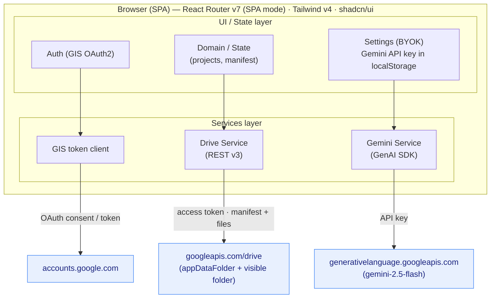

# High-Level Design (HLD): Serverless Capital Improvements & Tax Deduction Tracker

**Status:** v1.0 — decisions locked, ready to build
**Author:** Devin (on behalf of @jbisasky)
**Last updated:** 2026-06-12

> This document captures the architecture and design *intent* before any code is written.
> All previously open questions have been resolved with the owner; see the **Decisions Log**
> in §13. Implementation should follow the choices recorded here.

---

## 1. Objective & Scope

Build a production-grade, **100% serverless, client-side SPA** that:

1. Lets a homeowner record capital improvement projects (title, date, cost, attachments).
2. Uses an AI multimodal model to **extract structured fields** from uploaded receipts/invoices.
3. Tracks the **tax impact** of each project (cost-basis adjustment and/or deductible amount).
4. Persists everything to the user's **personal Google Drive**, with no central server.
5. Is built to remain operable for ~**20 years** with minimal maintenance and no hosting bill.

### Out of scope (v1)
- Multi-user collaboration / sharing.
- Filing taxes or integrating with tax software.
- Authoritative tax advice — the app records and assists, it does not replace a CPA.

### Demo mode (decision D14)
The landing page includes a **"See a demo"** button alongside the Google sign-in CTA. It drops
the user into a **read-only, pre-populated sandbox** with realistic sample data (e.g. a few
projects, receipts, and summary totals) — no Google sign-in or API key required. This lets
prospective users explore the full UI and understand the app's value proposition before committing
to auth. The demo environment uses static fixture data baked into the build and bypasses all
Drive/Gemini calls. A persistent banner indicates "Demo mode — sign in to use your own data."
Specified in LLD §16.

---

## 2. Architecture Overview



Key property: **no first-party backend exists**. The three external dependencies are all
Google services the user already trusts, contacted directly from the browser.

> The granular handshaking behind each edge above (exact API calls, sequence diagrams,
> retry/CAS protocols, data contracts) is specified in the companion
> [Low-Level Design](low-level-design.md).

### 2.1 Layered module map (proposed)

```
src/
  app/                # React Router v7 routes (SPA), layouts
  components/         # shadcn/ui-based presentational components
  features/
    auth/             # GIS init, token state, sign-in/out
    settings/         # BYOK key management UI + storage
    projects/         # list/detail/create/edit project UIs
    extraction/       # AI document extraction workflow + review step
  services/
    drive/            # Drive REST client: manifest read/write, file upload/download
    gemini/           # GenAI client: multimodal extraction calls
    storage/          # localStorage wrappers (typed)
  domain/             # pure types + tax logic (no I/O)
  lib/                # utils (uuid, money, dates, result types)
```

Rationale: services own all I/O and are individually mockable; `domain/` is pure and unit-
testable; `features/` compose services + components. This separation matters for a 20-year
codebase where dependencies will be swapped over time.

---

## 3. Technology Decisions & Rationale

| Layer | Choice | Notes / risks |
| --- | --- | --- |
| Routing/build | React Router v7 **SPA mode** | Compiles to static HTML/JS/CSS. No loaders/actions that require a server runtime — data is fetched client-side. Confirm `ssr: false` in `react-router.config.ts`. |
| Styling | Tailwind v4 (Oxide/Rust engine) | v4 changes config (CSS-first `@theme`, no `tailwind.config.js` required). shadcn/ui has a v4-compatible track — pin versions. |
| Components | shadcn/ui + Radix | Copied-in components (not a dependency) → good for longevity (you own the code). |
| Language | TypeScript strict | `strict: true`, `noUncheckedIndexedAccess`, `exactOptionalPropertyTypes`. Lint rule banning `any`. |
| Validation | **zod** (decided) | Runtime validation of manifest + API payloads. Critical because Drive data and AI output are untrusted at parse time. |
| Auth | Google Identity Services (token model) | Browser-only; see §5 for the token-lifetime caveat. |
| AI | `@google/genai` SDK, `gemini-2.5-flash` | Multimodal (image + PDF). BYOK key from `localStorage`. |

---

## 4. Data Model & Storage Design

### 4.1 Storage location
- Primary index: `appDataFolder/manifest.json` (hidden, per-user, per-app Drive space).
- Document files: stored in a **user-visible Drive folder** (decision B6), created/managed via
  the `drive.file` scope, and referenced by `fileId` in each project's `attachments`. This
  keeps receipts findable in the normal Drive UI even if this app disappears (longevity, §9).
  Only the `manifest.json` index lives in the hidden `appDataFolder`.

### 4.2 Manifest schema (canonical)

The **cost-basis-aware** schema below is the canonical model (decision C9). The work order's
original single-`taxDeductibleAmount` shape is retained only as a migration source.

```jsonc
{
  "schemaVersion": 2,                  // integer for migration logic
  "lastUpdated": "ISO-8601",
  "property": {                        // set once in Settings → "Your Property"
    "address": "123 Main St",
    "city": "Austin",
    "state": "TX",
    "zip": "78701",
    "propertyType": "primary_residence", // | "rental" | "home_office" | "vacation"
    "sqftTotal": 2400                  // optional — needed for home-office % calc
  },
  "settings": {                          // optional — app-managed Drive metadata
    "attachmentsFolderId": "string"      // user-visible folder for receipts (LLD §7.1)
  },
  "summary": {
    "totalCostBasisAdded": 0.00,       // sum of capital improvements (basis adjustments)
    "totalDeductible": 0.00            // sum of amounts that are *actually* deductible/credited
  },
  "projects": [
    {
      "id": "uuid",
      "title": "string",
      "completionDate": "YYYY-MM-DD",
      "totalCost": 0.00,
      "taxTreatment": "capital_improvement" | "repair" | "deductible" | "credit" | "unknown",
      "costBasisAdjustment": 0.00,     // for capital improvements
      "deductibleAmount": 0.00,        // for the narrow deductible/credit cases
      "irsJustification": "string",    // AI-assisted, human-confirmed
      "confidence": 0.0,               // AI extraction confidence (0..1), for review UI
      "attachments": [
        { "fileId": "string", "filename": "string", "mimeType": "string", "sizeBytes": 0 }
      ],
      "createdAt": "ISO-8601",
      "updatedAt": "ISO-8601",

      // --- Optional IRS-relevant fields ---
      "category": "roof",              // improvement type (roof, hvac, kitchen, etc.)
      "vendorName": "ABC Roofing LLC", // contractor/vendor
      "vendorTin": "12-3456789",       // EIN (optional — for 1099 if landlord)
      "paymentMethod": "credit_card",  // cash | check | credit_card | financing | mixed
      "datePaymentMade": "YYYY-MM-DD", // may differ from completionDate
      "permitNumber": "BLD-2026-04521",// building permit reference
      "usefulLifeYears": 27.5,         // depreciation period (rental property)
      "depreciationStartDate": "YYYY-MM-DD", // "placed in service" date
      "energyCreditType": "none",      // 25c_efficiency | 25d_solar | 45l | none
      "safeHarborElection": false,     // IRS de minimis safe harbor
      "sqftAffected": 200,             // for home-office deductions (Form 8829)
      "notes": "Full roof replacement" // free-form audit notes
    }
  ]
}
```

This model exists because of the domain accuracy issue in §6 — a single `taxDeductibleAmount`
field conflates two very different tax mechanics.

> **Migration from the work order baseline:** `version: "1.0"` → `schemaVersion: 2`;
> `summary.totalDeductions` is split into `totalCostBasisAdded` + `totalDeductible`; each
> project's `taxDeductibleAmount` maps to `deductibleAmount` with `taxTreatment: "unknown"`
> until reclassified. The `property` field and optional IRS fields are added as empty/absent
> (progressive enrichment — users fill them in over time).

### 4.3 Concurrency & durability (decision B4)
A single `manifest.json` over 20 years is a single point of failure and a multi-device write
hazard, so the following safeguards are **adopted**:
- **Optimistic concurrency:** read the Drive file's `headRevisionId`/ETag; on write, verify it
  hasn't changed (conditional update). On conflict, re-read, merge, retry.
- **Backups:** before each write, copy current manifest to a rotating `manifest.bak.N.json`.
- **Atomic writes:** upload new content then update pointer (Drive update is atomic per file).
- **Schema migrations:** `schemaVersion` gate with forward-only migration functions.

### 4.4 Attachment upload surfaces & create flow

Receipts and invoices are first-class project data — documentation completeness (LLD §10)
requires ≥1 attachment for most tax treatments. Upload is exposed in **three places**:

| Surface | Behavior |
| --- | --- |
| **Add new project** | File picker serves **dual purpose**: (1) optional Gemini extraction, (2) the same file is **persisted as a project attachment** when the user saves. Additional files may be added on the form step before save. |
| **Project detail** | Users can **upload**, **view**, **download**, and **remove** attachments inline without opening Edit. |
| **Edit project** | Same shared attachment zone as add/detail (UI/UX §5.4). |

**Save ordering (decision — LLD §9, ATT-06):** attachments are uploaded to Drive **first**; the
manifest is written **last** with the returned `fileId`s. On create, the app pre-assigns a
project `id`, uploads all pending files, then performs a single `addProject` manifest write.
This guarantees the manifest never references a missing Drive file.

**Implementation note (2026-06):** Domain types and read-only attachment display exist; the
Drive upload pipeline and UI wiring are specified in LLD §7.3–§7.4 and tracked in
[`docs/plans/attachment-upload-integration.md`](plans/attachment-upload-integration.md).

---

## 5. Authentication & Token Lifecycle

### 5.1 Flow
1. App loads GIS script; user clicks "Sign in with Google".
2. GIS **token client** requests an OAuth2 **access token** with scopes (see §5.3).
3. Access token held **in memory only** (per work order). Used as a Bearer token for Drive.

### 5.2 Token model & lifecycle (decision A1)
Pure browser GIS uses the **implicit/token model**, which returns a **short-lived access
token (~1 hour) and NO refresh token**. **Adopted approach:**
- Hold the access token **in memory only**.
- Proactively perform a **silent re-request** (`prompt: ''`) shortly before expiry while the
  Google session is alive.
- Accept **full re-auth on hard page refresh / new tab** (acceptable UX tradeoff for the
  stronger security posture).

### 5.3 Scopes (decision A3)
- `https://www.googleapis.com/auth/drive.appdata` — hidden app data, for `manifest.json`.
- `https://www.googleapis.com/auth/drive.file` — for the user-visible attachments folder this
  app creates/manages. Scoped to app-created files only; avoids full-`drive` over-permissioning.

### 5.4 OAuth client config (decision A2 — provision new)
Requires a Google Cloud project with an **OAuth Client ID** whose **Authorized JavaScript
origins** exactly match the hosting domain(s) — both the `*.pages.dev` URL and any future
custom domain (see §8). No client exists yet; provisioning steps are in the runbook
[`docs/google-cloud-setup.md`](google-cloud-setup.md).

---

## 6. Tax Domain Modeling — important accuracy note (decision C9: cost-basis-aware)

The work order frames everything as `taxDeductibleAmount` / `totalDeductions`. For a
**personal residence**, this is usually **not** how it works (IRS Pub 523/530):

- **Capital improvements** (new roof, addition, HVAC, remodel) are generally **NOT deductible**.
  They **increase the home's cost basis**, which **reduces capital-gains tax when you sell**.
- **Repairs/maintenance** generally have **no** tax effect for a personal residence.
- **Genuinely deductible / creditable** cases are narrower: energy-efficiency credits
  (e.g. §25C/§25D), medically necessary improvements (as itemized medical expense, net of
  value added), and the business-use-of-home / rental allocation portion.

**Adopted:** model both mechanics explicitly (see `taxTreatment`, `costBasisAdjustment`,
`deductibleAmount` in §4.2) and have the AI + UI classify each project rather than assuming
everything is "deductible." This avoids giving the user a misleading "total deductions" number
that could cause a filing error. The app must also display a clear disclaimer that it is **not
tax advice**.

---

## 7. AI Document Extraction

### 7.1 Flow
1. User selects a document (image/PDF) on the **add new project** screen (also available on
   edit/detail via the shared attachment zone — §4.4).
2. Optionally: file is sent **directly** to Gemini using the BYOK key for field extraction.
3. Model returns structured JSON conforming to a strict schema (`responseSchema`) — fields:
   cost, date, vendor, suggested treatment, justification.
4. **Human review step [C8]:** extracted values are shown for confirmation/edit *before* save,
   with the `confidence` score surfaced.
5. On **Create Project** / **Save Changes**: the source file (and any additional attachments)
   are uploaded to Drive **first**, then the manifest is updated with attachment metadata
   (§4.4 ordering; §4.3 CAS safeguards). AI extraction alone does **not** satisfy attachment
   requirements — the file must be saved as a Drive attachment on project create/save.

### 7.2 Inputs (decision C7: images + PDFs)
Supported inputs: **phone photos / scanned images and PDFs** (including multi-page invoices).
Small files are sent inline (base64); larger files use the Gemini **File API**. Multi-page
PDFs are passed as a single document where the model supports it, else split per page.

### 7.3 BYOK key handling (decision D11: add CSP + warning)
Key stored in `localStorage` per work order. Risk: any XSS can read it (and the access token).
**Adopted mitigations:** a strict **CSP** (real response header via Cloudflare Pages `_headers`,
see §8), no third-party script tags, an in-UI **warning** about the key being stored locally,
and an optional **session-only mode** (hold the key in memory for the session instead of
`localStorage`). Note: client-side "encryption" of the key offers limited real protection since
the decrypt path is also in the client.

---

## 8. Hosting & Deployment (decision D10: Cloudflare Pages)

Source of truth stays on **GitHub**; the static build is deployed to **Cloudflare Pages**
(free tier, global CDN). Cloudflare Pages was chosen over GitHub Pages specifically because it
can serve **real HTTP response headers** — required for the strict CSP in §7.3/§10 (GitHub
Pages can only do a weaker `<meta http-equiv>` CSP).

- **Domain:** default `*.pages.dev` subdomain (e.g. `capital-improvements-tracker.pages.dev`);
  a **custom domain** can be attached later at no cost (Cloudflare Registrar or external DNS).
  The `pages.dev` URL remains a permanent fallback.
- **Security headers:** a `_headers` file ships the CSP (self + Google endpoints only), HSTS,
  `X-Content-Type-Options`, `Referrer-Policy`, and frame-ancestors lockdown.
- **SPA routing:** native single-page fallback (serve `index.html` for unmatched client routes).
- **OAuth origins:** register **both** the `pages.dev` URL and any custom domain as Authorized
  JavaScript origins (§5.4).
- **CI/CD:** Cloudflare Pages builds directly from the GitHub repo on push to `main`
  (preview deployments for PRs).

### 8.1 Hosting is portable (why D10 is low-stakes / reversible)

The build output is just static files, fully decoupled from any host, and the app's data lives
in the user's Google Drive (never on the host). Migrating to another static host (Firebase
Hosting, Netlify, GitHub Pages, S3+CloudFront) is a ~15–30 min change with **zero application
code changes**:

1. Point the new host at the same GitHub repo (or upload the build output).
2. Re-express the security headers in the host's format: `_headers` (Cloudflare) ↔ `headers`
   in `firebase.json` (Firebase) ↔ `netlify.toml`. Same CSP, different file. *(Caveat: GitHub
   Pages can't serve real headers — only a weaker `<meta>` CSP.)*
3. Update the OAuth **Authorized JavaScript origins** to the new domain in Google Cloud.
4. Repoint DNS only if using a custom domain.

No data migration is ever required. Treat the host as swappable infrastructure.

---

## 9. Longevity (20-year) Strategy (decision D13: include if feasible)

- **Pin & vendor** dependencies; commit lockfile; prefer shadcn (owned code) over heavy libs.
- Minimize runtime dependencies; avoid services that can disappear (other than Google core).
- **PWA/offline read-only** (v1): a service worker caches the app shell and the last-fetched
  manifest so the UI loads and existing data is browsable even without connectivity or if
  hosting lapses. Write operations (create/edit/delete/extract) are disabled with an inline
  message while offline; they resume when connectivity returns. **Queued offline writes** (edit
  while offline → sync on reconnect) are deferred to post-v1 due to conflict-resolution
  complexity.
- Document the Google Cloud project / OAuth client
  ([`docs/google-cloud-setup.md`](google-cloud-setup.md)) so it can be recreated.
- Provide **data export** (decision B5): download `manifest.json` + a human-readable CSV/PDF so
  data is never trapped. (Attachments already live in a visible Drive folder per §4.1.)

---

## 10. Security Summary

- No central server ⇒ no server-side credential exposure surface.
- Threats concentrate in the browser: **XSS** (would expose access token + BYOK key) and
  **supply-chain** (malicious dependency). Mitigations: strict CSP, no third-party script tags
  beyond GIS and Plausible, minimal/pinned deps, SRI where applicable.
- Access token in memory only; BYOK key in `localStorage` (see §7.3 tradeoff).
- All traffic over HTTPS directly to Google; no proxy.
- **Analytics:** Plausible Analytics (cloud) — no cookies, no cross-site tracking,
  GDPR-compliant without a consent banner. Chosen over Google Analytics to avoid leaking
  behavioral metadata to ad networks, consistent with the app's zero-third-party-data-leakage
  posture. Custom events track aggregate funnel metrics (demo → sign-in → project created)
  with no PII. See LLD §18 for integration details.
- **Observability (OpenTelemetry):** The browser SDK (`@opentelemetry/sdk-trace-web`)
  captures performance and reliability metrics — API call latency, retry counts, route
  navigation timing, long-task jank detection — and exports traces to **Honeycomb** (cloud,
  free tier). This is strictly operational telemetry: **no PII, no financial data, no project
  content, and no user-identifying information** are ever included in spans or attributes.
  OTel answers "how fast/reliable is the app?" while Plausible answers "how many people use
  it?" — orthogonal concerns with no data overlap. See LLD §19 for integration details.
- **Runaway-usage failsafes:** because there's no backend to throttle calls, a bug (e.g. a
  render/`useEffect` loop) could burn API quota or Gemini tokens fast. The design mandates
  layered client guards — a per-gesture call budget, a global frequency circuit breaker, per-API
  rate limiters/breakers, bounded retries, and a daily/session AI spend budget — plus
  provider-side quota caps and API-key restrictions. Specified in LLD §14.

---

## 11. Testing Strategy

- **Unit / component:** **Vitest** (shares the Vite transform pipeline). Colocated `*.test.ts`
  files next to source. Covers `domain/` tax logic, money/date utils, zod schemas, budget/breaker
  state machines, and component rendering with Testing Library.
- **E2E:** **Playwright** against the Vite dev server. Top-level `e2e/*.spec.ts`. Covers full
  user flows: onboarding, add-from-receipt, project CRUD, settings, export, error states.
  External APIs (Google OAuth, Drive, Gemini) are intercepted via `page.route()` with canned
  responses — deterministic and credential-free in CI.
- **Type safety:** `tsc --noEmit` + ESLint `no-explicit-any` in CI gate.
- **CI:** GitHub Actions — lint/typecheck, Vitest, and Playwright jobs run in parallel on every
  push/PR. Branch protection requires all three to pass. Full specification in LLD §15.

---

## 12. Phased Roadmap (proposed)

1. **P0 — Skeleton:** RR7 SPA scaffold, Tailwind v4 + shadcn, strict TS config, Cloudflare
   Pages deploy + `_headers` CSP.
2. **P1 — Auth:** GIS sign-in, token lifecycle (§5), settings + BYOK storage,
   `docs/google-cloud-setup.md`.
3. **P2 — Storage:** Drive service, manifest read/write with concurrency + backups (§4.3).
4. **P3 — Projects CRUD:** list/detail/create/edit, money/date handling, summary totals.
5. **P4 — AI extraction:** Gemini multimodal + structured output + human review step.
6. **P5 — Tax model:** cost-basis vs deductible treatment, disclaimers, export.
7. **P6 — Hardening:** CSP, PWA/offline (read-only: service worker + cached manifest),
   backups/export, longevity docs.

---

## 13. Decisions Log

All questions resolved with the owner on 2026-06-12.

| # | Area | Question | Decision |
| --- | --- | --- | --- |
| A1 | Auth | ~1h token + silent re-auth + re-login on refresh? | **Yes — in-memory token** |
| A2 | Auth | Existing Google OAuth Client ID, or provision new? | **Provision new; document setup** |
| A3 | Auth | `drive.appdata` only, or also `drive.file`? | **Add `drive.file`** |
| B4 | Storage | Optimistic concurrency + backups on the manifest? | **Yes** |
| B5 | Storage | Human-visible export given hidden folder? | **Yes — manifest + CSV/PDF** |
| B6 | Storage | Attachments in `appDataFolder` or visible folder? | **Visible Drive folder** |
| C7 | AI | Which document inputs? | **Images + PDFs** |
| C8 | AI | Human review before saving extracted values? | **Yes** |
| C9 | Tax | Cost-basis-aware model vs literal "deductions"? | **Cost-basis-aware** |
| D10 | Hosting | Hosting target? | **Cloudflare Pages** (source on GitHub) |
| D11 | Security | BYOK key in localStorage acceptable as-is? | **Add CSP + warning + session-only option** |
| D12 | Scope | Single account or multi-account? | **Single account** |
| D13 | Longevity | PWA/offline + vendored deps in v1? | **Yes — offline read-only (service worker + cached manifest); queued writes post-v1** |
| D14 | Onboarding | "See a demo" on landing page? | **Yes — static demo mode** |
| D15 | HTTP | HTTP client library choice? | **Native `fetch` only — no Axios** |
| D16 | Testing | Test framework choices? | **Vitest (unit/component) + Playwright (E2E)** |

---

*This is a living design document. As implementation proceeds, sections will be refined and
this log updated if any decision is revisited.*
