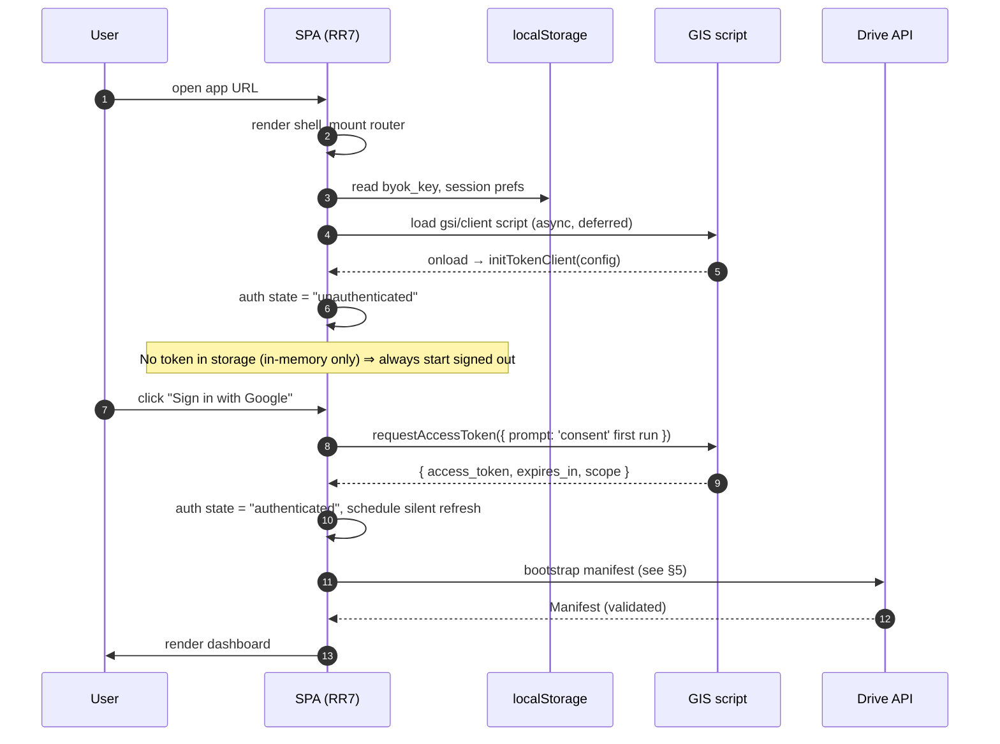
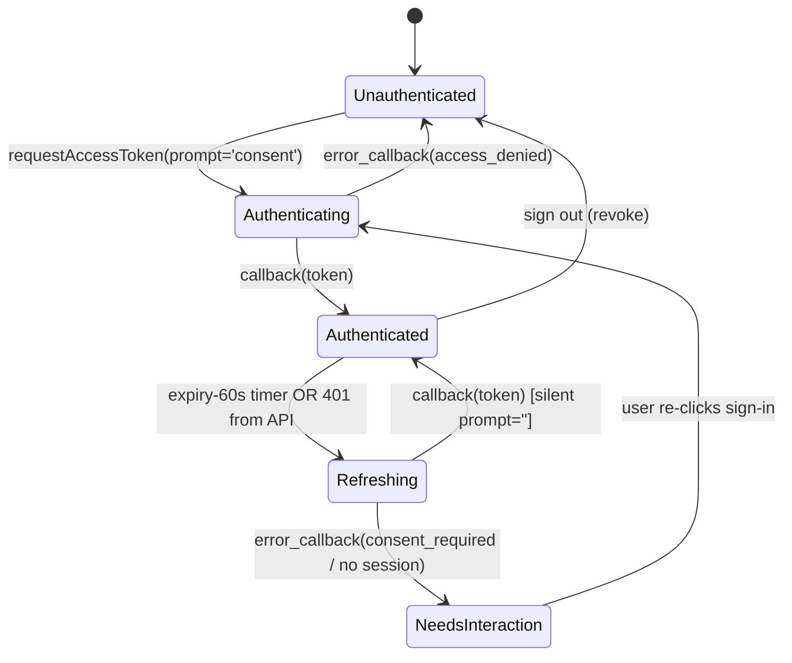
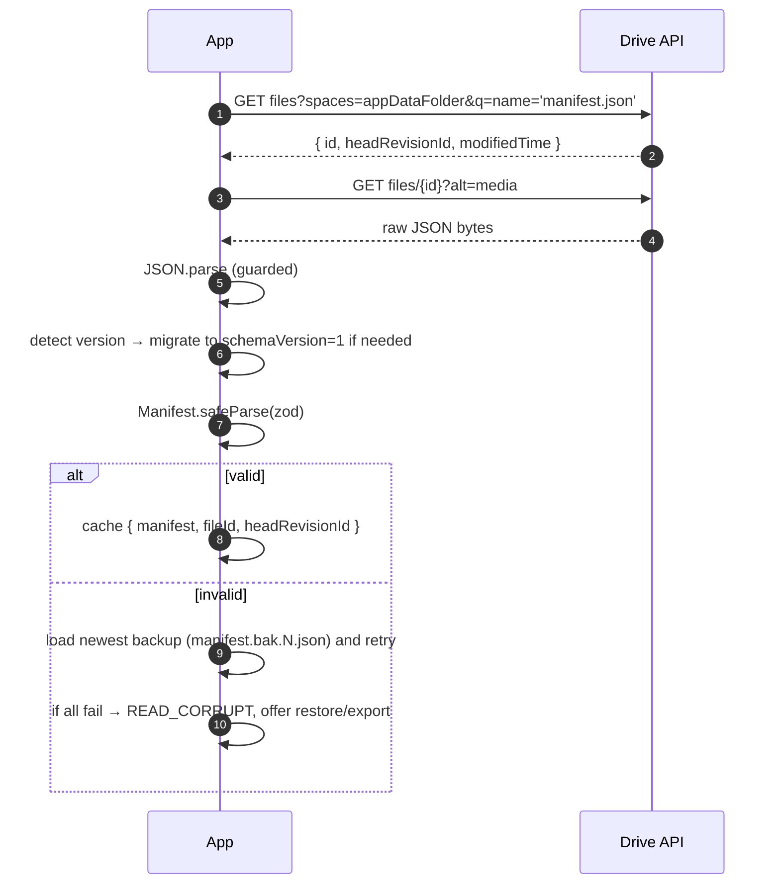
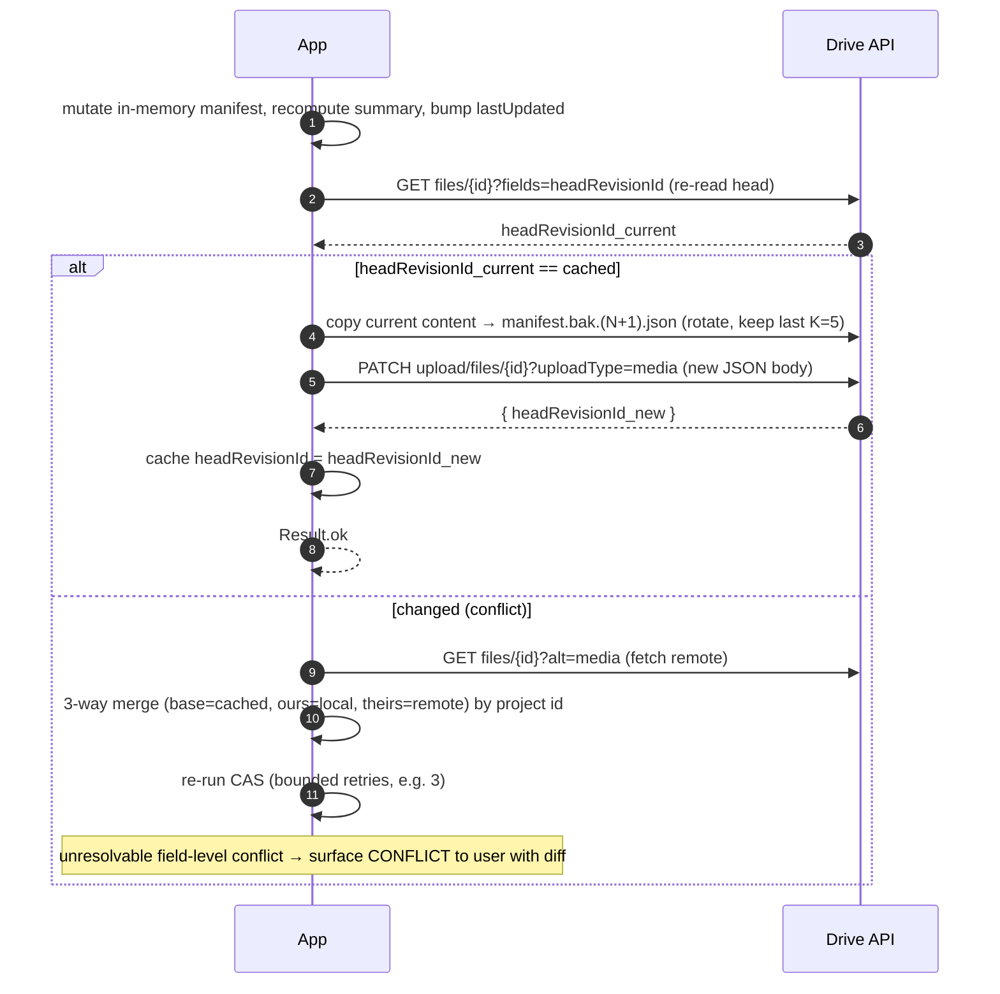
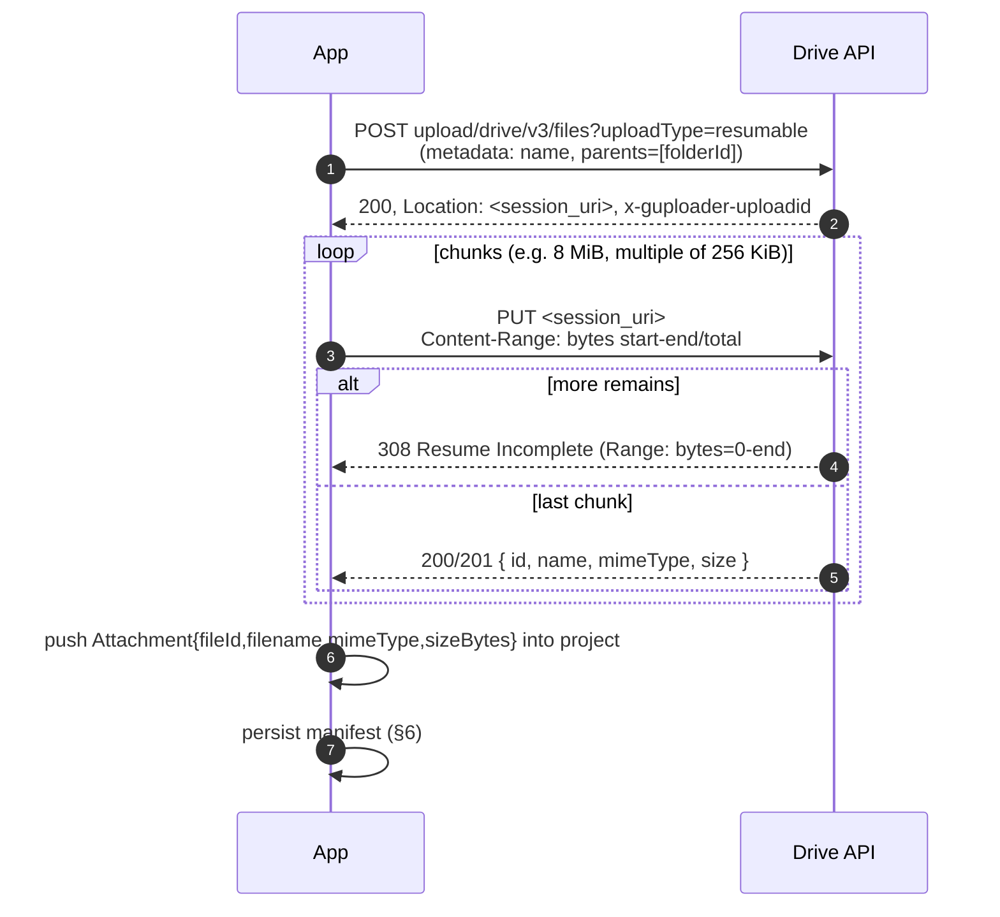
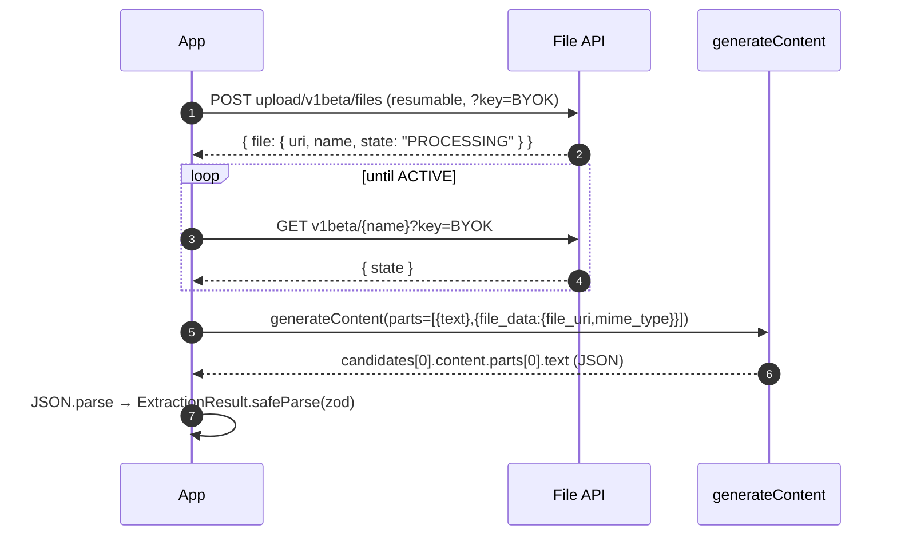
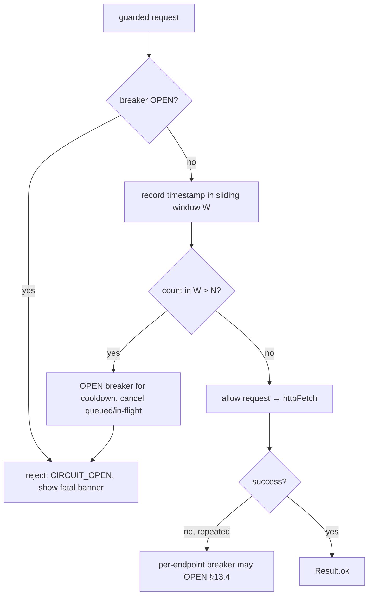

# Low-Level Design (LLD): Serverless Capital Improvements & Tax Deduction Tracker

**Status:** Draft v0.1 — companion to [`high-level-design.md`](high-level-design.md)
**Author:** Devin (on behalf of @jbisasky)
**Last updated:** 2026-06-12

> This document specifies the **granular handshaking** behind each edge of the §2 architecture
> flowchart in the HLD: exact API calls, headers, request/response shapes, ordering, retries,
> error handling, and the data contracts. It is implementation-facing. Where Google's public
> behavior is version-sensitive (GIS, Drive v3, Generative Language API), the contract is
> stated and any race/ambiguity is called out explicitly so it is handled in code, not assumed.

## Table of contents
1. [Conventions, primitives & cross-cutting concerns](#1-conventions-primitives--cross-cutting-concerns)
2. [Data contracts (TypeScript + zod)](#2-data-contracts-typescript--zod)
3. [App bootstrap sequence](#3-app-bootstrap-sequence)
4. [Auth handshake — GIS token client](#4-auth-handshake--gis-token-client)
5. [Drive: appData bootstrap & manifest read](#5-drive-appdata-bootstrap--manifest-read)
6. [Drive: manifest write (compare-and-swap + backups)](#6-drive-manifest-write-compare-and-swap--backups)
7. [Drive: attachment upload (resumable)](#7-drive-attachment-upload-resumable)
8. [AI extraction — Gemini multimodal](#8-ai-extraction--gemini-multimodal)
9. [End-to-end: "add project from a receipt"](#9-end-to-end-add-project-from-a-receipt)
10. [Error taxonomy & user messaging](#10-error-taxonomy--user-messaging)
11. [Concurrency edge cases](#11-concurrency-edge-cases)
12. [Security handshake details](#12-security-handshake-details)
13. [Runaway-usage failsafes (API/token budget protection)](#13-runaway-usage-failsafes-apitoken-budget-protection)
14. [Testing & CI](#14-testing--ci)
15. [Demo mode](#15-demo-mode)

---

## 1. Conventions, primitives & cross-cutting concerns

### 1.1 Result type (no thrown errors across layer boundaries)
Service methods return a discriminated `Result<T>` rather than throwing, so callers must handle
failure explicitly (strict TS, zero `any`).

```ts
type Ok<T> = { ok: true; value: T };
type Err<E extends AppError = AppError> = { ok: false; error: E };
type Result<T, E extends AppError = AppError> = Ok<T> | Err<E>;
```

### 1.2 Money
All monetary values are stored and computed as **integer cents** (`number` of cents) internally
to avoid floating-point drift; the JSON manifest serializes them as decimal dollars at the I/O
boundary only. See `Money` helpers in `lib/money.ts`.

### 1.3 Time
Timestamps are ISO-8601 UTC strings produced by `new Date().toISOString()`. Dates (e.g.
`completionDate`) are `YYYY-MM-DD` local-date strings with no timezone.

### 1.4 HTTP client
A single typed `httpFetch` wrapper around the **native `fetch` API** centralizes: auth header
injection, timeout (`AbortController`, default 30s), JSON (de)serialization, and mapping of HTTP
status → `AppError`. It implements the retry policy in §1.5.

> **No Axios (or any third-party HTTP client).** The browser-native `fetch` API covers every
> requirement (streaming, `AbortController`, `Headers`, `FormData` for multipart uploads).
> Adding Axios would introduce a redundant abstraction layer, extra bundle weight (~13 kB min),
> and a second set of interceptor/transform conventions to maintain. All HTTP concerns live in
> the single `httpFetch` wrapper — keeping the dependency surface minimal and the behavior
> fully visible in one place.

### 1.5 Retry & backoff policy
- **Retryable:** `408`, `429`, `500`, `502`, `503`, `504`, and network errors.
- **Strategy:** exponential backoff with full jitter, base 500 ms, factor 2, max 5 attempts,
  cap 8 s. Honor `Retry-After` header when present (overrides computed delay).
- **Never retried:** `400`, `403` (except rate-limit-shaped 403s from Google), `404`, `409`
  (conflict → domain-level resolution), `412` (precondition → CAS retry path, §6).
- **`401` is special:** triggers a single silent token refresh (§4.4), then **one** replay of
  the original request. A second `401` surfaces `AUTH_REQUIRED`.
- **Retries never self-retrigger unbounded:** the attempt cap is hard, and the whole retry path
  sits behind the runaway-usage failsafes in §13 (per-gesture budget, global breaker, per-API
  breaker), so a pathological retry/loop is contained rather than burning quota.

### 1.6 Idempotency
Mutations carry a client-generated `operationId` (UUID) recorded in an in-memory in-flight set so
double-submits (e.g. double-click) are coalesced. Drive writes are made idempotent via the
compare-and-swap precondition in §6.

---

## 2. Data contracts (TypeScript + zod)

Runtime validation (`zod`) guards **every** untrusted boundary: Drive file contents and Gemini
output. Parsing failure is a first-class `Result` error, never a crash.

```ts
import { z } from "zod";

export const Attachment = z.object({
  fileId: z.string().min(1),
  filename: z.string().min(1),
  mimeType: z.string().min(1),
  sizeBytes: z.number().int().nonnegative(),
});

export const TaxTreatment = z.enum([
  "capital_improvement", "repair", "deductible", "credit", "unknown",
]);

export const Project = z.object({
  id: z.string().uuid(),
  title: z.string().min(1),
  completionDate: z.string().regex(/^\d{4}-\d{2}-\d{2}$/),
  totalCost: z.number().nonnegative(),          // dollars at I/O boundary
  taxTreatment: TaxTreatment,
  costBasisAdjustment: z.number().nonnegative(),
  deductibleAmount: z.number().nonnegative(),
  irsJustification: z.string(),
  confidence: z.number().min(0).max(1),
  attachments: z.array(Attachment),
  createdAt: z.string().datetime(),
  updatedAt: z.string().datetime(),
});

export const Manifest = z.object({
  schemaVersion: z.literal(1),
  lastUpdated: z.string().datetime(),
  summary: z.object({
    totalCostBasisAdded: z.number().nonnegative(),
    totalDeductible: z.number().nonnegative(),
  }),
  projects: z.array(Project),
});

export type Manifest = z.infer<typeof Manifest>;
export type Project = z.infer<typeof Project>;
```

The AI extraction output uses a **separate, looser** schema (the model never writes ids/timestamps;
those are app-assigned after the human-review step):

```ts
export const ExtractionResult = z.object({
  title: z.string().min(1),
  completionDate: z.string().regex(/^\d{4}-\d{2}-\d{2}$/).nullable(),
  totalCost: z.number().nonnegative().nullable(),
  suggestedTreatment: TaxTreatment,
  costBasisAdjustment: z.number().nonnegative().nullable(),
  deductibleAmount: z.number().nonnegative().nullable(),
  irsJustification: z.string(),
  vendor: z.string().nullable(),
  confidence: z.number().min(0).max(1),
});
```

---

## 3. App bootstrap sequence



Key invariants:
- The token is **never** read from or written to storage; a refresh always starts cold.
- The BYOK key *is* read from `localStorage` at boot (unless session-only mode is active).
- Manifest bootstrap is gated on a valid token; if absent, the UI shows the signed-out state.

---

## 4. Auth handshake — GIS token client

### 4.1 Initialization
```ts
const tokenClient = google.accounts.oauth2.initTokenClient({
  client_id: GOOGLE_CLIENT_ID,
  scope: [
    "https://www.googleapis.com/auth/drive.appdata",
    "https://www.googleapis.com/auth/drive.file",
  ].join(" "),
  prompt: "",                 // default to silent; escalate per call
  callback: onTokenResponse,  // success path
  error_callback: onTokenError,
});
```

### 4.2 Token response contract
On success GIS invokes `callback` with:
```jsonc
{
  "access_token": "ya29....",
  "token_type": "Bearer",
  "expires_in": 3599,          // seconds (~1h); NO refresh_token in this flow
  "scope": "...drive.appdata ...drive.file"
}
```
We store in memory: `{ accessToken, grantedScopes: Set<string>, expiresAt: Date.now() + (expires_in-60)*1000 }`.
The 60 s safety margin triggers refresh *before* hard expiry.

### 4.3 Auth state machine


### 4.4 Silent refresh
- A timer fires at `expiresAt - now`. It calls `tokenClient.requestAccessToken({ prompt: "" })`.
- If the Google session is alive and consent already granted → new token via `callback`, no UI.
- If GIS calls `error_callback` with a recoverable reason (e.g. `interaction_required`) → state →
  `NeedsInteraction`; in-flight API calls are parked and a non-blocking "session expired, click to
  continue" affordance is shown.
- **Scope verification:** after every token response, assert all required scopes are present in
  `scope`; partial grants (user unchecked a box) → `INSUFFICIENT_SCOPE` with a re-consent CTA.

### 4.5 Sign-out
```ts
google.accounts.oauth2.revoke(accessToken, () => { /* clear in-memory auth */ });
```
Revocation is best-effort; local state is cleared regardless.

### 4.6 Mid-operation 401 handling (interaction with §1.5)
```mermaid
sequenceDiagram
    autonumber
    participant Svc as Drive/Gemini Service
    participant H as httpFetch
    participant Auth as Auth module
    participant API as Google API

    Svc->>H: request(withAuth)
    H->>API: GET/POST ... Authorization: Bearer <token>
    API-->>H: 401 Unauthorized
    H->>Auth: ensureFreshToken()
    Auth->>Auth: silent requestAccessToken(prompt='')
    alt refresh ok
        Auth-->>H: new token
        H->>API: replay original request (once)
        API-->>H: 200 OK
        H-->>Svc: Result.ok
    else refresh fails
        Auth-->>H: AUTH_REQUIRED
        H-->>Svc: Result.err(AUTH_REQUIRED)
        Note over Svc: operation parked; UI prompts re-auth, then resumes
    end
```

---

## 5. Drive: appData bootstrap & manifest read

The index (`manifest.json`) lives in the hidden `appDataFolder`; attachments live in a visible
folder (§7). Bootstrap resolves or creates the manifest, then downloads + validates + migrates.

### 5.1 Locate the manifest
```http
GET https://www.googleapis.com/drive/v3/files
      ?spaces=appDataFolder
      &q=name = 'manifest.json' and trashed = false
      &fields=files(id,name,headRevisionId,modifiedTime,size,md5Checksum)
Authorization: Bearer <token>
```
- 0 results → first run; create (§5.3).
- 1 result → capture `{ fileId, headRevisionId, modifiedTime }` as the **read token** for CAS.
- >1 results → anomaly (duplicate manifests). Resolution: pick the most recently `modifiedTime`,
  log `MANIFEST_DUPLICATE`, and surface a one-time repair prompt (merge + delete extras).

### 5.2 Download + validate + migrate


Migration is a forward-only registry keyed by detected shape:
```ts
const migrations: Record<string, (raw: unknown) => Manifest> = {
  "legacy-1.0": migrateLegacyV1ToV1, // splits totalDeductions, maps taxDeductibleAmount→deductibleAmount, treatment='unknown'
};
```

### 5.3 First-run create
```http
POST https://www.googleapis.com/upload/drive/v3/files?uploadType=multipart
Authorization: Bearer <token>
Content-Type: multipart/related; boundary=...

--...
Content-Type: application/json; charset=UTF-8
{ "name": "manifest.json", "parents": ["appDataFolder"], "mimeType": "application/json" }
--...
Content-Type: application/json
{ "schemaVersion": 1, "lastUpdated": "<now>", "summary": {"totalCostBasisAdded":0,"totalDeductible":0}, "projects": [] }
--...--
```
Response yields the new `fileId` + `headRevisionId`, cached for subsequent CAS writes.

---

## 6. Drive: manifest write (compare-and-swap + backups)

> **Important Drive caveat:** Drive API v3 does not expose a transactional conditional-write on
> file *content*. We therefore implement an application-level **compare-and-swap (CAS)** using
> `headRevisionId`: re-read the head revision immediately before writing and abort if it changed
> since our cached read token. A small race window remains between the check and the update; it is
> acceptable for a single-user app across a few devices, and is further mitigated by backups and
> a retry/merge loop. (If stronger guarantees are ever needed, move to a per-write lock file or a
> monotonically increasing `revision` field validated server-side via an Apps Script — out of
> scope for v1.)

### 6.1 Write protocol


### 6.2 Backup rotation
- Before each successful write, the **current** remote content is duplicated to
  `manifest.bak.{n}.json` in `appDataFolder` (Drive `files.copy` or re-upload).
- Keep the most recent `K = 5`; delete older `.bak.` files. Backups are validated on creation.

### 6.3 Merge rules (conflict)
- Project set is keyed by `id`. Adds from both sides union. 
- A project present on both sides: take the one with the newer `updatedAt`; if equal but differing,
  mark `CONFLICT` and present a field-level diff (no silent data loss).
- `summary` is **derived**, always recomputed post-merge (never merged directly).

---

## 7. Drive: attachment upload (resumable)

Attachments use the **resumable** upload protocol (robust to flaky mobile networks) into a
user-visible folder created/owned by the app via `drive.file`.

### 7.1 Ensure the visible folder
On first attachment: look up (or create) a folder named e.g. `Capital Improvements (App Data)`:
```http
POST https://www.googleapis.com/drive/v3/files
{ "name": "Capital Improvements (App Data)", "mimeType": "application/vnd.google-apps.folder" }
```
Cache the folder id in the manifest (`settings.attachmentsFolderId`, added to schema) so it is
discoverable across devices.

### 7.2 Resumable handshake

- **Resume after interruption:** query the session URI with `Content-Range: bytes */total` to get
  the last received byte (via `Range` header in the `308`), then continue.
- **Cleanup on cancel:** `DELETE <session_uri>` aborts the session.
- A file is only referenced in the manifest **after** the upload returns a final `fileId`, so a
  failed upload never leaves a dangling reference.

---

## 8. AI extraction — Gemini multimodal

Direct browser → `generativelanguage.googleapis.com` using the BYOK key. Small docs go inline;
large docs use the File API.

### 8.1 Decision: inline vs File API
- If `sizeBytes <= 15 MiB` (conservative vs the ~20 MiB request cap) → inline base64.
- Else → upload via File API first, reference by `file_uri`.

### 8.2 Inline extraction request
```http
POST https://generativelanguage.googleapis.com/v1beta/models/gemini-2.5-flash:generateContent?key=<BYOK>
Content-Type: application/json

{
  "contents": [{
    "role": "user",
    "parts": [
      { "text": "<extraction prompt: classify treatment per IRS Pub 523, return JSON>" },
      { "inline_data": { "mime_type": "application/pdf", "data": "<base64>" } }
    ]
  }],
  "generationConfig": {
    "temperature": 0,
    "response_mime_type": "application/json",
    "response_schema": { /* JSON-schema mirror of ExtractionResult */ }
  }
}
```

### 8.3 File API path (large docs)


### 8.4 Response handling
- Read `candidates[0].content.parts[0].text`; `JSON.parse`; `ExtractionResult.safeParse`.
- On `finishReason !== "STOP"` (e.g. `SAFETY`, `MAX_TOKENS`) → `EXTRACTION_INCOMPLETE`, fall back
  to manual entry with the raw text shown.
- `confidence` from the model is advisory; the UI **always** routes through human review (§9) —
  no extracted dollar amount is persisted without explicit user confirmation (decision C8).
- **Errors:** `400 API_KEY_INVALID` → settings CTA; `429 RESOURCE_EXHAUSTED` → backoff + "quota"
  message; `403` → key-permission message. The BYOK key is never logged.

---

## 9. End-to-end: "add project from a receipt"

```mermaid
sequenceDiagram
    autonumber
    participant U as User
    participant App
    participant Gem as Gemini
    participant Drive as Drive API

    U->>App: choose file(s)
    App->>App: validate type/size; preview
    App->>Gem: extract (inline or File API, §8)
    Gem-->>App: ExtractionResult (validated)
    App->>U: REVIEW screen (prefilled, confidence badges, editable)
    U->>App: correct fields, confirm treatment, submit
    App->>App: assign id, createdAt/updatedAt; build Project
    App->>Drive: resumable upload attachment(s) (§7) → fileId(s)
    App->>Drive: manifest CAS write (§6) with new project
    Drive-->>App: ok (headRevisionId_new)
    App->>App: recompute summary; update cache
    App->>U: success; project appears in list
    Note over App,Drive: If CAS conflict → merge+retry; if upload fails → no manifest ref written
```

Ordering rationale: **attachments first, manifest last.** This guarantees the manifest never
references a `fileId` that doesn't exist. If the manifest write ultimately fails after a
successful upload, the orphaned Drive file is recorded in an in-memory "pending GC" list and
cleaned up (or reconciled) on next successful manifest load.

---

## 10. Error taxonomy & user messaging

| `AppError.code` | Origin | Retry? | User-facing message / action |
| --- | --- | --- | --- |
| `NETWORK` | fetch/timeout | yes (§1.5) | "Connection issue — retrying…" |
| `AUTH_REQUIRED` | 2× 401 / refresh fail | no | "Session expired — sign in to continue" |
| `INSUFFICIENT_SCOPE` | partial consent | no | "Re-grant Drive access" (re-consent) |
| `READ_CORRUPT` | zod parse fail (+backups fail) | no | "Couldn't read your data — restore backup / export" |
| `MANIFEST_DUPLICATE` | >1 manifest | no | one-time repair flow |
| `CONFLICT` | CAS unresolved | manual | field-level diff, user picks |
| `UPLOAD_FAILED` | resumable error | yes | "Upload failed — retry" |
| `EXTRACTION_INCOMPLETE` | finishReason≠STOP | no | "Couldn't read this doc — enter manually" |
| `API_KEY_INVALID` | Gemini 400 | no | "Check your AI Studio key in Settings" |
| `QUOTA` | 429 | backoff | "AI quota reached — try later" |
| `DRIVE_QUOTA` | Drive 403 storage | no | "Your Google Drive is full" |
| `LOOP_GUARD_TRIPPED` | per-gesture budget (§13.2) | no | "Something looped unexpectedly — action stopped" (diagnostics) |
| `CIRCUIT_OPEN` | global/endpoint breaker (§13.3–4) | after cooldown + manual resume | "Paused requests to protect your quota — resume?" |
| `RATE_LIMITED_LOCAL` | token bucket (§13.4) | auto (delayed) | usually silent; brief "slowing down" if sustained |
| `AI_BUDGET_EXCEEDED` | spend budget (§13.5) | next reset / override | "Daily AI limit reached — raise limit or try tomorrow" |

Every `AppError` carries `{ code, httpStatus?, cause?, operationId? }`; user messages never leak
tokens, keys, or raw payloads.

---

## 11. Concurrency edge cases

- **Two devices editing simultaneously:** both pass the initial read; one writes first and bumps
  `headRevisionId`; the second's pre-write re-read detects the change → merge path (§6.3).
- **Tab refresh mid-write:** token is in-memory, so a refresh aborts the in-flight op; nothing is
  half-written because the manifest write is a single atomic Drive update (content replaced wholly).
- **Attachment uploaded but manifest write fails:** orphan tracked in pending-GC (see §9).
- **Clock skew between devices:** `updatedAt` ties are resolved by surfacing a conflict rather than
  trusting wall-clock ordering.
- **Backup write fails but main write would succeed:** abort the write (fail-safe: never lose the
  prior good state) and report `UPLOAD_FAILED`.

---

## 12. Security handshake details

- **Token:** in memory only; injected as `Authorization: Bearer` per request; never persisted,
  logged, or placed in URLs.
- **BYOK key:** sent only as the `?key=` query param to `generativelanguage.googleapis.com` over
  HTTPS; redacted from all logs/telemetry; session-only mode keeps it out of `localStorage`.
- **CSP (Cloudflare `_headers`):** `default-src 'self'`; `connect-src` limited to
  `https://www.googleapis.com https://generativelanguage.googleapis.com https://accounts.google.com`;
  `script-src 'self' https://accounts.google.com/gsi/client`; `frame-src https://accounts.google.com`;
  `object-src 'none'`; `base-uri 'self'`; plus HSTS and `X-Content-Type-Options: nosniff`.
- **No third-party scripts** beyond Google Identity Services; dependencies pinned (longevity).
- **Scope minimization:** `drive.file` (not full `drive`) so the app can only see files it created.

---

## 13. Runaway-usage failsafes (API/token budget protection)

A bug — a bad `useEffect` dependency array, a render loop, a retry that re-triggers itself, an
event handler firing in a tight loop — can hammer the Drive or Gemini endpoints and burn quota
(or, for Gemini, real tokens/$) in seconds. Because there is **no backend to throttle on our
behalf**, all guards live in the client, layered defense-in-depth, and are complemented by
**provider-side quotas** the owner configures. **No raw `fetch` to a Google endpoint is allowed
outside the guarded `httpFetch` pipeline** (enforced by lint rule + code review), so every call
passes through these checks.

### 13.1 Guard layers (summary)

| # | Guard | Scope | Trips when | Effect |
| --- | --- | --- | --- | --- |
| 1 | **Per-gesture call budget** | per user action | calls for one gesture exceed `K` (e.g. 8) | abort gesture, log `LOOP_GUARD_TRIPPED` (this is the primary anti-loop net) |
| 2 | **Global frequency breaker** | whole app | > `N` calls within window `W` (e.g. 30 calls / 10 s) | open circuit, halt all outbound calls for cooldown, show fatal banner |
| 3 | **Token-bucket rate limiter** | per API (Drive, Gemini, FileAPI) | sustained rate exceeds refill | queue/delay or reject with `RATE_LIMITED_LOCAL` |
| 4 | **Per-endpoint circuit breaker** | per API | `F` consecutive failures (e.g. 5) | open for cooldown `C`, then half-open probe |
| 5 | **Retry cap** (see §1.5) | per request | attempts > 5 | stop; never self-retrigger |
| 6 | **Idempotency / in-flight dedup** (see §1.6) | per operation | same `operationId` already running | coalesce, no new call |
| 7 | **Daily + session spend/quota budget** | per app, persisted | calls or estimated tokens exceed cap | block further AI calls until reset / user override |
| 8 | **AbortController on unmount/nav** | per component | route change / unmount | cancel in-flight, prevent zombie loops |

### 13.2 Per-gesture call budget (primary anti-loop net)
Every user-initiated action runs inside a `withCallBudget(label, K, fn)` scope. Each guarded
request decrements a counter bound to the current gesture via async context. Exceeding `K`
indicates a logic bug (a loop), not legitimate use, so the whole gesture is aborted and surfaced.

```ts
const r = await withCallBudget("extractReceipt", 8, async () => {
  // any guarded API calls here share the budget of 8
});
// if budget exceeded → Result.err(LOOP_GUARD_TRIPPED), nothing further is sent
```

This directly contains the classic React failure mode where a component re-renders and re-fires a
request every render: the budget is exhausted almost immediately and the cascade stops instead of
running unbounded.

### 13.3 Global frequency circuit breaker
A process-wide sliding-window counter trips a hard kill-switch if call frequency is implausibly
high regardless of source.



When the global breaker opens it is **sticky**: it requires either the cooldown to elapse *and* a
manual user "resume" click (so a runaway loop can't immediately re-trip in a tight cycle). The
event is logged with the recent call stack/labels to aid debugging.

### 13.4 Per-endpoint circuit breaker + token bucket
- **Token bucket** per API: e.g. Gemini bucket = capacity 5, refill 1/2 s; Drive bucket =
  capacity 10, refill 2/s. Requests take a token or wait (bounded) / reject.
- **Circuit breaker** per API: after `F` consecutive failures → `OPEN` for cooldown `C` (e.g.
  30 s), then `HALF_OPEN` allows a single probe; success → `CLOSED`, failure → `OPEN` again.
  This prevents retry storms against a failing endpoint.

### 13.5 Spend / token budget (Gemini specifically)
Gemini responses include `usageMetadata` (`promptTokenCount`, `candidatesTokenCount`,
`totalTokenCount`). We accumulate:
- a **session counter** (in memory) and a **rolling daily counter** (persisted in `localStorage`,
  keyed by UTC date), for both *request count* and *estimated tokens*.
- Configurable caps (sane defaults, editable in Settings), e.g. `maxAiCallsPerDay`,
  `maxAiTokensPerDay`, `maxAiCallsPerSession`.
- On reaching a cap → `AI_BUDGET_EXCEEDED`: further extractions are blocked with a clear message
  and an explicit, deliberate "raise limit / override for today" action (no silent bypass).

```ts
interface UsageBudget {
  maxAiCallsPerSession: number;   // e.g. 50
  maxAiCallsPerDay: number;       // e.g. 200
  maxAiTokensPerDay: number;      // e.g. 2_000_000
}
```

### 13.6 Provider-side limits (defense in depth — owner configures)
Client guards can be bypassed by a determined bug or a tampered build, so the **authoritative**
ceiling is set at Google:
- **AI Studio / Generative Language API quotas:** set requests-per-minute and requests-per-day
  limits on the project/key in the Google Cloud console (Quotas page). The free tier already
  enforces RPM/RPD caps; explicit lower caps add headroom safety.
- **API key restrictions:** restrict the BYOK key to the Generative Language API only, and add an
  **HTTP referrer restriction** to the app's domain(s) so a leaked key can't be used elsewhere.
- **Drive API quotas:** Drive enforces per-user rate limits; our backoff (§1.5) + breaker (§13.4)
  cooperate with `429`/`403 rateLimitExceeded` responses rather than fighting them.
- These steps are in the runbook [`docs/google-cloud-setup.md`](google-cloud-setup.md).

### 13.7 Observability
Every trip (`LOOP_GUARD_TRIPPED`, `CIRCUIT_OPEN`, `AI_BUDGET_EXCEEDED`, `RATE_LIMITED_LOCAL`) is
recorded to an in-app diagnostics log (ring buffer) with timestamp, label, and counters, viewable
in Settings → Diagnostics. This makes a runaway-loop bug obvious and debuggable after the fact
without external telemetry.

---

## 14. Testing & CI

Two tools cover the full testing pyramid: **Vitest** (unit / component) and **Playwright** (E2E).
Both run in a single GitHub Actions workflow on every push and PR.

### 14.1 Test pyramid overview

| Layer | Tool | Scope | Location | Runs against |
| --- | --- | --- | --- | --- |
| Unit | Vitest | Pure functions, domain logic, utilities | Colocated `*.test.ts` next to source | In-process (no browser) |
| Component | Vitest + Testing Library | React components in isolation | Colocated `*.test.tsx` next to source | jsdom / happy-dom |
| E2E | Playwright | Full user flows across pages | `e2e/*.spec.ts` (top-level) | Real browser against dev server |

### 14.2 Vitest — unit & component tests

Vitest shares the Vite config (`vite.config.ts`), so path aliases, TypeScript transforms, and
plugins work without extra setup.

```ts
// vitest.config.ts (extends vite.config.ts)
import { defineConfig, mergeConfig } from "vitest/config";
import viteConfig from "./vite.config";

export default mergeConfig(viteConfig, defineConfig({
  test: {
    globals: true,
    environment: "jsdom",
    include: ["src/**/*.test.{ts,tsx}"],
    coverage: {
      provider: "v8",
      include: ["src/**"],
      exclude: ["src/**/*.test.*", "src/test/**"],
    },
  },
}));
```

**What to unit-test (high value):**
- `src/domain/` — tax-treatment logic, cost-basis calculations, IRS rules. These are pure
  functions with well-defined inputs/outputs.
- `src/lib/money.ts` — integer-cents ↔ decimal-dollar conversions, rounding.
- `Result` helpers — mapping, chaining, error narrowing.
- Zod schemas (`§2`) — round-trip parse/serialize, reject malformed input.
- Retry/backoff logic (`§1.5`) — deterministic with a fake clock.
- Budget/circuit-breaker state machines (`§13`) — transition coverage.

**What to component-test:**
- Forms (add/edit project) — field validation, `taxTreatment` driving which amount fields
  are emphasized, zod error surfacing.
- AI extraction review — confidence badges render, editing a field clears the AI marker.
- State coverage (`§7 matrix`) — loading/empty/error states render the correct UI.

**Mocking strategy (unit/component):**
- Google APIs (Drive, GIS) → mock at the `httpFetch` wrapper boundary (`vi.mock`);
  never call real Google endpoints in unit tests.
- Gemini API → mock `extractFromDocument` service; feed canned extraction responses.
- `localStorage` → use Vitest's jsdom environment (provides `localStorage` natively).

### 14.3 Playwright — E2E tests

Playwright drives a real Chromium browser against the Vite dev server. Tests exercise full
user flows as described in the UI/UX design doc §6.

```ts
// playwright.config.ts
import { defineConfig } from "@playwright/test";

export default defineConfig({
  testDir: "e2e",
  use: {
    baseURL: "http://localhost:5173",
    screenshot: "only-on-failure",
    trace: "retain-on-failure",
  },
  webServer: {
    command: "npm run dev",
    port: 5173,
    reuseExistingServer: !process.env.CI,
  },
  projects: [
    { name: "chromium", use: { browserName: "chromium" } },
  ],
});
```

**E2E test inventory (maps to UI/UX §6 flows):**

| Spec file | Flow | Key assertions |
| --- | --- | --- |
| `landing.spec.ts` | Sign-in page loads, Google button visible | Privacy bullets, disclaimer present |
| `onboarding.spec.ts` | First-run → BYOK prompt → empty dashboard | Guided state, AI features gated without key |
| `add-from-receipt.spec.ts` | Upload → AI extract → review → save | Fields prefilled, confidence shown, saved to project list |
| `add-manual.spec.ts` | Manual form entry → save | Validation fires, project appears in list |
| `project-crud.spec.ts` | Create, read, update, delete | List updates, detail view correct, delete confirms |
| `settings.spec.ts` | BYOK entry, budget config, theme toggle | Key masked, test ping, budget limits persist |
| `export.spec.ts` | Export manifest / CSV | Download triggers with correct content |
| `error-states.spec.ts` | Auth expiry, Drive conflict, AI budget exceeded | Banners/dialogs render, recovery actions work |

**Mocking external APIs in E2E:**

Since the app is 100% client-side, all external calls (Google OAuth, Drive, Gemini) are
intercepted at the network level using Playwright's `page.route()`:

```ts
// e2e/fixtures/mock-google.ts
await page.route("**/googleapis.com/drive/**", (route) => {
  route.fulfill({ json: mockDriveResponse });
});
await page.route("**/generativelanguage.googleapis.com/**", (route) => {
  route.fulfill({ json: mockGeminiExtraction });
});
```

This keeps E2E tests deterministic, fast, and free of real API credentials in CI.

### 14.4 GitHub Actions CI workflow

```yaml
# .github/workflows/ci.yml
name: CI
on: [push, pull_request]

jobs:
  lint-and-typecheck:
    runs-on: ubuntu-latest
    steps:
      - uses: actions/checkout@v4
      - uses: actions/setup-node@v4
        with: { node-version: 20, cache: npm }
      - run: npm ci
      - run: npm run lint
      - run: npm run typecheck

  unit:
    runs-on: ubuntu-latest
    steps:
      - uses: actions/checkout@v4
      - uses: actions/setup-node@v4
        with: { node-version: 20, cache: npm }
      - run: npm ci
      - run: npx vitest run --coverage
      - uses: actions/upload-artifact@v4
        if: always()
        with:
          name: coverage-report
          path: coverage/

  e2e:
    runs-on: ubuntu-latest
    steps:
      - uses: actions/checkout@v4
      - uses: actions/setup-node@v4
        with: { node-version: 20, cache: npm }
      - run: npm ci
      - run: npx playwright install --with-deps chromium
      - run: npx playwright test
      - uses: actions/upload-artifact@v4
        if: always()
        with:
          name: playwright-report
          path: playwright-report/
          retention-days: 30
```

All three jobs run in parallel. PR merge requires all to pass (branch protection rule).

### 14.5 Test file conventions

- **Unit/component tests** live next to the file they test: `src/domain/tax.ts` →
  `src/domain/tax.test.ts`. This makes coverage gaps obvious at a glance.
- **E2E tests** live in a top-level `e2e/` directory since they span multiple routes/components.
- **Test utilities and fixtures** (mock data, helpers) live in `src/test/` (for Vitest) and
  `e2e/fixtures/` (for Playwright).
- Naming: `*.test.ts` for Vitest, `*.spec.ts` for Playwright — keeps the two layers
  unambiguous and allows separate glob patterns.

### 14.6 What is NOT tested (and why)

- **Real Google OAuth flow** — GIS consent is an interactive redirect to `accounts.google.com`;
  not feasible to automate without test account credentials. Mocked in E2E.
- **Real Gemini API calls in CI** — would require a BYOK key as a CI secret and would be
  non-deterministic (model output varies). Mocked with canned responses.
- **Contract tests** — overkill for a single SPA calling stable third-party APIs (Google Drive v3,
  Generative Language API). The mock shapes in E2E serve as de-facto consumer contracts;
  breaking changes from Google are caught by version-pinned API paths and release notes.

---

## 15. Demo mode

The landing page offers a **"See a demo"** button (HLD D14) that drops the user into a
read-only sandbox with no authentication required. This section specifies how it works.

### 15.1 Activation & routing

Clicking "See a demo" navigates to `/demo/dashboard`. All `/demo/*` routes mirror the
authenticated routes (`/dashboard`, `/projects`, `/projects/:id`, `/settings`, `/export`) but
wrap them in a `DemoProvider` context instead of the real `AuthProvider` + `DriveProvider`.

```ts
// Simplified route structure
"/"           → Landing (sign-in + "See a demo" CTA)
"/demo/*"     → DemoShell (DemoProvider wrapping real UI components)
"/dashboard"  → AuthShell (real AuthProvider + DriveProvider)
```

### 15.2 Data layer — static fixtures

Demo mode replaces all service calls with **static fixture data** bundled at build time:

```ts
// src/demo/fixtures.ts
import type { Manifest } from "../domain/manifest";

export const DEMO_MANIFEST: Manifest = {
  schemaVersion: 1,
  lastUpdated: "2025-06-01T00:00:00.000Z",
  summary: {
    totalCostBasisAdded: 42_300,
    totalDeductible: 1_200,
  },
  projects: [
    {
      id: "demo-001",
      title: "New roof",
      completionDate: "2025-04-12",
      totalCost: 18_000,
      taxTreatment: "capital_improvement",
      costBasisAdjustment: 18_000,
      deductibleAmount: 0,
      irsJustification: "Full tear-off and replacement of existing shingle roof.",
      confidence: 0.92,
      attachments: [/* demo file stubs */],
      createdAt: "2025-04-14T10:00:00.000Z",
      updatedAt: "2025-04-14T10:00:00.000Z",
    },
    // ... 3–5 more sample projects spanning different tax treatments
  ],
};
```

### 15.3 DemoProvider context

```ts
interface DemoContext {
  isDemo: true;
  manifest: Manifest;          // DEMO_MANIFEST (read-only)
  user: { email: "demo@example.com"; name: "Demo User" };
}
```

The `DemoProvider` supplies the same context shape as the real providers, so all existing
UI components (dashboard cards, project list, detail view, settings) render identically —
they read from context and don't care whether the data came from Drive or a fixture.

**Mutations are no-ops with feedback:** Any write action (create, edit, delete, save settings)
shows a toast: *"This is a demo — sign in to save your own data."* The fixture data never
changes. The "Extract with AI" button shows a canned extraction result (pre-built fixture)
rather than calling Gemini.

### 15.4 Persistent demo banner

A sticky top banner renders on all `/demo/*` routes:

```
┌──────────────────────────────────────────────────────┐
│ 🔍 Demo mode — exploring with sample data.  [Sign in to use your own data →] │
└──────────────────────────────────────────────────────┘
```

The banner is visually distinct (e.g. light blue background) so it's never confused with a
real session. The "Sign in" link navigates back to `/`.

### 15.5 What works vs. what doesn't in demo mode

| Feature | Demo behavior |
| --- | --- |
| Dashboard summary cards | Rendered from fixture data |
| Projects list + detail | Fully browsable (read-only) |
| Search & filter | Works against fixture data |
| Add / edit / delete | Toast: "Sign in to save" |
| AI extraction | Shows canned extraction result |
| Settings (BYOK, budgets) | Viewable; changes not persisted |
| Export | Downloads the demo fixture as JSON/CSV |
| Theme toggle | Works (persisted in localStorage) |
| Sign out | Navigates back to `/` |

### 15.6 Bundle impact

The fixture data is small (~2–5 KB JSON) and tree-shaken from the authenticated code path.
No additional API clients or service logic is loaded — the demo provider short-circuits
everything.

---

## 16. Scalability & limits

A 20-year single-user app will accumulate data. This section specifies the hard limits and
graceful-degradation strategies so the app never silently breaks as data grows.

### 16.1 Manifest size

The manifest is a single JSON file in Drive. Growth is linear with project count.

| Projects | Approx manifest size | Performance impact |
| --- | --- | --- |
| 50 | ~25 KB | Negligible |
| 200 | ~100 KB | Still fast; parse < 50 ms |
| 500 | ~250 KB | Parse ~100 ms; consider lazy rendering |
| 1,000+ | ~500 KB+ | Needs virtual scrolling on list view |

**Strategy:**
- **v1 target: handles up to ~500 projects comfortably.** This covers 20 years of a typical
  homeowner doing 20–30 projects per year.
- **UI: virtual scrolling (list virtualization)** kicks in when the project list exceeds 100
  items — only DOM nodes in/near the viewport are rendered. Libraries like `@tanstack/virtual`
  or a custom IntersectionObserver approach.
- **Parse performance:** the manifest is parsed once at boot and held in memory; subsequent
  operations mutate the in-memory copy. No re-parsing per operation.
- **If >1,000 projects (unlikely):** the manifest remains a single file (simplicity), but the
  UI paginates or virtualizes. A future migration could shard by year if needed — out of v1
  scope.

### 16.2 Attachment limits

| Limit | Value | Rationale |
| --- | --- | --- |
| Max file size (single upload) | 25 MB | Google Drive's simple upload limit; resumable handles this fine. Covers high-res phone photos and multi-page PDFs. |
| Max attachments per project | 10 | Prevents accidental bulk-dump; covers receipt + photos + invoice for a single project. |
| Accepted MIME types | `image/jpeg`, `image/png`, `image/webp`, `image/heic`, `application/pdf` | Standard receipt formats. HEIC for iPhone photos. |
| Total storage | User's Google Drive quota | No app-side limit beyond Drive's own quota; `DRIVE_QUOTA` error surfaces if full. |

**Enforcement:**
- File size validated client-side before upload begins. Oversized files show an inline error:
  "File too large (max 25 MB). Try compressing or splitting the document."
- Attachment count enforced in the form — "Add attachment" button disabled at 10 with tooltip.
- MIME type validated on drop/select; unsupported types rejected with: "Unsupported file type.
  Use JPEG, PNG, WebP, HEIC, or PDF."

### 16.3 Image compression before upload

Phone cameras produce 5–12 MB photos (12+ MP). For receipts and invoices, this resolution is
overkill — the AI extraction and human review need legibility, not pixel-perfect reproduction.

**Strategy:**
- **Client-side resize before upload** using `OffscreenCanvas` (or `<canvas>` fallback):
  - If image dimension exceeds 2048 px on the longest side → resize proportionally to 2048 px.
  - Re-encode as JPEG at quality 0.85 (or WebP 0.80 if browser supports encoding).
  - Typical result: 5–10 MB photo → 200–600 KB. Dramatically faster upload and less Drive
    storage consumed.
- **Original preserved option:** a "Keep original quality" checkbox (default: off) bypasses
  compression for users who want archival-quality uploads. The AI extraction works fine on
  compressed images.
- **PDFs are NOT compressed** — passed through as-is (re-compressing PDFs is lossy and complex).
- **Progress shows post-compression size** so the user sees realistic upload estimates.

### 16.4 Browser support

| Browser | Minimum version | Notes |
| --- | --- | --- |
| Chrome / Edge (Chromium) | 90+ | Covers 99%+ of Chromium users as of 2025 |
| Firefox | 90+ | ESM, `structuredClone`, `AbortController` all stable |
| Safari | 15.4+ | WebP support, proper ESM, `structuredClone` |
| Mobile Chrome (Android) | 90+ | Same as desktop Chrome |
| Mobile Safari (iOS) | 15.4+ | Same as desktop Safari |
| IE / Legacy Edge | ❌ Not supported | No polyfills provided; modern-only |

**Rationale:** The app uses modern APIs (`fetch`, `AbortController`, `structuredClone`,
`crypto.randomUUID()`, `OffscreenCanvas`, CSS `@layer`, `has()`) that require relatively
recent browsers. Supporting older versions would require heavy polyfills, contradicting the
longevity/minimal-deps principle.

**Enforcement:** The app shell includes a one-time feature-detection check at boot. If a
required API is missing, a static fallback page renders: "This app requires a modern browser.
Please update Chrome, Firefox, or Safari to the latest version."

### 16.5 localStorage quota handling

`localStorage` has a browser-enforced limit (typically 5–10 MB per origin). The app uses it
for: BYOK key (~50 bytes), theme preference (~10 bytes), daily AI usage counters (~100 bytes),
and potentially cached manifest for offline (~250 KB typical).

**Total expected usage:** < 500 KB — well within limits even at 1,000 projects.

**Graceful degradation:**
- All `localStorage.setItem()` calls are wrapped in a try/catch. On `QuotaExceededError`:
  - **Non-critical data** (theme, counters): silently degrade to in-memory (session-only).
  - **BYOK key:** surface a warning: "Browser storage is full — key will only persist for this
    session. Clear site data or use session-only mode."
  - **Offline cache (if using localStorage for manifest):** evict the oldest cached manifest
    and retry.
- The app shall never crash or show an unhandled error due to a full `localStorage`.

---

*Companion to the HLD. As implementation proceeds, request/response examples will be reconciled
against the live Google API behavior and any deviations recorded here.*
