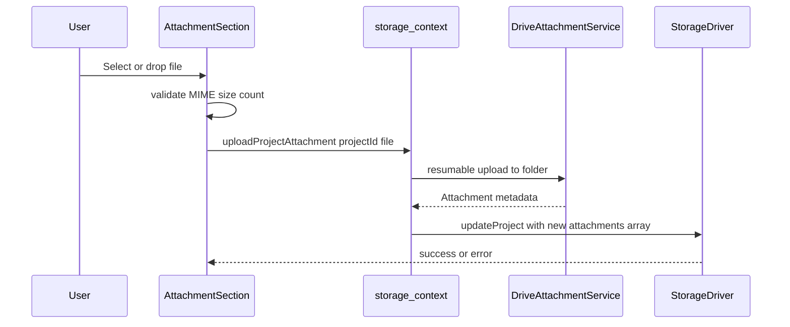

# Attachment Upload Integration (implementation plan)

**Status:** Implemented 2026-06-20 — archive when no longer needed.  
**Last updated:** 2026-06-20  
**Canonical requirements:** [`requirements-ears.md`](../requirements-ears.md) §5 (ATT-*), [`low-level-design.md`](../low-level-design.md) §7–§9, [`high-level-design.md`](../high-level-design.md) §4.4 & §7.1, [`ui-ux-design.md`](../ui-ux-design.md) §5.4 & §5.6.

---

## Problem

Attachments exist in the domain model (`src/domain/schemas.ts`) and are shown read-only on detail (`src/app/projects/detail-page.tsx`), but **no code path uploads files to Drive or writes `Attachment` metadata**. The new-project file picker in `src/app/projects/new-page.tsx` only feeds Gemini extraction and `formToProject()` always sets `attachments: []`.

After AI-only project create, detail shows “Attachments (0)” and documentation health flags missing attachments — expected until this work ships.

## Target behavior



### Upload entry points

1. **Add new project** — retain the file selected for AI extraction through review → form; on **Create Project**, upload it (and any extras) first, then save the project with `attachments: [...]`.
2. **Project detail** — inline upload zone plus **view / download / remove** on listed files (user need not open Edit).
3. **Edit project** — same shared attachment zone as add/detail (UI/UX §5.4).

## Architecture

### 1. Domain validation (pure, unit-tested)

New `src/domain/attachment-validation.ts`:

- Limits from LLD §17.2: **25 MB/file**, **10/project**, MIME whitelist (`application/pdf`, `image/jpeg`, `image/png`, `image/webp`, `image/heic`, `image/heif`)
- `validateAttachmentFile(file, currentCount)` → `Result<void>` with user-facing messages

### 2. Drive attachment service

New `src/services/drive-attachment.ts` implementing LLD §7:

- `ensureAttachmentsFolder(manifest)` → folder id; persist in manifest as `settings.attachmentsFolderId`
- `uploadAttachmentResumable(file, folderId)` → `Attachment` via Drive resumable protocol
- `getAttachmentMediaUrl(fileId)` / blob fetch for view/download
- `deleteDriveFile(fileId)` → optional cleanup on remove

**HTTP gap:** `src/services/http.ts` only handles JSON/text success paths. Add `src/services/http-raw.ts` for:

- Reading `Location` on resumable handshake
- Handling `308 Resume Incomplete` chunk responses
- Returning raw `Response` where needed

Reuse auth injection + retry patterns from `httpFetch`.

### 3. Extend storage layer

`src/services/storage-driver.ts` — add:

```ts
uploadProjectAttachment(projectId: string, file: File): Promise<Result<Manifest>>
removeProjectAttachment(projectId: string, fileId: string): Promise<Result<Manifest>>
getAttachmentBlob(projectId: string, fileId: string): Promise<Result<Blob>>
addProjectWithAttachments(project: Project, files: File[]): Promise<Result<Manifest>>
```

Implement in:

- `src/services/drive-storage-driver.ts` — real Drive I/O; **attachments-first, manifest-last** (LLD §9)
- `src/services/mock-storage-driver.ts` — in-memory `Map<fileId, Blob>` for demo view/download

`src/domain/schemas.ts` — extend `ManifestSchema`:

```ts
settings: z.object({ attachmentsFolderId: z.string().optional() }).optional()
```

Backward-compatible (optional field; no migration required).

### 4. Storage context API

`src/services/storage-context.tsx` — expose attachment methods; refresh manifest on success.

### 5. Shared UI component

New `src/app/projects/attachment-section.tsx`:

- Hidden file input + **Upload file** button (`accept` per LLD §17.2; mobile `capture="environment"` on camera button)
- List with status: uploading / uploaded / failed (inline retry per ERR-07)
- Actions: **View**, **Download**, **Remove** (confirm)
- Disabled at 10 attachments with tooltip
- Drag-and-drop with border highlight (ATT-10/11)

| Page | Mode |
|------|------|
| `new-page.tsx` | Pending files until save; includes AI `selectedFile` |
| `detail-page.tsx` | Live upload to existing project |
| `edit-page.tsx` | Live upload |

### 6. Page wiring

**New project**

- Retain `selectedFile` through review → form
- Pre-assign project `id` before upload (already via `crypto.randomUUID()` in `formToProject`)
- On submit: `addProjectWithAttachments(project, files)` where `files` = deduped `[selectedFile, ...extras]`

**Create ordering (LLD §9):**

1. Build project with pre-assigned `id`
2. Upload all pending files → `attachments[]`
3. `addProject({ ...project, attachments })` — single manifest write

**Detail / edit**

- Replace read-only list with `AttachmentSection`
- Empty state CTA: “Upload receipt or invoice”

## Implementation checklist

- [x] `attachment-validation.ts` + unit tests
- [x] `http-raw.ts` + `drive-attachment.ts` + unit tests
- [x] Extend `StorageDriver`, Manifest schema, Drive + Mock drivers, storage-context
- [x] `AttachmentSection` component + component test
- [x] Wire `new-page`, `detail-page`, `edit-page`
- [x] Test report: `docs/test-reports/attachment-upload.md`

## Deferred (follow-up PRs)

- Client-side image compression (LLD §17.3)
- Upload resume after browser tab kill (ATT-03 — basic resumable only in v1)
- Pending-GC orphan cleanup (ATT-07)

## Success criteria

- Create project from AI-scanned PDF → detail shows **Attachments (1)** with the same filename
- Detail page: user can upload without visiting Edit
- Doc health no longer flags missing attachments when ≥1 exists
- Demo mode (`/demo`) view/download via mock driver
- Signed-in mode uploads to Drive folder `"Capital Improvements (App Data)"`

## Key files

| File | Change |
|------|--------|
| `src/domain/schemas.ts` | Optional `manifest.settings.attachmentsFolderId` |
| `src/domain/attachment-validation.ts` | **New** |
| `src/services/storage-driver.ts` | Attachment methods |
| `src/services/drive-attachment.ts` | **New** |
| `src/services/http-raw.ts` | **New** |
| `src/services/drive-storage-driver.ts` | Delegate attachment ops |
| `src/services/mock-storage-driver.ts` | In-memory blob store |
| `src/services/storage-context.tsx` | Context methods |
| `src/app/projects/attachment-section.tsx` | **New** |
| `src/app/projects/new-page.tsx` | Persist AI file + extras |
| `src/app/projects/detail-page.tsx` | Upload + view/download/remove |
| `src/app/projects/edit-page.tsx` | Attachment zone |
