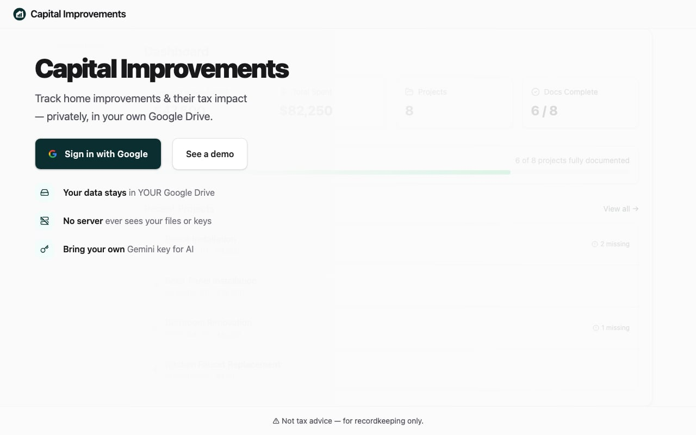
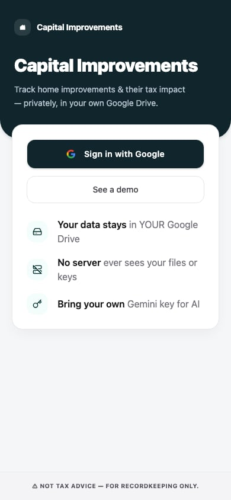

# Test Report: Harden A11y Follow-ups

**Tested locally** against `http://localhost:5173/` with Playwright Chromium.

## Changes under test

1. Lazy-route axe waits for projects/settings `h1` before `AxeBuilder.analyze()`
2. PR CI `e2e` job runs full local Playwright suite (`testIgnore` excludes `production-smoke.spec.ts`)
3. Attachment section heading `h3` → `h2` (heading order)
4. Desktop viewport auth/landing coverage restored alongside mobile-scoped tests
5. `AppShell` `<main>` is a flex column so `PageContentLoader` centers
6. `.cursor/` added to `.gitignore`; plan artifacts removed from the tree

## Results

### Unit / static

| Check | Result |
| --- | --- |
| `npx vitest run src/app/projects/attachment-section.test.tsx src/hooks/use-media-query.test.ts` | 7/7 passed |
| `npm run check` (typecheck + lint) | passed |

### Playwright (chromium)

| Suite | Result |
| --- | --- |
| `e2e/auth.spec.ts` | 14/14 passed (desktop + mobile A1/A2/A5) |
| `e2e/landing.spec.ts` | 9/9 passed (desktop + mobile demo/sign-in + axe) |
| `e2e/projects.spec.ts` | 13/13 passed (axe waits on list/detail/new) |
| `e2e/settings.spec.ts` | 14/14 passed (axe wait on Settings h1) |
| **Total targeted** | **50/50 passed** |

`npx playwright test --list` → **202 tests in 9 files** (no `production-smoke.spec.ts`).

## Evidence

### Desktop landing (responsive CTAs via `getByRole`)

### Mobile landing (scoped to `landing-mobile-card`)

## CI note

`.github/workflows/ci.yml` `e2e` job now runs `npx playwright test --reporter=list` with `VITE_GOOGLE_CLIENT_ID` set. Production smoke remains a separate job gated to `push` on `main` via `playwright.production.config.ts`.
