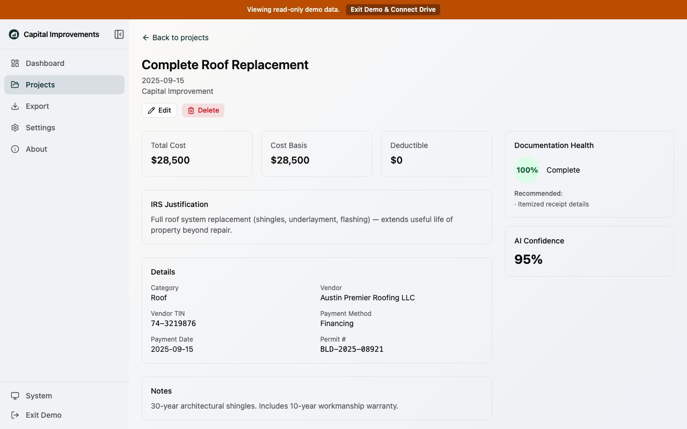

# Test Report: Semantic HTML landmark fixes

**Tested locally** against `http://localhost:5173/` with Playwright Chromium.

## Changes under test

1. Fixed mismatched JSX in project detail (`<section>` closed with `
`), which broke the Vite transform and cascading E2E failures
2. Labelled complementary landmarks so axe `landmark-unique` passes when the app shell sidebar and project-detail sidebar both render:
   - App shell: `aria-label="Main navigation"`
   - Project detail (live + skeleton): `aria-label="Documentation status"`

## Results

### Unit / static

| Check | Result |
| --- | --- |
| `npx vitest run src/app/projects/detail-page.test.tsx src/components/layout/app-shell.test.tsx` | 31/31 passed |
| `npx tsc --noEmit -p tsconfig.app.json` | passed |

### Playwright (chromium)

| Suite | Result |
| --- | --- |
| Full `npx playwright test --project=chromium` | **109/109 passed** |
| Project detail axe (`e2e/projects.spec.ts`) | passed |
| Demo project detail axe (`e2e/demo.spec.ts`) | passed |

## Evidence

### Project detail (labelled documentation sidebar)

