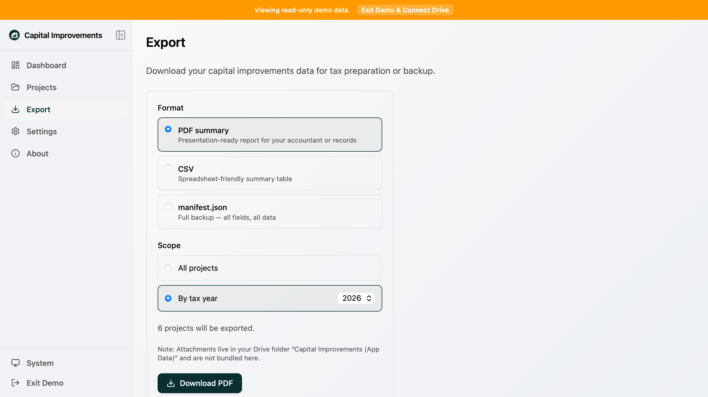
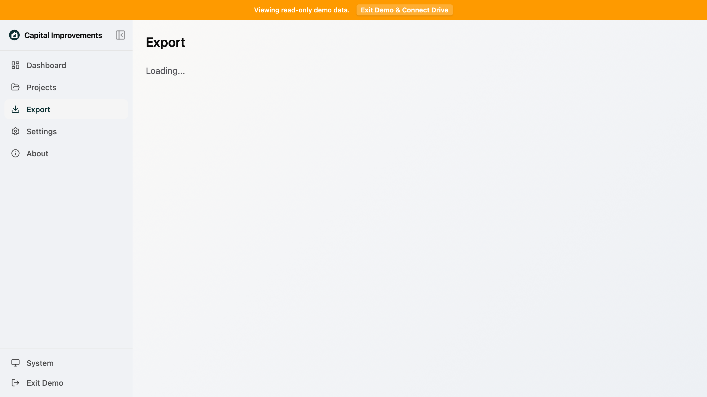

# Test Report: PDF Export + Scope Selector

**Date:** 2026-07-02  
**Feature:** PDF summary export and per-year scope selector for the Export page  
**Files changed:**
- `src/app/export/pdf-document.tsx` — new PDF document component (`CapitalImprovementsPdf`) and pure helper utilities
- `src/app/export/page.tsx` — updated Export page with PDF format radio, scope selector (All / By tax year), year picker, "Generating…" state
- `src/app/export/pdf-document.test.ts` — 25 unit tests
- `e2e/export.spec.ts` — 13 E2E tests
- `package.json` — added `@react-pdf/renderer`

---

## Summary

The Export page previously only supported JSON and CSV. This feature completes the spec from `docs/ui-ux-design.md` §5.8 and requirements EXP-01/LONG-05 by adding:

1. **PDF format** — client-side `@react-pdf/renderer` document with a cover/summary page, per-project detail pages (Capital Improvements and Other), IRS justification, documentation status, and attachment lists.
2. **Scope selector** — "All projects" or "By tax year" with a conditional year dropdown populated from actual project data.
3. **PDF is the new default format** — surfaced first as the most user-facing option.

---

## Unit Tests — `src/app/export/pdf-document.test.ts`

All pure helper functions are covered (no React or PDF renderer in the test environment needed).

| Suite | Tests | Result |
| --- | --- | --- |
| `formatCurrencyPdf` | 3 | PASS |
| `formatTaxTreatment` | 6 | PASS |
| `formatCategory` | 4 | PASS |
| `formatDocStatus` | 3 | PASS |
| `getProjectYear` | 2 | PASS |
| `filterProjectsByScope` | 4 | PASS |
| `getAvailableYears` | 3 | PASS |
| **Total** | **25** | **PASS** |

```
 Test Files  1 passed (1)
      Tests  25 passed (25)
   Duration  598ms
```

---

## Full Unit Test Suite

No regressions. All 37 test files pass.

```
 Test Files  37 passed (37)
      Tests  251 passed (251)
   Duration  3.35s
```

---

## E2E Tests — `e2e/export.spec.ts`

Runs against the `/demo/export` route (MockStorageDriver, no auth required).

| Test | Result |
| --- | --- |
| Shows the Export heading | PASS |
| PDF format is selected by default | PASS |
| All three format options are present | PASS |
| Scope selector shows All and By tax year options | PASS |
| Selecting "By tax year" reveals a year dropdown | PASS |
| Project count updates when switching to year scope | PASS |
| Download button shows correct label for each format | PASS |
| CSV download triggers a file download | PASS |
| JSON download triggers a file download | PASS |
| PDF download triggers a file download | PASS |
| Attachments note is displayed | PASS |
| Screenshot — default state | PASS |
| Screenshot — year scope selected | PASS |
| **Total** | **13/13 PASS** |

```
Running 13 tests using 1 worker
  13 passed (13.7s)
```

---

## Screenshots

### Export page — year scope selected (fully loaded)



*Shows: PDF format selected by default, Scope radio with "By tax year" active, year dropdown showing 2026, "6 projects will be exported.", "Download PDF" button.*

### Export page — default state (screenshot taken at navigation time)



*Note: screenshot taken immediately after navigation; manifest hydrates asynchronously. All 13 functional tests pass including the full loaded UI assertions.*

---

## PDF Structure

The generated PDF contains up to three pages:

1. **Cover / Summary page** — property address, export date, scope label, three summary cards (Cost Basis Added / Total Deductible / Total Spend), projects overview table with columns (Project, Date, Category, Total Cost, Basis Adj., Treatment, Docs), attachments note, not-tax-advice disclaimer.
2. **Capital Improvements detail page** — one card per capital improvement project with all key fields, IRS justification block, attachments list, missing-field warnings.
3. **Other Projects detail page** — same card layout for repair / deductible / credit projects.

---

## Requirement Coverage

| Requirement | Status |
| --- | --- |
| EXP-01 — PDF summary format | Implemented |
| EXP-02 — Attachments note | Implemented |
| EXP-03 — JSON full manifest | Unchanged (retained) |
| EXP-04 — CSV key fields | Unchanged (retained) |
| LONG-05 — CSV/PDF export | Implemented |
| DOC-15 — documentationStatus column | Implemented (PDF "Docs" column + per-card badge) |
| ANLYT-11 — Export event with format prop | trackExport("pdf") fires on PDF download |
