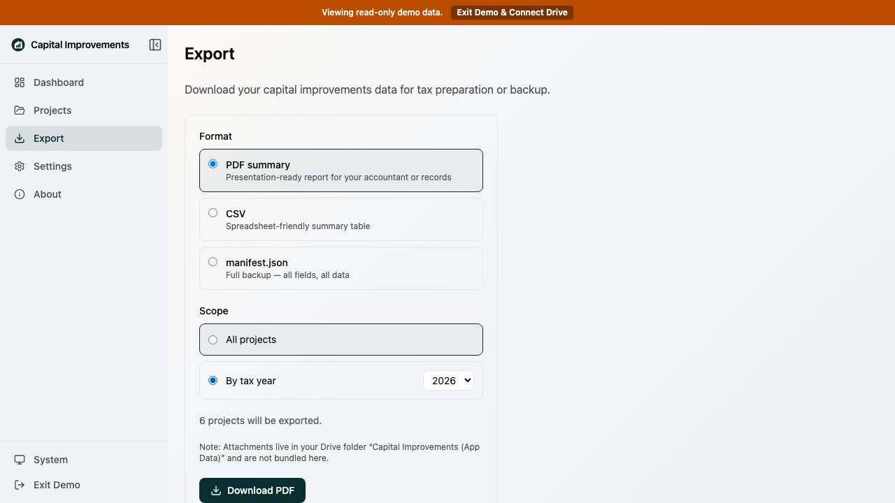

# Test Report: PR #53 Review Fixes

**Date:** 2026-07-10

**Scope:** Follow-up fixes from code review: year-scoped export after loading, offline cached startup, Safe Harbor tooltip markup, attachment remove dialog focus management, auth restoration for E2E/local runs, and doc image size compliance.

---

## Summary

| Evidence | Result |
| --- | --- |
| Focused Vitest suites | PASS - 5 files, 39 tests |
| TypeScript + ESLint (`npm run check`) | PASS |
| Dashboard + Projects E2E (`chromium`) | PASS - 21 tests |
| Export E2E (`chromium`) | PASS - 14 tests |
| Documentation image size check | PASS - 38 images <= 200 kB |

---

## Commands

```bash
npx vitest run src/services/auth.test.ts src/services/storage-context.test.tsx src/app/export/export-page.test.tsx src/app/projects/project-form.test.tsx src/components/ui/alert-dialog.test.tsx
npm run check
npx playwright test e2e/dashboard.spec.ts e2e/projects.spec.ts --project=chromium
npx playwright test e2e/export.spec.ts --project=chromium
npm run compress:doc-images:check
```

## Screenshot Evidence

Export E2E regenerated the documentation screenshots below; both were verified under the 200 kB documentation image limit.




---

## Notes

- `npm ci` completed with a Node engine warning from `react-router@8.1.0` requiring Node `>=22.22.0`; this VM is Node `22.14.0`. Tests and checks above still passed after install.
- `npx playwright install chromium` was required in this cloud environment before E2E could run.
