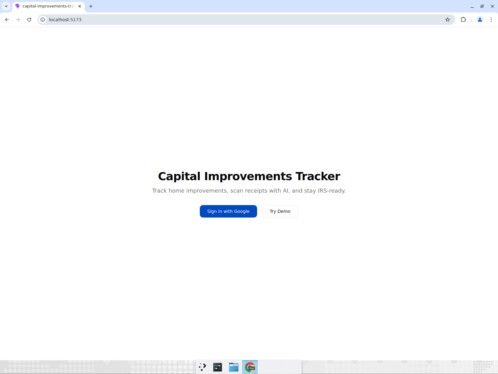
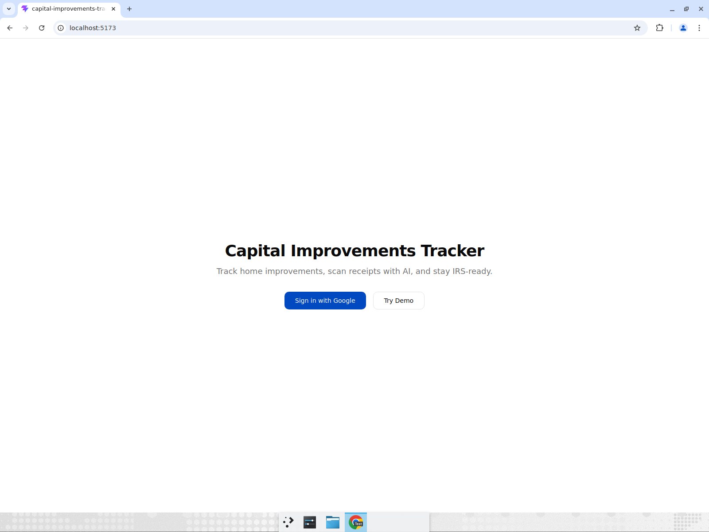
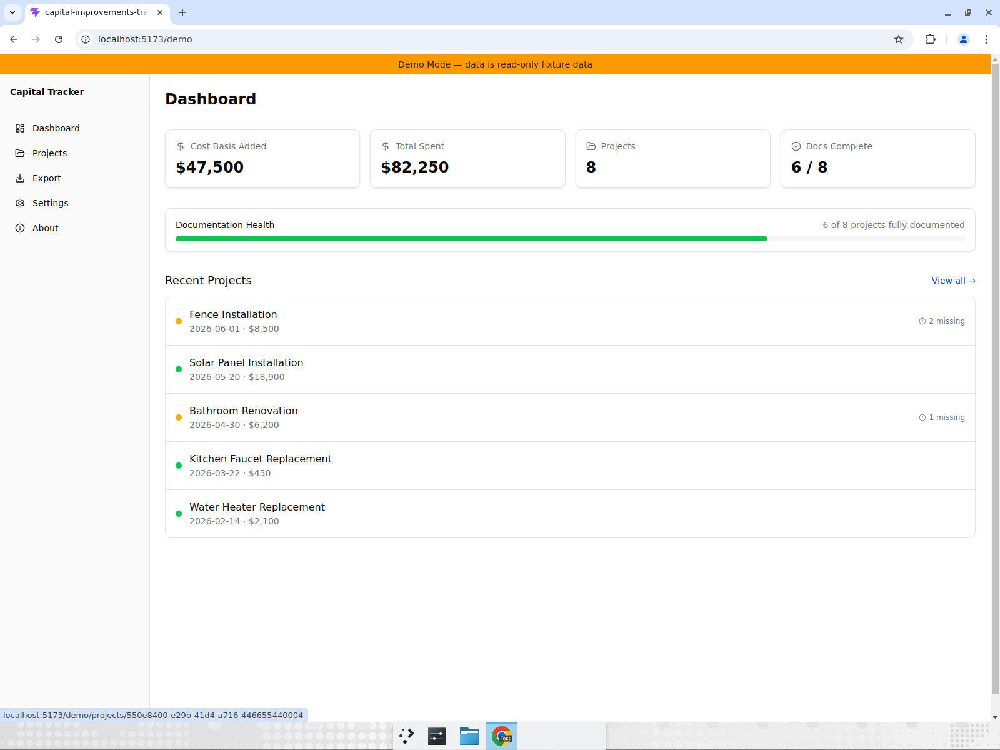
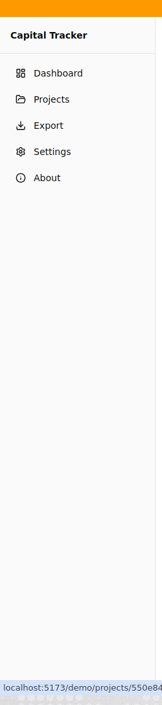
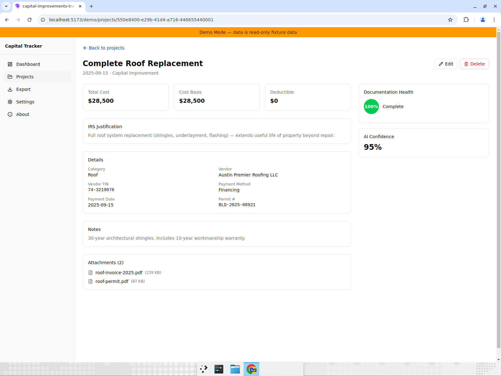

# Test Report: Task 4 — GIS OAuth2 + Drive Storage Driver (PR #16)

**Tested locally** against `http://localhost:5173/` with `npm run dev`. No `VITE_GOOGLE_CLIENT_ID` configured, so full OAuth flow could not be tested end-to-end — testing focused on auth guard behavior, landing page rendering, demo mode isolation, and graceful degradation without credentials.

## Results

- **It should render sign-in as a button, not a link** — PASSED
- **It should no-op when clicking sign-in without OAuth client ID** — PASSED
- **It should redirect /dashboard to landing when unauthenticated** — PASSED
- **It should redirect /settings and /projects to landing** — PASSED
- **It should run demo mode independently of auth** — PASSED

## Evidence

### Landing page — sign-in is a `<button>`, not `<a>`

DOM confirms: `<button type="button">Sign in with Google</button>` (was previously `<Link to="/dashboard">`).

### Sign-in click is a safe no-op

Clicking "Sign in with Google" produces no navigation, no crash, no loading state. URL stays at `/`.

### Auth guard redirects /dashboard → /

Navigating to `/dashboard` redirects to `/` (landing page). Same for `/projects` and `/settings`.

### Demo mode — dashboard with fixture data

$47,500 cost basis, $82,250 total, 8 projects, 6/8 docs complete. Amber banner visible.

### Demo mode — sidebar has no sign-out button

Sidebar shows Dashboard, Projects, Export, Settings, About — no "Sign out" button (correctly hidden in demo mode).

### Demo mode — project detail renders

Complete Roof Replacement: $28,500, 100% doc health, 95% AI confidence, all IRS fields populated.

## Not Tested

- **Full GIS OAuth flow** (sign-in → token → Drive API): Requires `VITE_GOOGLE_CLIENT_ID` env var with a real GCP OAuth client.
- **Silent token refresh**: Requires live token to test 60s-before-expiry refresh.
- **Drive manifest CRUD**: Requires authenticated session with Drive API access.
- **Sign-out button in live mode sidebar**: Only renders when `isAuthenticated === true`, which requires a real OAuth session.

These are expected limitations — the auth infrastructure is in place but requires GCP project configuration to exercise.
