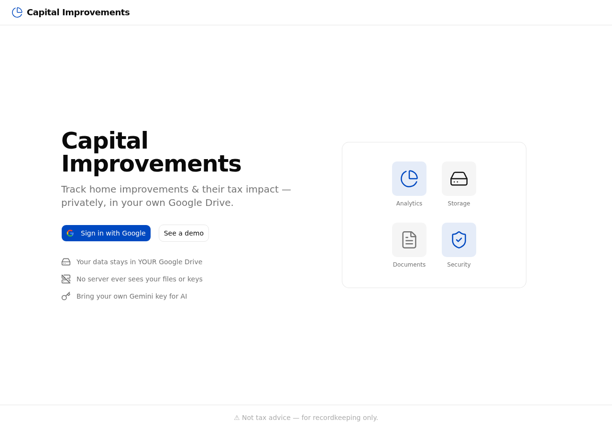
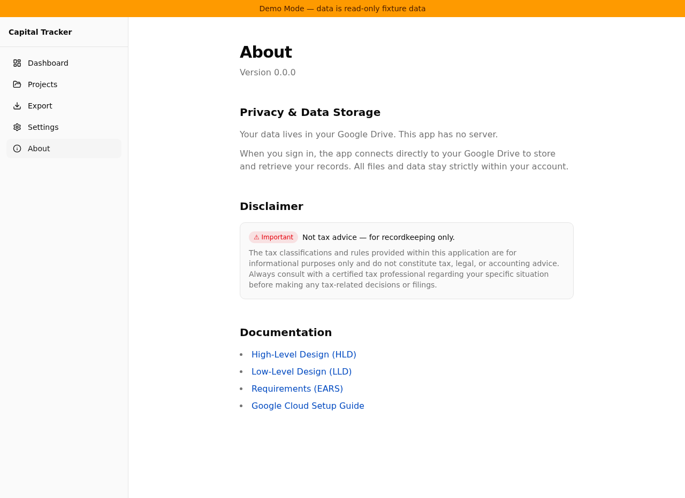

# Test Report: Task 7 — Landing Page & About Page Refinement

**Tested locally** against `http://localhost:5173/` with `npm run dev`.

## Summary of Changes

- **Landing page** redesigned to a two-column marketing layout matching `docs/ui-ux-design.md §5.1`:
  - Header bar with PieChart icon + brand text
  - Left column: hero heading, subheading, Google-branded sign-in CTA, demo link, feature bullets
  - Right column: decorative Card with Lucide icon composition (hidden on mobile)
  - Footer strip with "Not tax advice" disclaimer
  - Google "G" SVG icon component (`GoogleIcon`)
- **About page** fixes:
  - Replaced `your-org` with `jbisasky` in all GitHub links
  - Added Requirements (EARS) documentation link
  - Added `Badge` component for disclaimer visual emphasis
- **New shadcn/ui components**: `Card`, `Badge` (project-convention compliant)
- **Vitest setup**: Added `@testing-library/jest-dom/vitest` setup file
- **Playwright E2E infrastructure**: Config, Chromium, `e2e/` test directory

## Unit Test Results (Vitest)

```
 Test Files  9 passed (9)
      Tests  45 passed (45)
```

### Landing page tests (7/7 passed)
- Renders hero heading and subheading
- Renders "Sign in with Google" button (enabled when not loading)
- Renders "See a demo" link pointing to `/demo`
- Renders all three feature bullet points
- Shows "Signing in…" and disables button when `status === "authenticating"`
- Shows session-expired message when `status === "needs_interaction"`
- Redirects to `/dashboard` when `isAuthenticated === true`

### About page tests (3/3 passed)
- Renders version string
- Renders disclaimer text
- Renders all documentation links with correct `href` values (including `jbisasky` org)

## E2E Test Results (Playwright)

```
  3 passed (1.9s)
```

- Landing page loads and shows hero text
- "See a demo" button navigates to `/demo`
- Sign-in button is visible and clickable

## Screenshots

### Landing page (desktop, 1280×900)



Two-column layout: hero + CTA on left, decorative icon card on right, header bar at top, disclaimer footer at bottom.

### About page (via demo mode)



Updated documentation links (all pointing to `jbisasky`), Requirements (EARS) link added, disclaimer with Badge component.

## Typecheck & Lint

```
npm run check  →  0 errors
```
