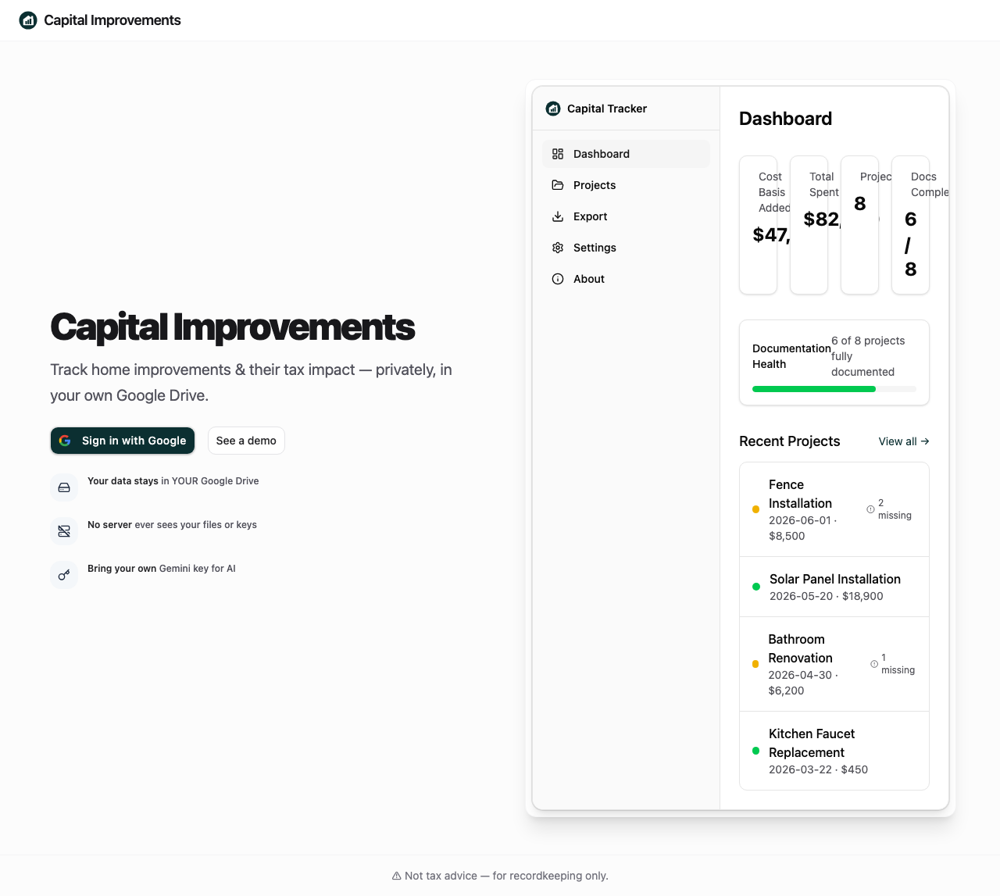
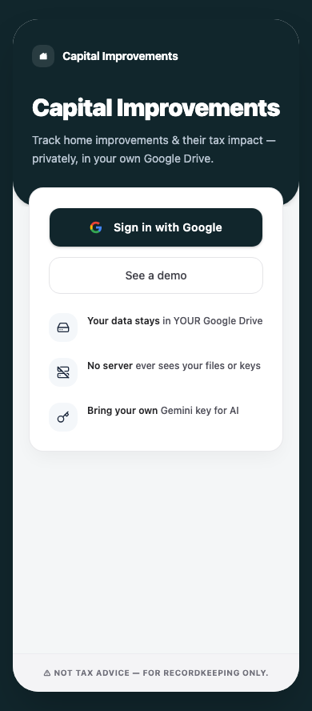

# Test Report: Landing & Shell UI Overhaul

**Scope:** Docs-first slate-teal brand system, split-screen landing layout, app shell polish (HLD D17, UI/UX §5.1/§11, EARs §31).

## Documentation updates

- [`docs/ui-ux-design.md`](../ui-ux-design.md) — §4 visual treatment, §5.1 split-screen landing, §9.1 mobile rules, §11 token table
- [`docs/high-level-design.md`](../high-level-design.md) — D17 visual identity, stack cross-ref
- [`docs/low-level-design.md`](../low-level-design.md) — §1.8 visual tokens, §16.1 landing preview note
- [`docs/requirements-ears.md`](../requirements-ears.md) — §31 UX-01–04, LND-01–06

## Unit tests

**Command:** `npx vitest run src/app/landing/`

| Test file | Result |
| --- | --- |
| `src/app/landing/page.test.tsx` | 11 passed |
| `src/app/landing/landing-dashboard-preview.test.tsx` | 1 passed |
| `src/app/landing/landing-preview-data.test.ts` | 1 passed |

**New assertions:** no `mask-image` backdrop; `md:grid-cols-2` split layout; bold anchor phrases; framed preview in desktop column.

## E2E tests

**Command:** `npx playwright test e2e/landing.spec.ts`

| Test | Result |
| --- | --- |
| loads and shows hero text | PASSED |
| "See a demo" navigates to /demo | PASSED |
| Sign-in button visible and enabled | PASSED |
| desktop split-screen layout screenshot | PASSED |
| mobile layout screenshot | PASSED |

## Static analysis

- `npm run typecheck` — PASSED
- `npm run lint` — PASSED

## Evidence

### Desktop — split-screen with framed dashboard preview

Solid white copy column left; `LandingDashboardPreview` in `rounded-xl border-zinc-100 shadow-xl` frame right. No text-over-image collision.

### Mobile — compact layout with enclosed feature card

Navbar logo only (no oversized hero logo); hero content in elevated `rounded-2xl` compound card on `bg-zinc-50/50`; borderless `#feature-list` with relaxed line height; premium Google CTA with ring/shadow.

**Mobile polish (2026-06-20):** native app shell — dark `#11262c` outer frame, `max-w-[420px]` slate-50 canvas, split hero pitch + elevated action card, branded header mark, icon tiles, uppercase footer strip.

## Implementation files

- [`src/index.css`](../../src/index.css) — slate-teal `--primary`, zinc `--muted-foreground`
- [`src/app/landing/page.tsx`](../../src/app/landing/page.tsx) — split layout, zinc typography
- [`src/components/layout/app-shell.tsx`](../../src/components/layout/app-shell.tsx) — zinc nav + slate-teal active states
- [`public/favicon.svg`](../../public/favicon.svg) — slate-teal brand circle
