# UI/UX Low-Level Design: Screens, Features & Flows

**Status:** Draft v0.1 — companion to the [HLD](high-level-design.md) and [LLD](low-level-design.md)
**Author:** Devin (on behalf of @jbisasky)
**Last updated:** 2026-06-20

> This document specifies **what the user sees and does**: the feature set, information
> architecture, every screen (with wireframes), the core flows, and — critically — the
> **non-happy-path states** (loading / empty / error / offline / conflict / auth-expired /
> budget-exceeded) mapped to the error taxonomy in [LLD §11](low-level-design.md#11-error-taxonomy--user-messaging).
> Built with shadcn/ui (Radix) + Tailwind v4; mobile-first because receipts are captured on phones.

## Table of contents
1. [Design principles](#1-design-principles)
2. [Feature list (MVP vs later)](#2-feature-list-mvp-vs-later)
3. [Information architecture & navigation](#3-information-architecture--navigation)
4. [Global layout & shell](#4-global-layout--shell)
5. [Screen inventory (wireframes)](#5-screen-inventory-wireframes)
6. [Core user flows](#6-core-user-flows)
7. [State coverage matrix](#7-state-coverage-matrix)
8. [Component inventory (shadcn/ui)](#8-component-inventory-shadcnui)
9. [Responsive & mobile capture](#9-responsive--mobile-capture)
   - [9.1 Landing mobile rules](#91-landing-mobile-rules)
10. [Accessibility](#10-accessibility)
11. [Visual design & theming](#11-visual-design--theming)
12. [Loading & perceived performance](#12-loading--perceived-performance)
13. [Microcopy & legal](#13-microcopy--legal)

---

## 1. Design principles

- **Trust & clarity over flash.** This is a financial record that must be legible in 20 years.
  Plain language, generous spacing, no dark patterns.
- **Mobile-first capture, desktop-first review.** Adding a receipt happens on a phone; reviewing
  totals and exporting happens on a laptop. Both must be first-class.
- **AI assists, the human decides.** Every AI-extracted value is editable and must be confirmed
  before it's saved (LLD §9). Confidence is shown, never hidden.
- **Honest about money & tax.** Distinguish *cost basis* from *deductible* everywhere; always show
  the "not tax advice" disclaimer near any tax figure (HLD §6).
- **Every state is designed.** Loading, empty, error, offline, and conflict are not afterthoughts.
- **Reversible & recoverable.** Destructive actions confirm; data is exportable; backups exist.
- **Premium financial-record aesthetic.** High-contrast dark slate-teal primary on clean white
  surfaces; editorial typography with tightened headings; no generic demo-template blue.

---

## 2. Feature list (MVP vs later)

### MVP (v1)
| Area | Feature |
| --- | --- |
| Auth | Google sign-in (GIS), sign-out, session-expiry re-auth prompt |
| Settings | BYOK Gemini key entry (+ session-only toggle), AI budget caps, key/connection status |
| Projects | Create / read / update / delete improvement projects |
| Attachments | Upload receipts/invoices (image/PDF), view/download, remove |
| AI extraction | Extract fields from a document → **review/confirm** screen → save |
| Tax model | Per-project `taxTreatment`, cost-basis vs deductible amounts, justification |
| Dashboard | Summary cards (total cost basis added, total deductible, project count) |
| Search/filter | Filter projects by year, treatment, text search by title/vendor |
| Export | Download `manifest.json` + human-readable CSV/PDF |
| Resilience | Loading/empty/error states, conflict resolution UI, diagnostics log |
| Disclaimers | "Not tax advice" persistent affordance |

| Resilience | PWA offline read-only: service worker caches app shell + manifest; browse existing data offline; writes disabled until connectivity returns |

### Later (post-v1)
- Queued offline writes (edit while offline → sync on reconnect).
- Per-year **cost-basis report** view (running adjusted basis over time).
- Bulk import (multi-file drop → batched extraction with a review queue).
- Tag/category taxonomy and per-room or per-system grouping.
- Reminders (e.g. "tax season — review unclassified projects").
- Photo annotation, multi-page document stitching UI.
- Optional encryption-at-rest passphrase for the BYOK key.

---

## 3. Information architecture & navigation

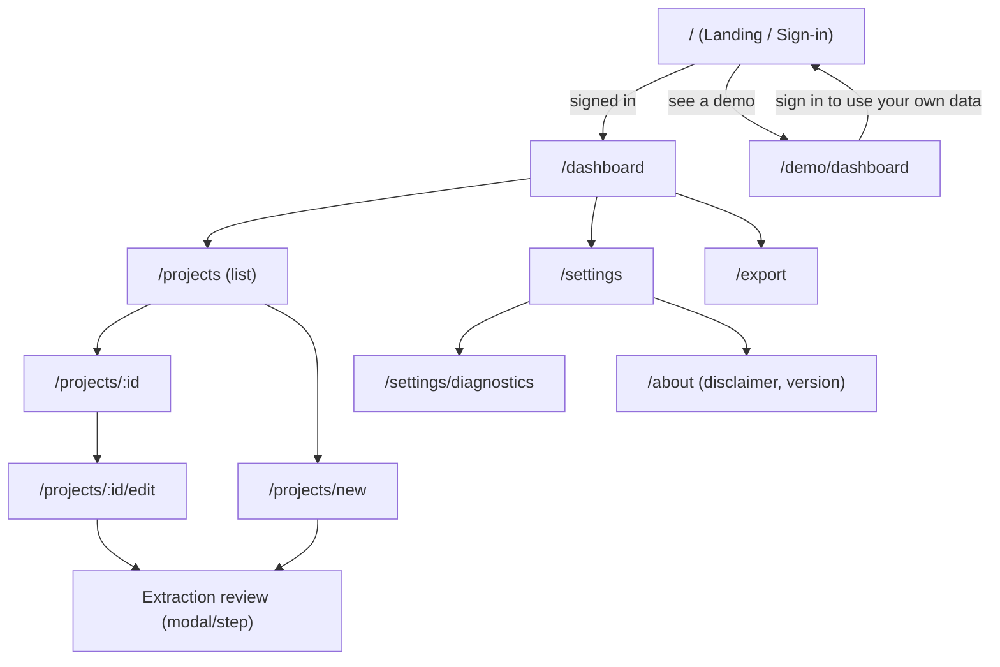
```mermaid
flowchart TD
    Landing["/ (Landing / Sign-in)"] -->|signed in| Dash["/dashboard"]
    Landing -->|see a demo| Demo["/demo/dashboard"]
    Demo -->|sign in to use your own data| Landing
    Dash --> Projects["/projects (list)"]
    Projects --> Detail["/projects/:id"]
    Projects --> New["/projects/new"]
    Detail --> Edit["/projects/:id/edit"]
    New --> Review["Extraction review (modal/step)"]
    Edit --> Review
    Dash --> Settings["/settings"]
    Settings --> Diag["/settings/diagnostics"]
    Dash --> Export["/export"]
    Settings --> About["/about (disclaimer, version)"]
```

Primary nav (always reachable): **Dashboard · Projects · Add · Export · Settings**. On mobile this
collapses to a bottom tab bar with a center **Add (＋)** action; on desktop it's a left rail or top bar.

---

## 4. Global layout & shell

### Desktop layout

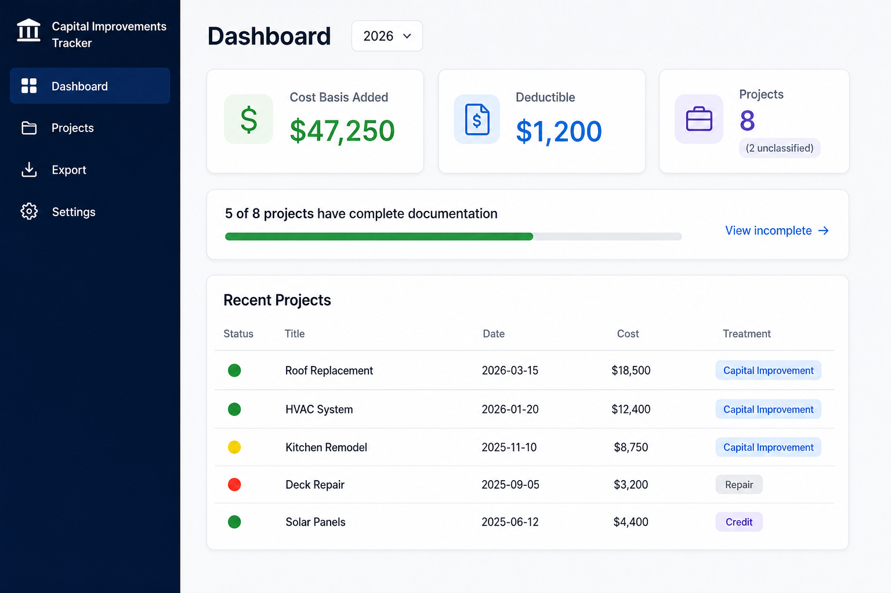

<details><summary>ASCII wireframe (original)</summary>

```
DESKTOP                                              
┌───────────────────────────────────────────────────────────┐
│ ◑ Capital Improvements         [search…]      ⟳  ◧  ⚙  (J) │  ← top bar: brand, search, sync, theme, settings, account
├───────────┬───────────────────────────────────────────────┤
│ Dashboard │                                                │
│ Projects  │              <route content>                   │
│ Add  ＋   │                                                │
│ Export    │                                                │
│ Settings  │                                                │
│           │                                                │
│ ── status │  ⚠ Not tax advice · ● Synced 2m ago            │  ← persistent footer strip
└───────────┴───────────────────────────────────────────────┘
```

</details>

### Mobile layout

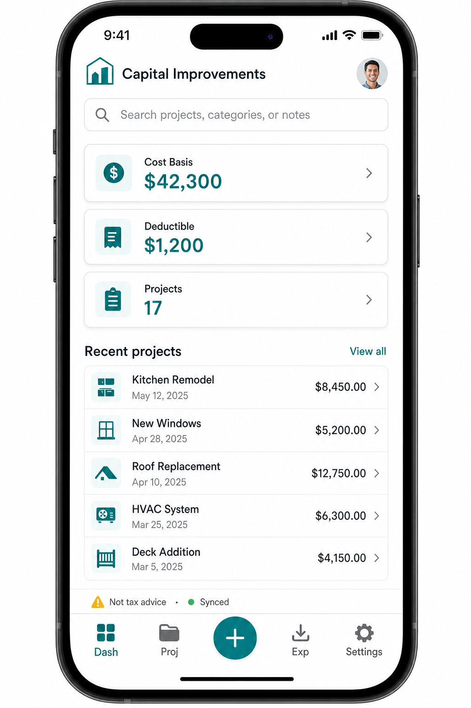

<details><summary>ASCII wireframe (original)</summary>

```
MOBILE
┌───────────────────────────┐
│ ◑ Capital Improvements  (J)│
│ [search…]                  │
│                            │
│      <route content>       │
│                            │
│ ⚠ Not tax advice · ●Synced │
├───────────────────────────┤
│ ▣Dash  ▤Proj  ＋  ⭳Exp  ⚙ │  ← bottom tab bar, center Add
└───────────────────────────┘
```

</details>

Persistent elements:
- **Sync indicator** (`⟳`/`●`): idle / syncing / synced (with timestamp) / error. Reflects Drive
  CAS write status (LLD §6). Click → last-sync details / retry.
- **"Not tax advice"** chip: always visible, links to the disclaimer in /about.
- **Account menu** `(J)`: email, sign out, switch is N/A (single account, HLD D12).

### Visual treatment (app shell)

Wireframe PNGs in this section are **legacy reference**; final colors, typography, and spacing
follow [§11 Visual design & theming](#11-visual-design--theming) (HLD D17).

- **Brand mark:** `HomeChartLogo` (house + bar chart SVG), colored via `--primary` (rich dark
  slate-teal). Used in the landing header, sidebar rail, and favicon.
- **Sidebar / mobile tab bar:** zinc neutrals for labels (`text-zinc-600` idle,
  `text-zinc-800` emphasis); active nav and selected tabs use slate-teal (`text-primary`), not
  corporate blue; dividers and borders use `border-zinc-100`.
- **Shell chrome headings:** app rail title uses `font-semibold tracking-tight`; route-level
  `<h1>` / `<h2>` use `font-extrabold tracking-tighter` (see §11).
- **Implementation:** [`src/components/layout/app-shell.tsx`](../src/components/layout/app-shell.tsx).

---

## 5. Screen inventory (wireframes)

### 5.1 Landing / Sign-in (`/`)

| Desktop | Mobile |
| --- | --- |
| 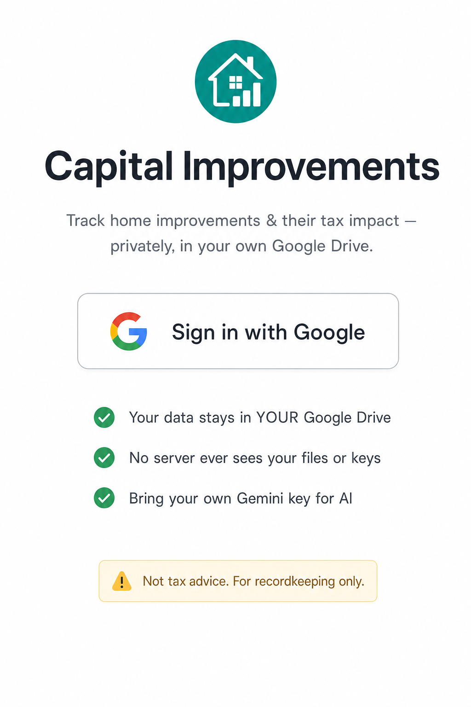 | 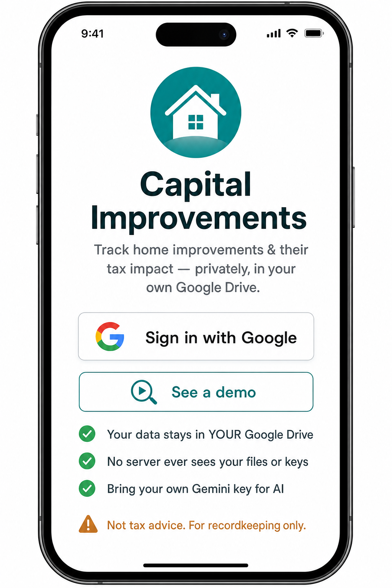 |

> PNG mockups above are **legacy reference**. Authoritative layout is the split-screen spec below
> and [§11](#11-visual-design--theming).

<details><summary>ASCII wireframe — layered full-bleed desktop + native mobile (authoritative)</summary>

```
md / lg (768–1279px)  —  ghost-layered, centred hero
┌──────────────────────────────────────────────────────────────────┐
│ [logo] Capital Improvements              (header, bg-zinc-50/50) │
├──────────────────────────────────────────────────────────────────┤
│ <main relative overflow-hidden>                                  │
│  │                                                               │
│  ├─ z-10 absolute inset-0 ── LandingDashboardPreview            │
│  │       min-w-[1200px] opacity-20 border shadow-lg             │
│  │                                                               │
│  └─ z-20 relative flex justify-center items-center  px-8 py-12  │
│          ┌──────────────────────────────────────────────┐       │
│          │ H1  text-5xl font-black tracking-tighter     │       │
│          │ subhead  max-w-md text-balance text-xl       │       │
│          │ [pointer-events-auto] LandingActions:        │       │
│          │   [Sign in with Google]  [See a demo]        │       │
│          │   FeatureList (teal badge tiles)             │       │
│          └──────────────────────────────────────────────┘       │
├──────────────────────────────────────────────────────────────────┤
│ footer disclaimer                             (border-zinc-100) │
└──────────────────────────────────────────────────────────────────┘

DESKTOP (xl+, ≥1280px)  —  same ghost-layer watermark, wider viewport
┌──────────────────────────────────────────────────────────────────┐
│ [logo] Capital Improvements                            (header)  │
├──────────────────────────────────────────────────────────────────┤
│ <main relative overflow-hidden bg-zinc-50/50>                   │
│  ├─ z-0 absolute inset-0 ── LandingDashboardPreview             │
│  │       min-w-[1200px] opacity-20 border shadow-lg             │
│  ├─ z-10 gradient shield  from-zinc-50 via-zinc-50/90 to-trans.  │
│  └─ z-20 relative flex justify-center items-center  px-8 py-12  │
│          ┌──────────────────────────────────────────────┐       │
│          │ H1  text-5xl font-black tracking-tighter     │       │
│          │ subhead  max-w-md text-balance text-xl       │       │
│          │ [Sign in with Google]  [See a demo]          │       │
│          │ FeatureList (teal badge tiles)               │       │
│          └──────────────────────────────────────────────┘       │
├──────────────────────────────────────────────────────────────────┤
│ footer disclaimer                                               │
└──────────────────────────────────────────────────────────────────┘

SMALL TABLET (sm, 640–767px)  —  same mobile layout, 2-col card
┌──────────────────────────────────────────────────────────────────┐
│ ┌ dark hero  bg-[#11262c] rounded-b-[2rem] sm:px-8 ───────────┐  │
│ │ [logo mark] Capital Improvements                             │  │
│ │ <div sm:max-w-xl> H1 · subhead text-balance </div>          │  │
│ └──────────────────────────────────────────────────────────────┘  │
│   ┌ floating white card  sm:mx-8 ────────────────────────────┐   │
│   │ [Sign in…]  [See a demo]   │  • Your data stays …        │   │
│   │       sm:w-[45%]           │  • No server …              │   │
│   │                            │  • Bring your own …         │   │
│   │                            │       sm:w-[55%]            │   │
│   └───────────────────────────────────────────────────────────┘   │
│ footer strip                                                     │
└──────────────────────────────────────────────────────────────────┘

MOBILE (<640px)  —  native full-screen, no phone-frame wrapper
┌──────────────────────────────────────────────────────────────────┐
│ ┌ dark hero  bg-[#11262c] rounded-b-[2rem] overflow-hidden ───┐  │
│ │ [logo mark] Capital Improvements (white, sm)                │  │
│ │ H1  text-3xl font-black text-white                          │  │
│ │ subhead  max-w-sm text-balance text-sm text-slate-300/90    │  │
│ └─────────────────────────────────────────────────────────────┘  │
│   ┌ floating white card  -mt-6 z-10 rounded-2xl mx-5 ────────┐   │
│   │ [Sign in with Google]  (bg-[#11262c])                     │   │
│   │ [See a demo]  (bg-transparent border-zinc-200)            │   │
│   │ • **Your data stays**  in YOUR Google Drive               │   │
│   │ • **No server**  ever sees your files or keys             │   │
│   │ • **Bring your own**  Gemini key for AI                   │   │
│   └───────────────────────────────────────────────────────────┘   │
│ flex-1 spacer  (bg-[#f4f6f7])                                    │
│ footer  bg-zinc-100/80 uppercase text-[10px] text-zinc-500       │
└──────────────────────────────────────────────────────────────────┘
```

</details>

**Layout rules (no collision):**
- Hero copy and CTAs always sit at a **higher z-index than the dashboard preview** and are
  guaranteed opaque by the gradient mask — never directly overlaid on unmasked preview content.
- **All desktop breakpoints (`md`/`lg`/`xl`, ≥768 px):** three-layer stacking — ① `LandingDashboardPreview`
  at `absolute inset-0 z-0`, dimmed to `opacity-20`, `min-w-[1200px]` preventing sidebar reflow.
  ② Gradient shield at `z-10` (`from-zinc-50 via-zinc-50/90 via-[40%] to-transparent`) ensures
  the text column is always legible. ③ Hero copy + CTAs at `relative z-20`, centred horizontally
  (`justify-center`) with `px-8 py-12` breathing room. Desktop canvas is `bg-zinc-50/50`.
- **Small tablet (`sm`, 640–767 px):** same mobile DOM renders; the floating card switches to a
  two-column flex row (`sm:flex-row sm:gap-8`): CTAs left (`sm:w-[45%]`), feature list right
  (`sm:w-[55%]`). Hero text constrained to `sm:max-w-xl`; card margins widen to `sm:mx-8`.
- **Mobile (`<640 px`):** native full-screen — no phone-frame canvas wrapper. Dark hero block
  (`bg-[#11262c] rounded-b-[2rem] overflow-hidden`) fills edge-to-edge. White floating card
  (`-mt-6 relative z-10 rounded-2xl mx-5`) overlaps the hero bottom. Canvas body (`bg-[#f4f6f7]`)
  fills the spacer and provides the ear-cutout fill behind the hero's rounded bottom.
- **Feature bullets:** bold **anchor phrases** (`font-semibold text-zinc-900`) for scannability;
  trailing description text relaxes to `text-zinc-500 font-normal`.

**CTAs & behavior:**
- **Primary CTA:** "Sign in with Google" — slate-teal fill (`bg-[#11262c]`). On desktop: `size="lg"
  md:h-auto md:py-4 md:px-6 md:text-base md:font-semibold` for touch-friendly proportions.
- **Secondary CTA:** "See a demo" — `bg-white border-zinc-200 shadow-sm hover:bg-zinc-50
  hover:border-zinc-300 transition-all`. Navigates to `/demo/dashboard` (HLD D14, LLD §16).
- Error inline if GIS init fails (origin mismatch → friendly "config issue" note).

**Static preview (marketing chrome):**
- [`LandingDashboardPreview`](../src/app/landing/landing-dashboard-preview.tsx) — presentational
  sidebar + dashboard mock; data from [`landing-preview-data.ts`](../src/app/landing/landing-preview-data.ts)
  (derived from demo fixtures). **Not** the same as `/demo/*` routes — no auth, no live navigation.
- Orchestrated by [`landing/page.tsx`](../src/app/landing/page.tsx).

See also [§9.1 Landing mobile rules](#91-landing-mobile-rules).

### 5.2 Dashboard (`/dashboard`)

| Desktop | Mobile |
| --- | --- |
|  | 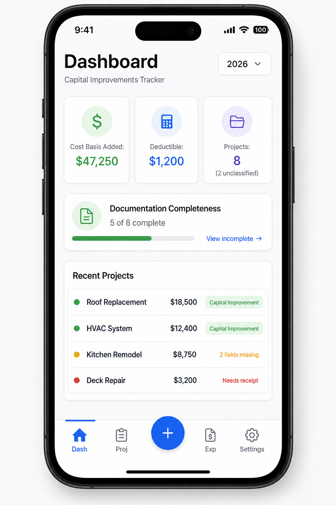 |

<details><summary>ASCII wireframe (original)</summary>

```
┌─────────────────────────────────────────────────────────┐
│ Overview                                  Tax year: 2025 ▾│
│ ┌──────────────┐ ┌──────────────┐ ┌──────────────┐       │
│ │ Cost basis + │ │ Deductible   │ │ Projects     │       │
│ │  $42,300     │ │  $1,200      │ │  17          │       │
│ │ this year    │ │ (credits)    │ │ 3 unclassified│      │
│ └──────────────┘ └──────────────┘ └──────────────┘       │
│ ⚠ "Deductible" is rare for a primary home — most items    │
│    raise cost basis. Learn more →                         │
│                                                           │
│ Recent projects                          [View all →]     │
│ • New roof              2025-04   $18,000  Capital impr.   │
│ • HVAC replacement      2025-02   $9,500   Capital impr.   │
│ • Attic insulation      2025-01   $2,300   Credit (§25C)   │
│                                                           │
│ [ ＋ Add improvement ]                                     │
└─────────────────────────────────────────────────────────┘
```

</details>
- Summary cards are **derived** values (LLD §6.3). "Unclassified" badge nudges the user to set
  `taxTreatment` on `unknown` items. Year selector filters everything.

### 5.3 Projects list (`/projects`)

| Desktop | Mobile |
| --- | --- |
| 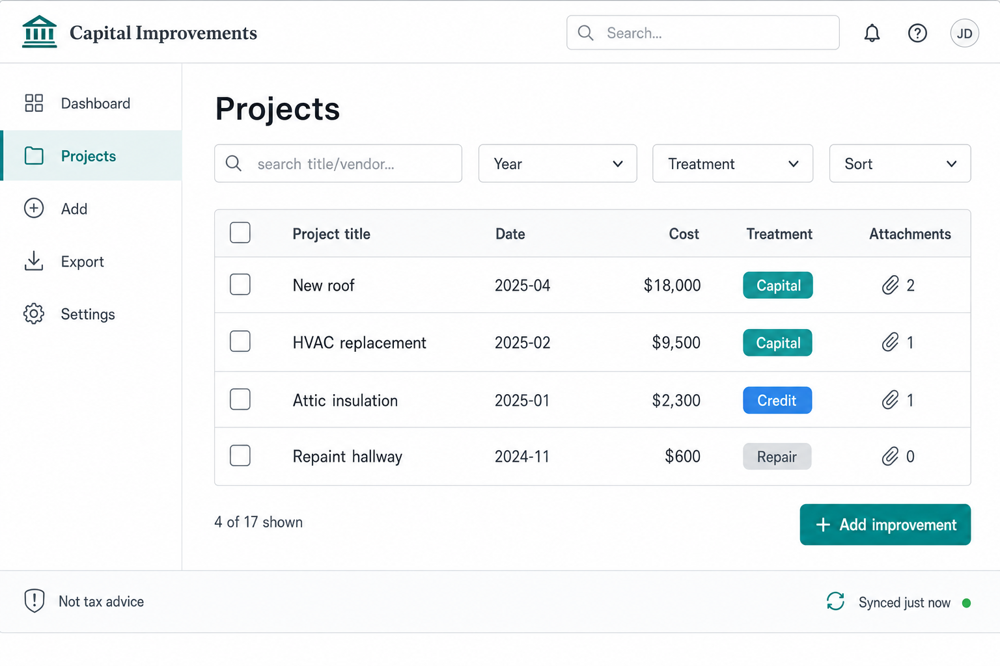 | 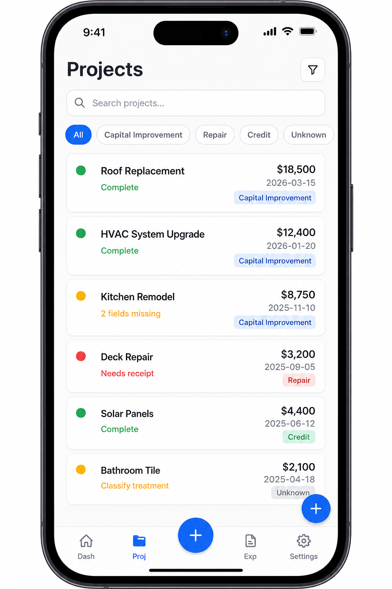 |

<details><summary>ASCII wireframe (original)</summary>

```
┌─────────────────────────────────────────────────────────┐
│ Projects   [search title/vendor…]  Year▾ Treatment▾ Sort▾ │
│ ┌─────────────────────────────────────────────────────┐ │
│ │ ☐  New roof            2025-04  $18,000  Capital  📎2 │ │
│ │ ☐  HVAC replacement    2025-02   $9,500  Capital  📎1 │ │
│ │ ☐  Attic insulation    2025-01   $2,300  Credit   📎1 │ │
│ │ ☐  Repaint hallway     2024-11     $600  Repair   📎0 │ │
│ └─────────────────────────────────────────────────────┘ │
│ 4 of 17 shown                       [ ＋ Add improvement ]│
└─────────────────────────────────────────────────────────┘
```

</details>
- Row: title, completion date, cost, treatment chip, attachment count. Tap → detail. Checkboxes
  enable bulk actions (delete/export selection) — later phase for bulk extract.
- Empty state: friendly illustration + "Add your first improvement" + "Import receipts".

### 5.4 Add / Edit project (`/projects/new`, `/projects/:id/edit`)
Two entry modes that converge on the same form:
- **From a receipt** (AI-assisted): drop/scan file(s) → one Gemini synthesis → review/confirm → form prefilled.
- **Manual**: blank form (attachments may still be queued before save).

The new-project attachment zone supports **multiple files** (multi-select, drag-and-drop, removable
list, max 10). All are uploaded on save; AI reads all files together and suggests one project
field set on a single review screen.

| Desktop | Mobile |
| --- | --- |
| 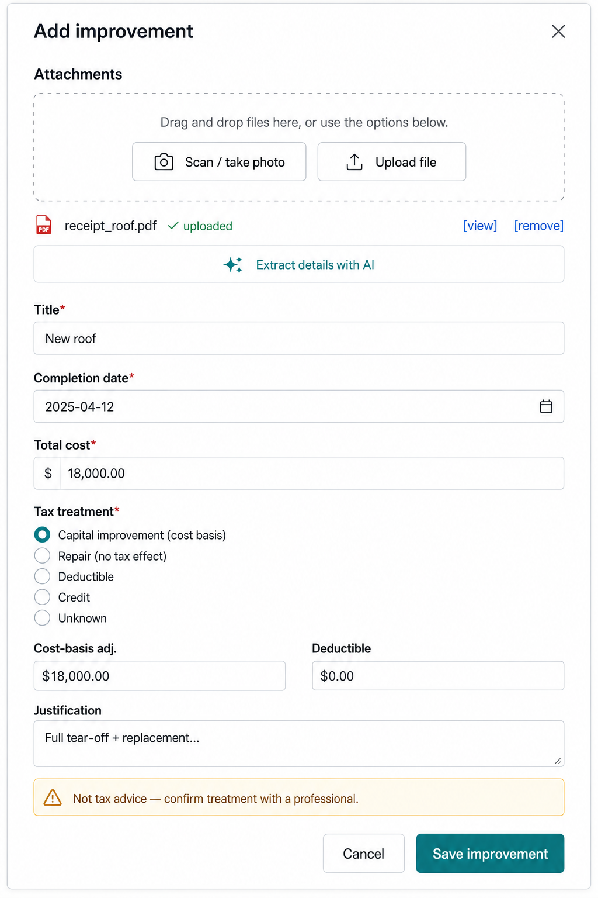 | 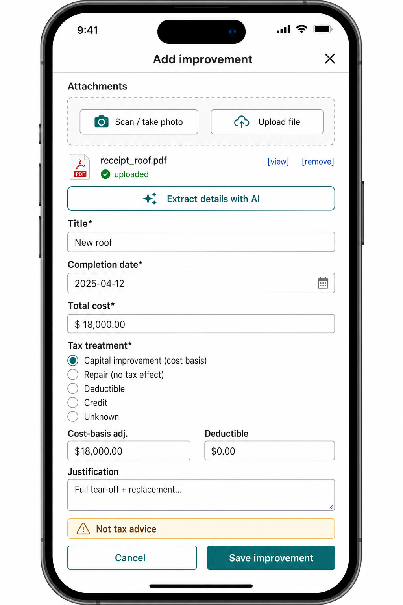 |

<details><summary>ASCII wireframe (original)</summary>

```
┌─────────────────────────────────────────────────────────┐
│ Add improvement                                   [ × ]   │
│ ┌─ Attachments ─────────────────────────────────────────┐│
│ │  [ 📷 Scan / take photo ]  [ ⬆ Upload files ]            ││
│ │  receipt_roof.pdf  1/2  [remove]                         ││
│ │  permit_scan.pdf   2/2  [remove]                         ││
│ │  ✨ Extract details with AI (2 files)                       ││
│ └───────────────────────────────────────────────────────┘│
│ Title*           [ New roof                              ] │
│ Completion date* [ 2025-04-12 ]                           │
│ Total cost*      [ $ 18,000.00 ]                          │
│ Tax treatment*   ( ) Capital improvement (cost basis)     │
│                  ( ) Repair (no tax effect)               │
│                  ( ) Deductible   ( ) Credit  ( ) Unknown │
│ Cost-basis adj.  [ $ 18,000.00 ]   Deductible [ $ 0.00 ]  │
│ Justification    [ Full tear-off + replacement…         ] │
│ ⚠ Not tax advice — confirm treatment with a professional. │
│                         [ Cancel ]   [ Save improvement ] │
└─────────────────────────────────────────────────────────┘
```

</details>
- Field-level validation (zod-mirrored). `taxTreatment` drives which amount fields are emphasized
  (capital → cost-basis; credit/deductible → deductible amount).
- The file used for **Extract details with AI** is retained through the review step and persisted
  as a project attachment on **Create Project** (ATT-12, AI-14). Additional files may be added on
  the form step before save.
- Save = attachments-first, manifest-last (LLD §9). Button shows progress; disabled while a budget
  or circuit guard is tripped (LLD §14) with an inline reason.

### 5.5 AI extraction review (modal/step)

| Desktop | Mobile |
| --- | --- |
| 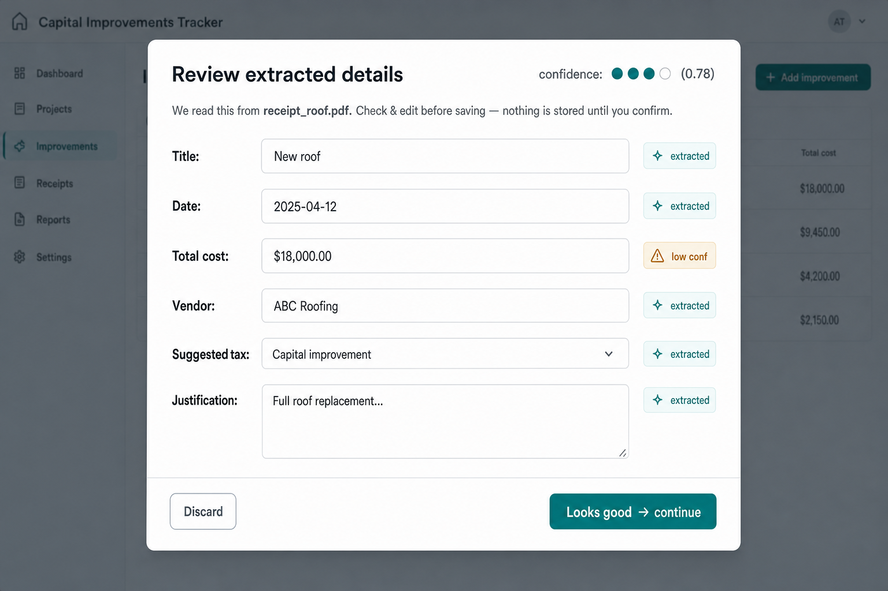 | 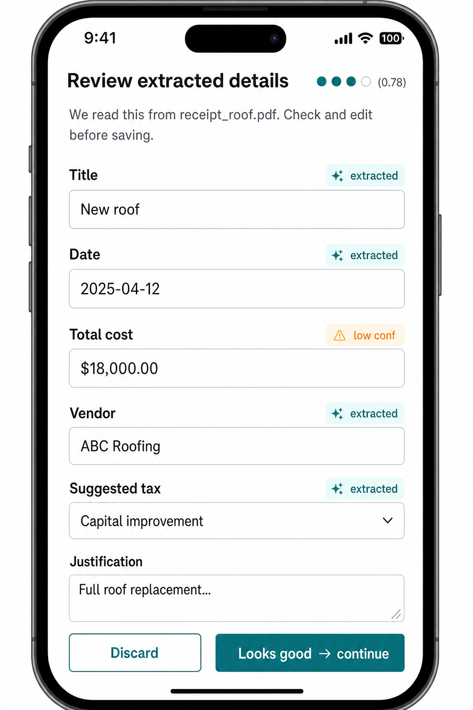 |

<details><summary>ASCII wireframe (original)</summary>

```
┌─────────────────────────────────────────────────────────┐
│ Review extracted details          confidence: ●●●○ (0.78) │
│ From 3 files (AI synthesized). Check & edit before save.  │
│                                                           │
│ Title          [ New roof                  ]  ✦ extracted │
│ Date           [ 2025-04-12 ]                 ✦           │
│ Total cost     [ $18,000.00 ]                 ⚠ low conf  │
│ Vendor         [ ABC Roofing ]                ✦           │
│ Itemization    [ Itemized ▾ ]                 ✦           │
│ Suggested tax  [ Capital improvement ▾ ]      ✦           │
│ Justification  [ Full roof replacement…    ]              │
│                                                           │
│ [ Discard ]                  [ Looks good → continue ]    │
└─────────────────────────────────────────────────────────┘
```

</details>
- Single review screen with editable fields and a confidence badge. Per-field "✦ extracted"
  markers; editing a field clears its AI marker. No per-file conflict UI — Gemini synthesizes one
  best-guess answer from all attachments. `finishReason != STOP` → fallback banner "couldn't read
  fully, enter manually" (maps to `EXTRACTION_INCOMPLETE`).
- **Receipt detail level** dropdown (label: *Materials/itemization visible on receipt*): `Itemized`,
  `Lump sum only`, `Unclear`. Stored on the project; Documentation Health recommends improving this
  when attachments exist but detail is not itemized (advisory — not tax advice).

### 5.6 Project detail (`/projects/:id`)

| Desktop | Mobile |
| --- | --- |
| 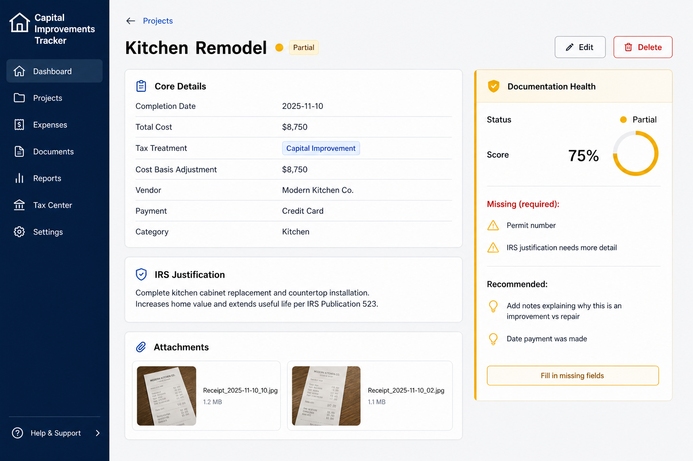 | 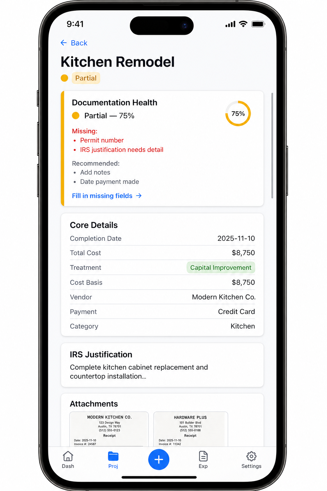 |

<details><summary>ASCII wireframe (original)</summary>

```
┌─────────────────────────────────────────────────────────┐
│ ← Projects                              [ Edit ] [ ⋯ ]    │
│ New roof                                                   │
│ Completed 2025-04-12 · ABC Roofing                        │
│ ┌───────────────┐                                         │
│ │ Total cost    │ $18,000.00                              │
│ │ Treatment     │ Capital improvement                     │
│ │ Cost basis +  │ $18,000.00                              │
│ │ Deductible    │ $0.00                                   │
│ └───────────────┘                                         │
│ Justification: Full tear-off and replacement…             │
│ Attachments (2):  📄 receipt_roof.pdf [view] [download]   │
│                   🖼 photo_after.jpg  [view] [download]   │
│ ⚠ Not tax advice.            History: created/updated …   │
└─────────────────────────────────────────────────────────┘
```

</details>
- `⋯` menu: delete (confirm), duplicate, export this project.
- **Upload on detail:** in addition to view/download on existing files, the attachments card includes
  an inline upload zone (same `AttachmentSection` as add/edit — HLD §4.4, ATT-13). Users can add
  receipts after project create without visiting Edit.

### 5.7 Settings (`/settings`)

| Desktop | Mobile |
| --- | --- |
| 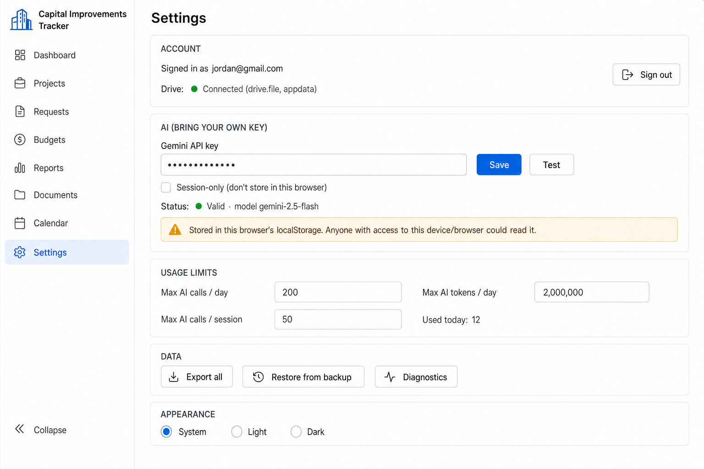 | 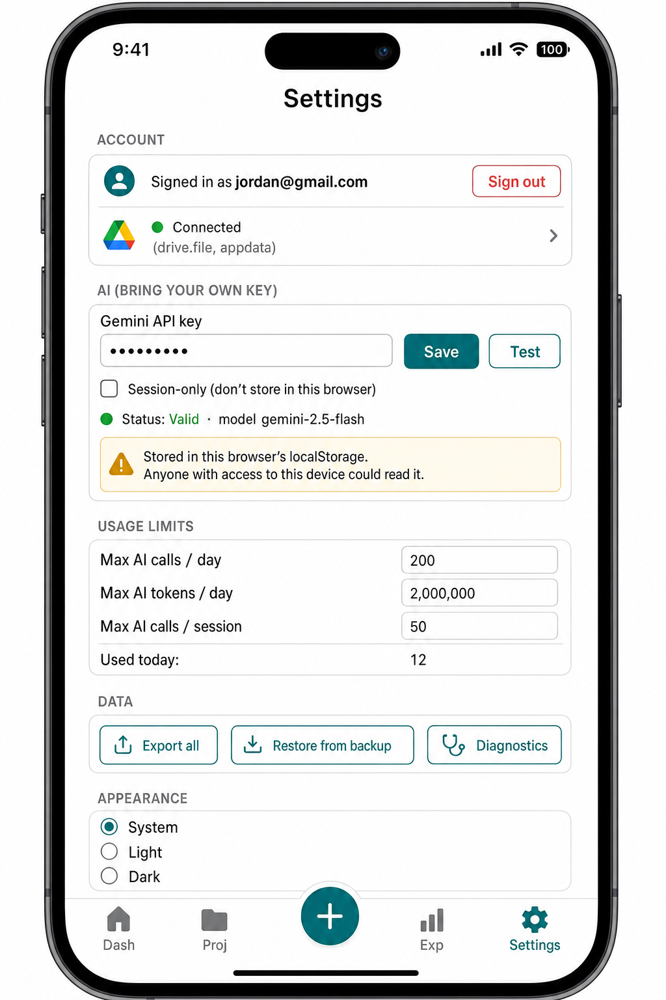 |

<details><summary>ASCII wireframe (original)</summary>

```
┌─────────────────────────────────────────────────────────┐
│ Settings                                                  │
│ Account                                                   │
│   Signed in as jordan@… [ Sign out ]                      │
│   Drive: ● Connected (drive.file, appdata)                │
│                                                           │
│ AI (Bring Your Own Key)                                   │
│   Gemini API key [ •••••••••••••  ] [ Save ] [ Test ]     │
│   ☐ Session-only (don't store in this browser)            │
│   Status: ● Valid · model gemini-2.5-flash                │
│   ⚠ Stored in this browser's localStorage. Anyone with    │
│     access to this device/browser could read it.          │
│                                                           │
│ Usage limits (runaway protection)                         │
│   Max AI calls / day      [ 200 ]                         │
│   Max AI tokens / day     [ 2,000,000 ]                   │
│   Max AI calls / session  [ 50 ]    Used today: 12        │
│                                                           │
│ Data                                                      │
│   [ Export all ]  [ Restore from backup ]  [ Diagnostics ]│
│ Appearance: ( ) System ( ) Light ( ) Dark                 │
└─────────────────────────────────────────────────────────┘
```

</details>
- BYOK warning is explicit (decision D11). "Test" pings Gemini with a trivial call (counts against
  budget). Budgets back LLD §14.5; "used today" reflects the persisted counter.

### 5.8 Export (`/export`)

| Desktop | Mobile |
| --- | --- |
| 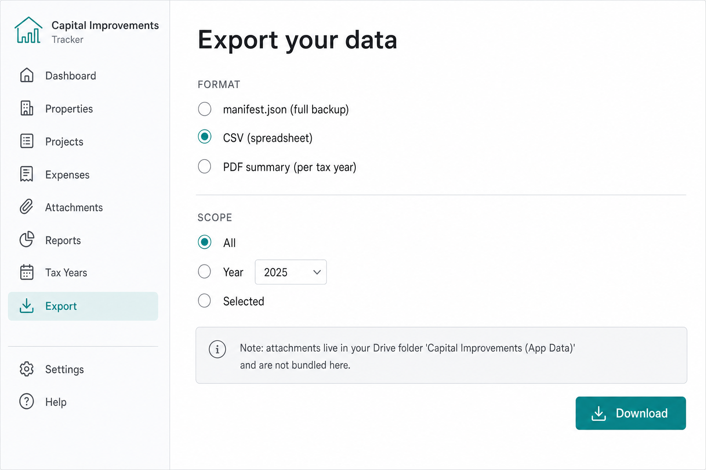 | 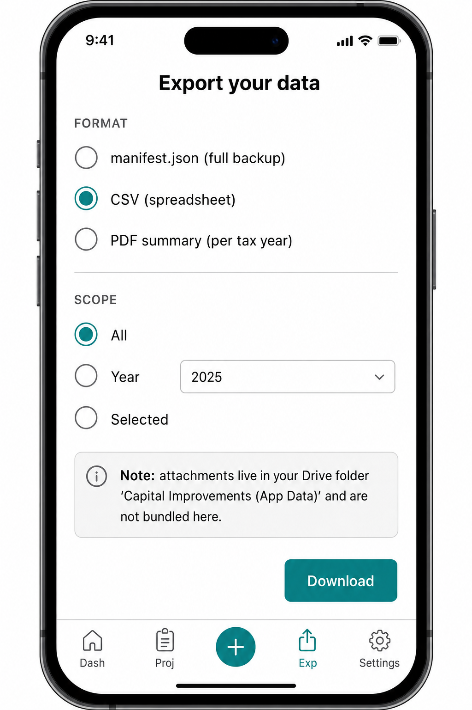 |

<details><summary>ASCII wireframe (original)</summary>

```
┌─────────────────────────────────────────────────────────┐
│ Export your data                                          │
│ Format:  ( ) manifest.json (full backup)                  │
│          ( ) CSV (spreadsheet)                            │
│          ( ) PDF summary (per tax year)                   │
│ Scope:   ( ) All   ( ) Year [2025 ▾]   ( ) Selected       │
│ Note: attachments live in your Drive folder "Capital      │
│ Improvements (App Data)", one subfolder per project, and  │
│ are not bundled here.                                       │
│                                   [ Download ]            │
└─────────────────────────────────────────────────────────┘
```

</details>

### 5.9 Diagnostics (`/settings/diagnostics`)
- Read-only ring-buffer log (LLD §14.7): timestamped events incl. `LOOP_GUARD_TRIPPED`,
  `CIRCUIT_OPEN`, `AI_BUDGET_EXCEEDED`, sync conflicts. "Copy log" (redacted) for support.

### 5.10 About (`/about`)
- App version, the full **not-tax-advice disclaimer**, links to HLD/LLD, Google Cloud setup, and
  a "how your data is stored" privacy explainer.

---

## 6. Core user flows

### 6.1 First-run onboarding
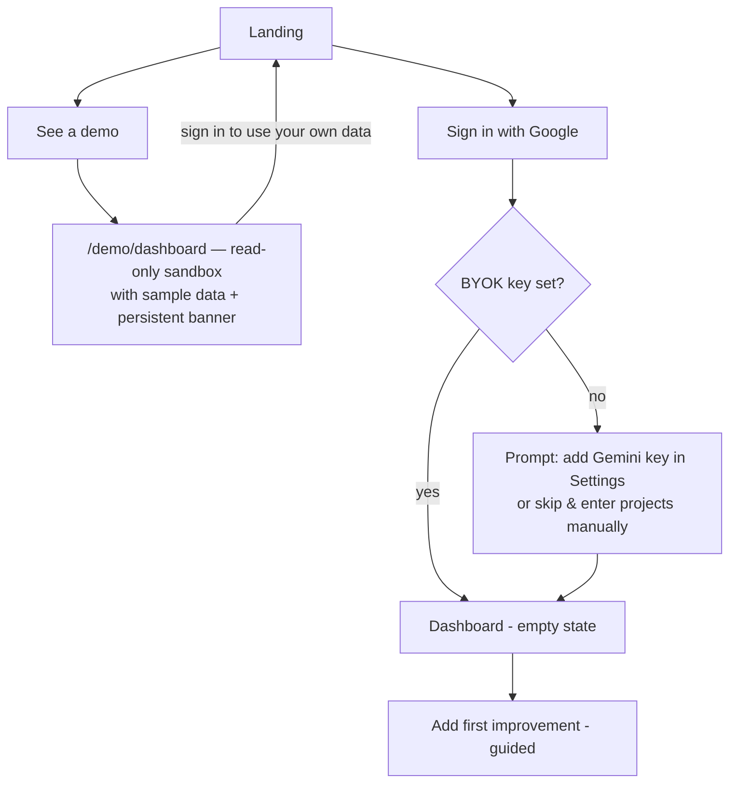
```mermaid
flowchart TD
    A[Landing] --> B[Sign in with Google]
    A --> G["See a demo"]
    G --> H["/demo/dashboard — read-only sandbox<br/>with sample data + persistent banner"]
    H -->|sign in to use your own data| A
    B --> C{BYOK key set?}
    C -- no --> D[Prompt: add Gemini key in Settings<br/>or skip & enter projects manually]
    C -- yes --> E[Dashboard - empty state]
    D --> E
    E --> F[Add first improvement - guided]
```
First run shows an **empty dashboard** with a one-card guide. AI features are gated behind a key but
the app is fully usable manually without one (graceful degradation).

### 6.2 Add improvement from a receipt (happy path)
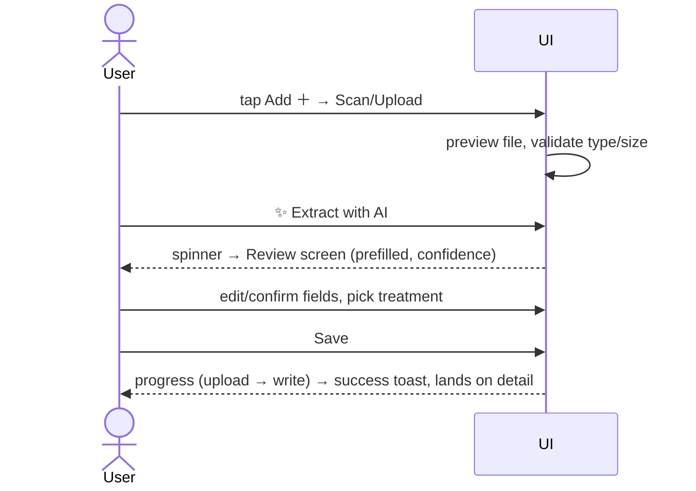
```mermaid
sequenceDiagram
    actor U as User
    participant UI
    U->>UI: tap Add ＋ → Scan/Upload
    UI->>UI: preview file, validate type/size
    U->>UI: ✨ Extract with AI
    UI-->>U: spinner → Review screen (prefilled, confidence)
    U->>UI: edit/confirm fields, pick treatment
    U->>UI: Save
    UI-->>U: progress (upload → write) → success toast, lands on detail
```

### 6.3 Session expiry mid-task
- Non-blocking banner: "Your Google session expired. **Reconnect** to keep working." In-progress
  form data is preserved in memory; after re-auth the pending save resumes (maps to `AUTH_REQUIRED`,
  LLD §4.6). Never lose typed input.

### 6.4 Edit conflict (two devices)
- On CAS conflict (LLD §6), show a **diff dialog**: "This project changed on another device." Side-
  by-side fields, choose **Keep mine / Keep theirs / Merge**. Summary recomputed after.

---

## 7. State coverage matrix

Every data-bearing screen must implement these. Mapped to LLD §11 codes where applicable.

| State | Where | UX |
| --- | --- | --- |
| **Loading** | dashboard, list, detail | skeleton rows/cards (not spinners) |
| **Empty** | first run, filtered-to-zero | illustration + primary CTA + secondary hint |
| **Auth required** | global | banner + "Reconnect"; preserve in-flight input (`AUTH_REQUIRED`) |
| **Insufficient scope** | after consent | "Re-grant Drive access" CTA (`INSUFFICIENT_SCOPE`) |
| **Offline** | global | "You're offline — viewing last synced data"; writes disabled/queued (later: queue) |
| **Sync conflict** | save | diff dialog (`CONFLICT`) |
| **Read corrupt** | boot | "Couldn't read your data" → restore backup / export (`READ_CORRUPT`) |
| **Upload failed** | add/edit/detail | inline retry on the attachment (`UPLOAD_FAILED`) |
| **Extraction incomplete** | review | fallback to manual + raw text (`EXTRACTION_INCOMPLETE`) |
| **AI key invalid** | extract, settings | inline + Settings deep-link (`API_KEY_INVALID`) |
| **AI quota / budget** | extract | "Daily AI limit reached — raise limit/override" (`AI_BUDGET_EXCEEDED`,`QUOTA`) |
| **Circuit open** | global | "Paused requests to protect your quota — Resume" (`CIRCUIT_OPEN`) |
| **Drive full** | save | "Your Google Drive is full" (`DRIVE_QUOTA`) |
| **Saving / optimistic** | add/edit | button progress; optimistic row with pending indicator |
| **Success** | mutations | toast + state update; no full reload |

---

## 8. Component inventory (shadcn/ui)

| Pattern | shadcn/Radix component |
| --- | --- |
| App shell nav | `NavigationMenu` / custom rail + `Tabs` (mobile bottom bar) |
| Cards (summary, detail) | `Card` |
| Tables / lists | `Table` (desktop) + responsive list rows |
| Forms | `Form` + `Input`, `Label`, `RadioGroup`, `Select`, `Textarea`, `Switch` |
| Currency input | custom `MoneyInput` (integer-cents, LLD §1.2) on `Input` |
| Dialogs | `Dialog` (review, conflict, confirm-delete), `AlertDialog` (destructive) |
| Toasts | `Sonner`/`Toast` for save/sync feedback |
| File upload | custom dropzone + `Progress` |
| Badges/chips | `Badge` (treatment, confidence, "Not tax advice") |
| Tooltips/help | `Tooltip`, `HoverCard` (tax-term explainers) |
| Empty/skeleton | `Skeleton` + custom empty-state |
| Theme | `DropdownMenu` theme switch |

---

## 9. Responsive & mobile capture

- **Breakpoints:** mobile (<640), tablet (≥768), desktop (≥1024). Mobile = bottom tab bar; desktop
  = left rail + top bar.
- **Camera capture:** the file input uses `accept="image/*,application/pdf"` and
  `capture="environment"` on mobile so "Scan / take photo" opens the rear camera directly.
- **Touch targets:** ≥44px; primary actions thumb-reachable (bottom of viewport).
- Tables degrade to stacked rows; long numbers right-aligned and never truncated silently.

### 9.1 Landing mobile rules

Cross-reference: [§5.1 Landing / Sign-in](#51-landing--sign-in-).

- **Full-screen native layout:** the mobile view is a plain `min-h-screen flex-col bg-[#f4f6f7]`
  column — no phone-frame canvas wrapper, no outer rounded card. The page fills the device
  viewport edge-to-edge exactly as a native app would on real hardware.
- **Dark hero block:** `MobileHeroBlock` — `overflow-hidden rounded-b-[2rem] bg-[#11262c]`,
  `px-6 sm:px-8 pt-8 pb-12`. Contains: compact nav row + `<div sm:max-w-xl>` wrapping the H1
  (`text-3xl font-black text-white`) and subhead (`max-w-sm text-balance text-sm
  text-slate-300/90`). The logo mark appears in a `bg-white/10 rounded-lg` tile.
- **Floating interaction card:** white `rounded-2xl` card with `-mt-6 relative z-10 mx-5 sm:mx-8`
  overlaps the hero's rounded bottom. Contains only: CTA buttons + `#feature-list`. The hero
  headline is **not** inside this card.
- **Small tablet two-column card (601–767 px):** within the card, `LandingActions` switches to
  `sm:flex-row sm:gap-8` — buttons column `sm:w-[45%]`, feature list column `sm:w-[55%]`.
- **Feature rows:** `text-base`; icon tiles use `bg-teal-50/80 p-2.5 rounded-xl text-teal-950`
  (brand teal wash); rows use `items-center gap-4`; lead phrase `font-semibold text-zinc-900`;
  trailing text `font-normal text-zinc-500`.
- **Footer:** `MobileDisclaimerFooter` — `mt-auto bg-zinc-100/80 text-[10px] font-bold uppercase
  tracking-wider text-zinc-500 border-t border-zinc-200/50`.
- **Breakpoints:** mobile at `<md` (`md:hidden`); desktop section at `md+` (`hidden md:flex`);
  within the desktop section, ghost-layer layout at `md`–`lg`, 12-column grid split at `xl+` (1280 px). Consistent with MOB-01.

---

## 10. Accessibility

- WCAG 2.1 AA: contrast ≥4.5:1; visible focus rings (Radix provides correct focus management).
- Full keyboard operability: tab order, `Esc` closes dialogs, `Enter` submits forms.
- Semantic labels on all inputs; currency fields announce currency. Confidence conveyed by **text +
  icon**, not color alone.
- Live regions for async results (sync status, save success/failure) so screen readers announce them.
- Respect `prefers-reduced-motion` (skeleton/transitions) and `prefers-color-scheme`.

---

## 11. Visual design & theming

- **Tailwind v4** CSS-first `@theme`; tokenized colors/spacing/radii. Light + dark + system.
  Implementation: [`src/index.css`](../src/index.css) (LLD §1.3).
- **Density:** comfortable default; compact toggle later for power users.
- Tax-treatment chips and semantic states (success/warn/error/info) use distinct but accessible
  hues + text labels — never color alone (A11Y-03).

### 11.1 Brand palette

| Role | Tailwind / CSS token | Notes |
| --- | --- | --- |
| Primary action | `--primary` → rich dark slate-teal (`oklch(0.28 0.04 200)`) | Buttons, logo, active nav, focus ring |
| Primary on-color text | `--primary-foreground` → near-white (`oklch(0.985 0 0)`) | WCAG AA on primary fills (A11Y-01) |
| Body / headings | `text-zinc-800`, `text-zinc-900` | Page titles; pair with extrabold + tracking |
| Lead anchor phrases | `font-semibold text-zinc-900` | Bold openers in feature bullets (e.g. **Your data stays**) |
| Trailing descriptor text | `font-normal text-zinc-500` | Softer second half of feature bullets |
| Secondary copy | `text-zinc-600` | Subheads, nav idle labels |
| Tertiary / footer | `text-zinc-500` | Disclaimers, meta, timestamps, uppercase footer strips |
| Page canvas (desktop) | `bg-zinc-50/50` | Warm off-white tint — desktop landing, shell bg |
| Feature icon badges | `bg-teal-50/80 text-teal-950 rounded-xl` | Teal wash tiles; replaces generic gray |
| Cards / floating surfaces | `bg-white border-zinc-200/80 shadow-[…]` | Floating card, dashboard mockup |
| Shell dividers | `border-zinc-100` | Header bottom, footer top, sidebar rail |
| **Forbidden** | `bg-blue-*`, `text-blue-*`, `bg-white` as desktop page canvas, washed `text-slate-500` as body | No generic demo blue; pure white canvas replaced by `zinc-50/50` |

Dark mode: map `--primary` to a lighter slate-teal tint for contrast on dark surfaces (e.g.
`oklch(0.72 0.06 200)` in `.dark`). Pixel-perfect dark landing polish may follow in a later pass.

### 11.2 Typography

- **Font stack:** Inter (via `--font-sans`); single legible UI font throughout.
- **Page titles (`h1`, `h2`):** `font-extrabold tracking-tighter` (or `tracking-tight` on smaller
  sub-section headings).
- **Shell chrome:** `font-semibold tracking-tight` for sidebar brand and compact labels.
- **Money columns:** tabular numerals (`font-variant-numeric: tabular-nums`).
- **List scannability:** value-prop and feature bullets use `<strong>` on the **leading anchor
  phrase** (e.g. **Your data stays** in YOUR Google Drive).

---

## 12. Loading & perceived performance

Response-time perception follows well-established UX thresholds (Nielsen, 1993). Every
async operation in the app maps to one of the tiers below, with a prescribed indicator.

### 12.1 Response-time tiers

| Tier | Latency | User perception | Indicator strategy |
| --- | --- | --- | --- |
| **Instant** | < 100 ms | Feels immediate; cause & effect fused | None — any visual change is the feedback itself |
| **Acknowledged** | 100 ms – 1 s | Noticeable pause, but flow isn't broken | Subtle inline cue: button state change, slight opacity shift, tiny progress dot |
| **Working** | 1 – 5 s | User knows something is happening; attention may wander | Skeleton placeholder (layout loads), or spinner with label ("Extracting…") |
| **Long** | 5 – 15 s | User may switch tabs; needs reassurance & ability to cancel | Determinate progress bar (or indeterminate with elapsed time / status text) + Cancel button |
| **Very long** | > 15 s | High abandonment risk; user needs estimated time | Stepped progress ("Uploading… Analyzing… Almost done") + Cancel + elapsed timer |

### 12.2 Operation-to-indicator map

| Operation | Expected latency | Tier | Indicator |
| --- | --- | --- | --- |
| In-app navigation (route change) | < 100 ms | Instant | None (React Router instant) |
| Theme toggle | < 100 ms | Instant | Immediate CSS class swap |
| Search / filter (client-side) | < 100 ms | Instant | List re-renders instantly |
| Sign-in (GIS consent popup) | 1–3 s | Working | "Sign in with Google" button shows Google's own popup; on return, landing fades to skeleton dashboard |
| Dashboard load (post-auth) | 1–3 s | Working | **Skeleton cards + skeleton rows** — three summary-card placeholders shimmer, recent-projects rows shimmer |
| Projects list load | 0.5–2 s | Working | **Skeleton rows** — table rows shimmer; filters disabled until data arrives |
| Project detail load | 0.3–1 s | Acknowledged | Skeleton detail card; usually near-instant (manifest already cached) |
| Save project (attachment upload + CAS write) | 1–5 s | Working | **Button progress state** — "Save" → "Saving…" with inline spinner; button disabled; on success: toast + navigate to detail |
| AI extraction (small file, inline) | 3–8 s | Long | **Spinner + label** — "Extracting details…" overlay on the form; Cancel button visible; on complete: transition to Review screen |
| AI extraction (large file, File API) | 8–30 s | Very long | **Stepped progress** — "Uploading file… → Processing… → Extracting…" with elapsed timer; Cancel aborts the File API session |
| Export download (client-side gen) | < 1 s | Acknowledged | Button briefly shows "Generating…" then triggers download |
| Manifest first-run create | 1–2 s | Working | Skeleton dashboard (same as post-auth load) |
| Backup rotation (pre-write) | 0.5–1 s | Acknowledged | No separate indicator — folded into the save button progress |
| Silent token refresh | < 1 s | Acknowledged | No visible indicator when successful; on failure → NeedsInteraction banner |
| BYOK "Test" ping | 1–3 s | Working | "Test" button → "Testing…" spinner → ✓ Valid / ✗ Invalid result inline |

### 12.3 Design rules

1. **Skeletons for layout, spinners for actions.** Initial page loads use skeleton
   placeholders (cards, rows, detail blocks shaped like the real content) to give the user a
   sense of the page structure. Discrete actions ("I clicked a button") use a spinner or
   button-progress state.

2. **Never block the full screen.** Loading indicators are scoped to the region that's
   waiting — a skeleton card, not a full-page overlay. The shell (nav, top bar, footer) remains
   interactive. Exception: the AI extraction overlay covers the form area but not the global
   nav.

3. **Always provide an escape.** Any operation expected to exceed 3 seconds must have a
   **Cancel** affordance. Cancellation triggers `AbortController.abort()` on in-flight
   requests and restores the pre-operation state.

4. **Optimistic rows.** After a successful save, the new/updated project appears immediately
   in the list with a subtle "syncing" indicator (pulse dot), before the CAS write round-trip
   confirms. If the write fails, the row reverts with an error toast.

5. **Transition, don't flash.** If an operation completes in < 300 ms, the skeleton/spinner
   is held for a minimum of 300 ms total to avoid a jarring flash of loading state. This
   prevents the "flicker" that's worse than no indicator at all.

6. **Progressive disclosure on long ops.** Operations over 5 seconds show staged messages
   (e.g. "Uploading → Processing → Extracting") so the user knows the system isn't stuck.

---

## 13. Microcopy & legal

- **Persistent disclaimer:** "Not tax advice — for recordkeeping only. Confirm treatment with a
  qualified professional." Shown near every tax figure and in /about.
- **Cost-basis education:** inline `HoverCard` on "cost basis" / "deductible" / "credit" explaining
  the difference (HLD §6), so the UI actively prevents the common misconception.
- **Privacy reassurance:** "**Your data lives** in your Google Drive. **This app has no server.**"
  (bold anchor phrases on landing bullets; see §5.1).
- **Tone:** calm, factual, second person. Avoid jargon; expand IRS terms on first use.

---

*Companion to the HLD/LLD. Wireframes are intent, not pixel specs; final spacing/typography land
during P0–P4 implementation.*
