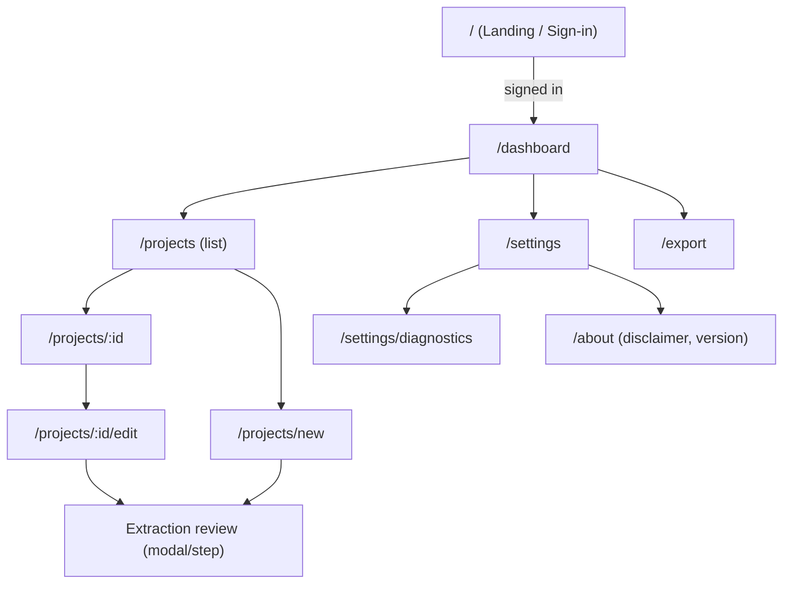
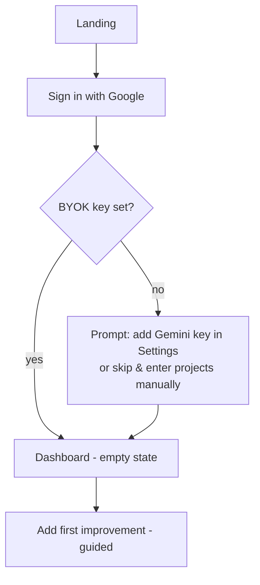
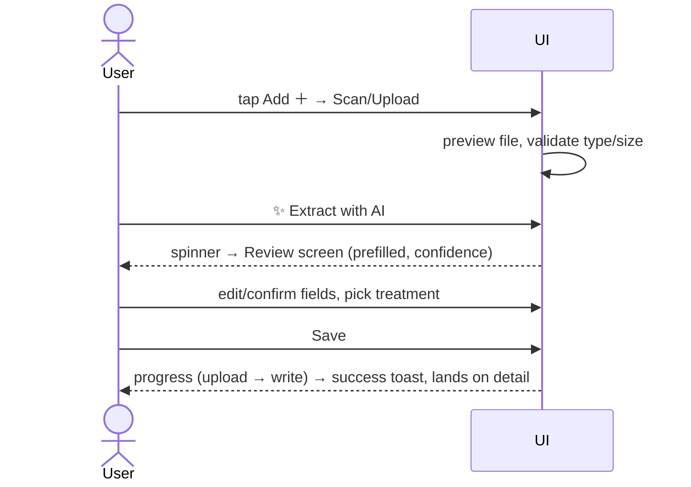

# UI/UX Low-Level Design: Screens, Features & Flows

**Status:** Draft v0.1 — companion to the [HLD](high-level-design.md) and [LLD](low-level-design.md)
**Author:** Devin (on behalf of @jbisasky)
**Last updated:** 2026-06-12

> This document specifies **what the user sees and does**: the feature set, information
> architecture, every screen (with wireframes), the core flows, and — critically — the
> **non-happy-path states** (loading / empty / error / offline / conflict / auth-expired /
> budget-exceeded) mapped to the error taxonomy in [LLD §10](low-level-design.md#10-error-taxonomy--user-messaging).
> Built with shadcn/ui (Radix) + Tailwind v4; mobile-first because receipts are captured on phones.

## Table of contents
1. [Design principles](#1-design-principles)
2. [Feature list (MVP vs later)](#2-feature-list-mvp-vs-later)
3. [Information architecture & navigation](#3-information-architecture--navigation)
4. [Global layout & shell](#4-global-layout--shell)
5. [Screen inventory (wireframes)](#5-screen-inventory-wireframes)
6. [Core user flows](#6-core-user-flows)
7. [State coverage matrix](#7-state-coverage-matrix)
8. [Component inventory (shadcn/ui)](#8-component-inventory-shadcnui)
9. [Responsive & mobile capture](#9-responsive--mobile-capture)
10. [Accessibility](#10-accessibility)
11. [Visual design & theming](#11-visual-design--theming)
12. [Microcopy & legal](#12-microcopy--legal)

---

## 1. Design principles

- **Trust & clarity over flash.** This is a financial record that must be legible in 20 years.
  Plain language, generous spacing, no dark patterns.
- **Mobile-first capture, desktop-first review.** Adding a receipt happens on a phone; reviewing
  totals and exporting happens on a laptop. Both must be first-class.
- **AI assists, the human decides.** Every AI-extracted value is editable and must be confirmed
  before it's saved (LLD §9). Confidence is shown, never hidden.
- **Honest about money & tax.** Distinguish *cost basis* from *deductible* everywhere; always show
  the "not tax advice" disclaimer near any tax figure (HLD §6).
- **Every state is designed.** Loading, empty, error, offline, and conflict are not afterthoughts.
- **Reversible & recoverable.** Destructive actions confirm; data is exportable; backups exist.

---

## 2. Feature list (MVP vs later)

### MVP (v1)
| Area | Feature |
| --- | --- |
| Auth | Google sign-in (GIS), sign-out, session-expiry re-auth prompt |
| Settings | BYOK Gemini key entry (+ session-only toggle), AI budget caps, key/connection status |
| Projects | Create / read / update / delete improvement projects |
| Attachments | Upload receipts/invoices (image/PDF), view/download, remove |
| AI extraction | Extract fields from a document → **review/confirm** screen → save |
| Tax model | Per-project `taxTreatment`, cost-basis vs deductible amounts, justification |
| Dashboard | Summary cards (total cost basis added, total deductible, project count) |
| Search/filter | Filter projects by year, treatment, text search by title/vendor |
| Export | Download `manifest.json` + human-readable CSV/PDF |
| Resilience | Loading/empty/error states, conflict resolution UI, diagnostics log |
| Disclaimers | "Not tax advice" persistent affordance |

### Later (post-v1)
- PWA install + offline read; queued writes when offline.
- Per-year **cost-basis report** view (running adjusted basis over time).
- Bulk import (multi-file drop → batched extraction with a review queue).
- Tag/category taxonomy and per-room or per-system grouping.
- Reminders (e.g. "tax season — review unclassified projects").
- Photo annotation, multi-page document stitching UI.
- Optional encryption-at-rest passphrase for the BYOK key.

---

## 3. Information architecture & navigation



Primary nav (always reachable): **Dashboard · Projects · Add · Export · Settings**. On mobile this
collapses to a bottom tab bar with a center **Add (＋)** action; on desktop it's a left rail or top bar.

---

## 4. Global layout & shell

### Desktop layout


<details><summary>ASCII wireframe (original)</summary>

```
DESKTOP                                              
┌───────────────────────────────────────────────────────────┐
│ ◑ Capital Improvements         [search…]      ⟳  ◧  ⚙  (J) │  ← top bar: brand, search, sync, theme, settings, account
├───────────┬───────────────────────────────────────────────┤
│ Dashboard │                                                │
│ Projects  │              <route content>                   │
│ Add  ＋   │                                                │
│ Export    │                                                │
│ Settings  │                                                │
│           │                                                │
│ ── status │  ⚠ Not tax advice · ● Synced 2m ago            │  ← persistent footer strip
└───────────┴───────────────────────────────────────────────┘
```

</details>

### Mobile layout


<details><summary>ASCII wireframe (original)</summary>

```
MOBILE
┌───────────────────────────┐
│ ◑ Capital Improvements  (J)│
│ [search…]                  │
│                            │
│      <route content>       │
│                            │
│ ⚠ Not tax advice · ●Synced │
├───────────────────────────┤
│ ▣Dash  ▤Proj  ＋  ⭳Exp  ⚙ │  ← bottom tab bar, center Add
└───────────────────────────┘
```

</details>

Persistent elements:
- **Sync indicator** (`⟳`/`●`): idle / syncing / synced (with timestamp) / error. Reflects Drive
  CAS write status (LLD §6). Click → last-sync details / retry.
- **"Not tax advice"** chip: always visible, links to the disclaimer in /about.
- **Account menu** `(J)`: email, sign out, switch is N/A (single account, HLD D12).

---

## 5. Screen inventory (wireframes)

### 5.1 Landing / Sign-in (`/`)


<details><summary>ASCII wireframe (original)</summary>

```
┌───────────────────────────────────────────┐
│              ◑  Capital Improvements        │
│   Track home improvements & their tax       │
│   impact — privately, in your own Drive.    │
│                                             │
│        [  Sign in with Google  ]            │
│                                             │
│  • Your data stays in YOUR Google Drive     │
│  • No server ever sees your files or keys   │
│  • Bring your own Gemini key for AI         │
│                                             │
│  ⚠ Not tax advice. For recordkeeping only.  │
└───────────────────────────────────────────┘
```

</details>
- Single primary CTA. Below the fold: privacy explainer + what you'll need (Google account, an AI
  Studio key). Error inline if GIS init fails (origin mismatch → friendly "config issue" note).

### 5.2 Dashboard (`/dashboard`)


<details><summary>ASCII wireframe (original)</summary>

```
┌─────────────────────────────────────────────────────────┐
│ Overview                                  Tax year: 2025 ▾│
│ ┌──────────────┐ ┌──────────────┐ ┌──────────────┐       │
│ │ Cost basis + │ │ Deductible   │ │ Projects     │       │
│ │  $42,300     │ │  $1,200      │ │  17          │       │
│ │ this year    │ │ (credits)    │ │ 3 unclassified│      │
│ └──────────────┘ └──────────────┘ └──────────────┘       │
│ ⚠ "Deductible" is rare for a primary home — most items    │
│    raise cost basis. Learn more →                         │
│                                                           │
│ Recent projects                          [View all →]     │
│ • New roof              2025-04   $18,000  Capital impr.   │
│ • HVAC replacement      2025-02   $9,500   Capital impr.   │
│ • Attic insulation      2025-01   $2,300   Credit (§25C)   │
│                                                           │
│ [ ＋ Add improvement ]                                     │
└─────────────────────────────────────────────────────────┘
```

</details>
- Summary cards are **derived** values (LLD §6.3). "Unclassified" badge nudges the user to set
  `taxTreatment` on `unknown` items. Year selector filters everything.

### 5.3 Projects list (`/projects`)


<details><summary>ASCII wireframe (original)</summary>

```
┌─────────────────────────────────────────────────────────┐
│ Projects   [search title/vendor…]  Year▾ Treatment▾ Sort▾ │
│ ┌─────────────────────────────────────────────────────┐ │
│ │ ☐  New roof            2025-04  $18,000  Capital  📎2 │ │
│ │ ☐  HVAC replacement    2025-02   $9,500  Capital  📎1 │ │
│ │ ☐  Attic insulation    2025-01   $2,300  Credit   📎1 │ │
│ │ ☐  Repaint hallway     2024-11     $600  Repair   📎0 │ │
│ └─────────────────────────────────────────────────────┘ │
│ 4 of 17 shown                       [ ＋ Add improvement ]│
└─────────────────────────────────────────────────────────┘
```

</details>
- Row: title, completion date, cost, treatment chip, attachment count. Tap → detail. Checkboxes
  enable bulk actions (delete/export selection) — later phase for bulk extract.
- Empty state: friendly illustration + "Add your first improvement" + "Import receipts".

### 5.4 Add / Edit project (`/projects/new`, `/projects/:id/edit`)
Two entry modes that converge on the same form:
- **From a receipt** (AI-assisted): drop/scan a file → extraction → review → form prefilled.
- **Manual**: blank form.


<details><summary>ASCII wireframe (original)</summary>

```
┌─────────────────────────────────────────────────────────┐
│ Add improvement                                   [ × ]   │
│ ┌─ Attachments ─────────────────────────────────────────┐│
│ │  [ 📷 Scan / take photo ]  [ ⬆ Upload file ]           ││
│ │  receipt_roof.pdf  ✓ uploaded   [view] [remove]        ││
│ │  ✨ Extract details with AI                             ││
│ └───────────────────────────────────────────────────────┘│
│ Title*           [ New roof                              ] │
│ Completion date* [ 2025-04-12 ]                           │
│ Total cost*      [ $ 18,000.00 ]                          │
│ Tax treatment*   ( ) Capital improvement (cost basis)     │
│                  ( ) Repair (no tax effect)               │
│                  ( ) Deductible   ( ) Credit  ( ) Unknown │
│ Cost-basis adj.  [ $ 18,000.00 ]   Deductible [ $ 0.00 ]  │
│ Justification    [ Full tear-off + replacement…         ] │
│ ⚠ Not tax advice — confirm treatment with a professional. │
│                         [ Cancel ]   [ Save improvement ] │
└─────────────────────────────────────────────────────────┘
```

</details>
- Field-level validation (zod-mirrored). `taxTreatment` drives which amount fields are emphasized
  (capital → cost-basis; credit/deductible → deductible amount).
- Save = attachments-first, manifest-last (LLD §9). Button shows progress; disabled while a budget
  or circuit guard is tripped (LLD §13) with an inline reason.

### 5.5 AI extraction review (modal/step)


<details><summary>ASCII wireframe (original)</summary>

```
┌─────────────────────────────────────────────────────────┐
│ Review extracted details          confidence: ●●●○ (0.78) │
│ We read this from receipt_roof.pdf. Check & edit before    │
│ saving — nothing is stored until you confirm.             │
│                                                           │
│ Title          [ New roof                  ]  ✦ extracted │
│ Date           [ 2025-04-12 ]                 ✦           │
│ Total cost     [ $18,000.00 ]                 ⚠ low conf  │
│ Vendor         [ ABC Roofing ]                ✦           │
│ Suggested tax  [ Capital improvement ▾ ]      ✦           │
│ Justification  [ Full roof replacement…    ]              │
│                                                           │
│ [ Discard ]                  [ Looks good → continue ]    │
└─────────────────────────────────────────────────────────┘
```

</details>
- Per-field "✦ extracted" markers and **low-confidence warnings** on individual fields. Editing a
  field clears its AI marker. `finishReason != STOP` → fallback banner "couldn't read fully, enter
  manually" (maps to `EXTRACTION_INCOMPLETE`).

### 5.6 Project detail (`/projects/:id`)


<details><summary>ASCII wireframe (original)</summary>

```
┌─────────────────────────────────────────────────────────┐
│ ← Projects                              [ Edit ] [ ⋯ ]    │
│ New roof                                                   │
│ Completed 2025-04-12 · ABC Roofing                        │
│ ┌───────────────┐                                         │
│ │ Total cost    │ $18,000.00                              │
│ │ Treatment     │ Capital improvement                     │
│ │ Cost basis +  │ $18,000.00                              │
│ │ Deductible    │ $0.00                                   │
│ └───────────────┘                                         │
│ Justification: Full tear-off and replacement…             │
│ Attachments (2):  📄 receipt_roof.pdf [view] [download]   │
│                   🖼 photo_after.jpg  [view] [download]   │
│ ⚠ Not tax advice.            History: created/updated …   │
└─────────────────────────────────────────────────────────┘
```

</details>
- `⋯` menu: delete (confirm), duplicate, export this project.

### 5.7 Settings (`/settings`)


<details><summary>ASCII wireframe (original)</summary>

```
┌─────────────────────────────────────────────────────────┐
│ Settings                                                  │
│ Account                                                   │
│   Signed in as jordan@… [ Sign out ]                      │
│   Drive: ● Connected (drive.file, appdata)                │
│                                                           │
│ AI (Bring Your Own Key)                                   │
│   Gemini API key [ •••••••••••••  ] [ Save ] [ Test ]     │
│   ☐ Session-only (don't store in this browser)            │
│   Status: ● Valid · model gemini-2.5-flash                │
│   ⚠ Stored in this browser's localStorage. Anyone with    │
│     access to this device/browser could read it.          │
│                                                           │
│ Usage limits (runaway protection)                         │
│   Max AI calls / day      [ 200 ]                         │
│   Max AI tokens / day     [ 2,000,000 ]                   │
│   Max AI calls / session  [ 50 ]    Used today: 12        │
│                                                           │
│ Data                                                      │
│   [ Export all ]  [ Restore from backup ]  [ Diagnostics ]│
│ Appearance: ( ) System ( ) Light ( ) Dark                 │
└─────────────────────────────────────────────────────────┘
```

</details>
- BYOK warning is explicit (decision D11). "Test" pings Gemini with a trivial call (counts against
  budget). Budgets back LLD §13.5; "used today" reflects the persisted counter.

### 5.8 Export (`/export`)


<details><summary>ASCII wireframe (original)</summary>

```
┌─────────────────────────────────────────────────────────┐
│ Export your data                                          │
│ Format:  ( ) manifest.json (full backup)                  │
│          ( ) CSV (spreadsheet)                            │
│          ( ) PDF summary (per tax year)                   │
│ Scope:   ( ) All   ( ) Year [2025 ▾]   ( ) Selected       │
│ Note: attachments live in your Drive folder "Capital      │
│ Improvements (App Data)" and are not bundled here.        │
│                                   [ Download ]            │
└─────────────────────────────────────────────────────────┘
```

</details>

### 5.9 Diagnostics (`/settings/diagnostics`)
- Read-only ring-buffer log (LLD §13.7): timestamped events incl. `LOOP_GUARD_TRIPPED`,
  `CIRCUIT_OPEN`, `AI_BUDGET_EXCEEDED`, sync conflicts. "Copy log" (redacted) for support.

### 5.10 About (`/about`)
- App version, the full **not-tax-advice disclaimer**, links to HLD/LLD, Google Cloud setup, and
  a "how your data is stored" privacy explainer.

---

## 6. Core user flows

### 6.1 First-run onboarding

First run shows an **empty dashboard** with a one-card guide. AI features are gated behind a key but
the app is fully usable manually without one (graceful degradation).

### 6.2 Add improvement from a receipt (happy path)


### 6.3 Session expiry mid-task
- Non-blocking banner: "Your Google session expired. **Reconnect** to keep working." In-progress
  form data is preserved in memory; after re-auth the pending save resumes (maps to `AUTH_REQUIRED`,
  LLD §4.6). Never lose typed input.

### 6.4 Edit conflict (two devices)
- On CAS conflict (LLD §6), show a **diff dialog**: "This project changed on another device." Side-
  by-side fields, choose **Keep mine / Keep theirs / Merge**. Summary recomputed after.

---

## 7. State coverage matrix

Every data-bearing screen must implement these. Mapped to LLD §10 codes where applicable.

| State | Where | UX |
| --- | --- | --- |
| **Loading** | dashboard, list, detail | skeleton rows/cards (not spinners) |
| **Empty** | first run, filtered-to-zero | illustration + primary CTA + secondary hint |
| **Auth required** | global | banner + "Reconnect"; preserve in-flight input (`AUTH_REQUIRED`) |
| **Insufficient scope** | after consent | "Re-grant Drive access" CTA (`INSUFFICIENT_SCOPE`) |
| **Offline** | global | "You're offline — viewing last synced data"; writes disabled/queued (later: queue) |
| **Sync conflict** | save | diff dialog (`CONFLICT`) |
| **Read corrupt** | boot | "Couldn't read your data" → restore backup / export (`READ_CORRUPT`) |
| **Upload failed** | add/edit | inline retry on the attachment (`UPLOAD_FAILED`) |
| **Extraction incomplete** | review | fallback to manual + raw text (`EXTRACTION_INCOMPLETE`) |
| **AI key invalid** | extract, settings | inline + Settings deep-link (`API_KEY_INVALID`) |
| **AI quota / budget** | extract | "Daily AI limit reached — raise limit/override" (`AI_BUDGET_EXCEEDED`,`QUOTA`) |
| **Circuit open** | global | "Paused requests to protect your quota — Resume" (`CIRCUIT_OPEN`) |
| **Drive full** | save | "Your Google Drive is full" (`DRIVE_QUOTA`) |
| **Saving / optimistic** | add/edit | button progress; optimistic row with pending indicator |
| **Success** | mutations | toast + state update; no full reload |

---

## 8. Component inventory (shadcn/ui)

| Pattern | shadcn/Radix component |
| --- | --- |
| App shell nav | `NavigationMenu` / custom rail + `Tabs` (mobile bottom bar) |
| Cards (summary, detail) | `Card` |
| Tables / lists | `Table` (desktop) + responsive list rows |
| Forms | `Form` + `Input`, `Label`, `RadioGroup`, `Select`, `Textarea`, `Switch` |
| Currency input | custom `MoneyInput` (integer-cents, LLD §1.2) on `Input` |
| Dialogs | `Dialog` (review, conflict, confirm-delete), `AlertDialog` (destructive) |
| Toasts | `Sonner`/`Toast` for save/sync feedback |
| File upload | custom dropzone + `Progress` |
| Badges/chips | `Badge` (treatment, confidence, "Not tax advice") |
| Tooltips/help | `Tooltip`, `HoverCard` (tax-term explainers) |
| Empty/skeleton | `Skeleton` + custom empty-state |
| Theme | `DropdownMenu` theme switch |

---

## 9. Responsive & mobile capture

- **Breakpoints:** mobile (<640), tablet (≥768), desktop (≥1024). Mobile = bottom tab bar; desktop
  = left rail + top bar.
- **Camera capture:** the file input uses `accept="image/*,application/pdf"` and
  `capture="environment"` on mobile so "Scan / take photo" opens the rear camera directly.
- **Touch targets:** ≥44px; primary actions thumb-reachable (bottom of viewport).
- Tables degrade to stacked rows; long numbers right-aligned and never truncated silently.

---

## 10. Accessibility

- WCAG 2.1 AA: contrast ≥4.5:1; visible focus rings (Radix provides correct focus management).
- Full keyboard operability: tab order, `Esc` closes dialogs, `Enter` submits forms.
- Semantic labels on all inputs; currency fields announce currency. Confidence conveyed by **text +
  icon**, not color alone.
- Live regions for async results (sync status, save success/failure) so screen readers announce them.
- Respect `prefers-reduced-motion` (skeleton/transitions) and `prefers-color-scheme`.

---

## 11. Visual design & theming

- **Tailwind v4** CSS-first `@theme`; tokenized colors/spacing/radii. Light + dark + system.
- Restrained palette: neutral surfaces, one accent for primary actions, semantic colors for
  success/warn/error/info. Tax-treatment chips use distinct but accessible hues + labels.
- Typography: a single legible system/UI font; tabular numerals for money columns.
- Density: comfortable default; compact toggle later for power users.

---

## 12. Microcopy & legal

- **Persistent disclaimer:** "Not tax advice — for recordkeeping only. Confirm treatment with a
  qualified professional." Shown near every tax figure and in /about.
- **Cost-basis education:** inline `HoverCard` on "cost basis" / "deductible" / "credit" explaining
  the difference (HLD §6), so the UI actively prevents the common misconception.
- **Privacy reassurance:** "Your data lives in your Google Drive. This app has no server."
- **Tone:** calm, factual, second person. Avoid jargon; expand IRS terms on first use.

---

*Companion to the HLD/LLD. Wireframes are intent, not pixel specs; final spacing/typography land
during P0–P4 implementation.*
